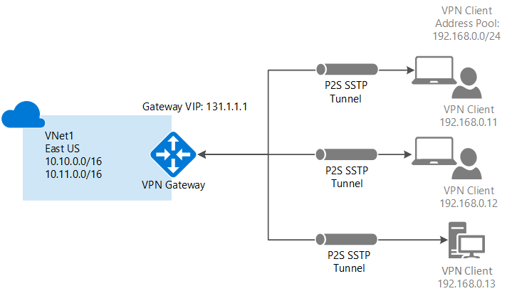
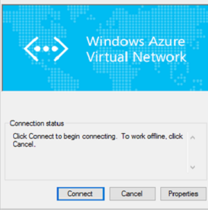

<properties
   pageTitle="設定點為網站 VPN 閘道器連線到使用傳統的入口網站 Azure 虛擬網路 |Microsoft Azure"
   description="安全地連結至 Azure 虛擬網路藉由建立點為網站 VPN 閘道器連線。"
   services="vpn-gateway"
   documentationCenter="na"
   authors="cherylmc"
   manager="carmonm"
   editor=""
   tags="azure-service-management"/>

<tags
   ms.service="vpn-gateway"
   ms.devlang="na"
   ms.topic="hero-article"
   ms.tgt_pltfrm="na"
   ms.workload="infrastructure-services"
   ms.date="10/17/2016"
   ms.author="cherylmc"/>

# 設定點為網站連線至 VNet，使用 [傳統] 入口網站

> [AZURE.SELECTOR]
- [資源管理員-Azure 入口網站](vpn-gateway-howto-point-to-site-resource-manager-portal.md)
- [資源管理員-PowerShell](vpn-gateway-howto-point-to-site-rm-ps.md)
- [傳統-Azure 入口網站](vpn-gateway-howto-point-to-site-classic-azure-portal.md)
- [傳統-傳統入口網站](vpn-gateway-point-to-site-create.md)

點網站 (P2S) 設定，可讓您建立虛擬網路個別的用戶端電腦從安全的連線。 當您要連線到您 VNet 從遠端位置，例如從家用版或會議，或您只需要幾個需要連線到虛擬網路的用戶端，P2S 連線相當實用。

本文會引導您以點為網站連線**傳統部署模型**使用**傳統的入口網站**中建立 VNet。

點-網站的連線不需要 VPN 裝置或-在公開的 IP 位址搭配使用。 從用戶端電腦開始連線建立 VPN 連線時。 如需有關點為網站連線的詳細資訊，請參閱[VPN 閘道器常見問題集](vpn-gateway-vpn-faq.md#point-to-site-connections)和[規劃及設計](vpn-gateway-plan-design.md)。

### 部署模型和 P2S 連線的方法

[AZURE.INCLUDE [deployment models](../../includes/vpn-gateway-deployment-models-include.md)] 

下表顯示的兩種部署模型及部署 P2S 設定的方法。 當有包含設定步驟的文章時，我們連結直接從這個資料表。

[AZURE.INCLUDE [vpn-gateway-clasic-rm](../../includes/vpn-gateway-table-point-to-site-include.md)] 

## 基本的工作流程

 
下列步驟會引導您完成建立安全點為網站連線至虛擬網路的步驟。 

點-網站連線設定分成四個區段。 設定每一個區段順序很重要。 不會略過的步驟，或直接。

- **第 1 節**建立虛擬網路和 VPN 閘道器。
- **第 2 節**建立驗證時所使用的憑證，並將其上傳。
- **第 3 節**匯出，並安裝您的用戶端憑證。
- **第 4 節**設定您的 VPN 用戶端。

## 區段 1-建立虛擬網路和 VPN 閘道器

### 第 1 部分︰ 建立虛擬網路

1. [Azure 傳統入口網站](https://manage.windowsazure.com/)登入。 下列步驟使用 [傳統] 入口網站不 Azure 入口網站。 目前您無法建立使用 Azure 入口網站 P2S 連線。

2. 在螢幕的左下角，按一下 [**新增**]。 在功能窗格] 中按一下**網路服務**]，然後按一下 [**虛擬網路**。 按一下 [開始設定精靈的 [**建立自訂**]。

3. 在 [**虛擬網路詳細資料**] 頁面中，輸入下列資訊，然後再按一下上右下方的下一個箭號。
    - **名稱**︰ 虛擬網路的名稱。 例如，「 VNet1 」。 這是此 VNet 部署 Vm 時，會參照到的名稱。
    - **位置**︰ 位置與直接相關，實體位置 （區域），您希望資源 (Vm) 所在的位置。 例如，如果您想 Vm 您部署實體位於東亞美國此虛擬網路時，選取該位置。 您無法變更建立後，您的虛擬網路與相關聯的區域。

4. 在 [ **DNS 伺服器及 VPN 連線**] 頁面中，輸入下列資訊，然後再按一下上右下方的下一個箭號。
    - **DNS 伺服器**︰ 輸入的 DNS 伺服器名稱及 IP 位址，或從快顯功能表中選取先前已註冊的 DNS 伺服器。 此設定不會建立 DNS 伺服器。 其可讓您指定您想要使用這個虛擬網路名稱解析 DNS 伺服器。 如果您想要使用的 Azure 的預設名稱解析服務，將 [此節保留空白。
    - **設定點為網站 VPN**︰ 選取此核取方塊。

5. 在**點為網站連線**] 頁面中，指定您 VPN 用戶端將會收到連線時的 IP 位址的 IP 位址範圍。 有一些您可以指定位址範圍規則。 請務必確認您指定的範圍沒有與重疊任何在內部部署網路上的範圍。

6. 輸入下列資訊，，然後按一下 [下一步的箭號。
 - **位址空間**︰ 包含起始 IP 和 CIDR （地址計數）。
 - **新增地址空間**︰ 只有在您的網路設計的都需要新增位址空間。

7. 在**虛擬網路位址空間**頁面上，指定您想要用於虛擬網路位址範圍。 這些是動態 IP 位址 (DIPS)，會指派 Vm 及其他您部署到這個虛擬網路的角色執行個體。  務必選取範圍不會重疊使用的用於您的內部網路的範圍。 您必須進行共同作業的網路系統管理員，可能需要設想的 IP 位址範圍從您的內部部署網路位址空間，讓您用於虛擬網路。

8. 輸入下列資訊，，然後按一下 [核取記號，以開始建立您的虛擬網路。
 - **位址空間**︰ 新增您想要使用這個虛擬網路，包括開始的 IP 及計算的內部 IP 位址範圍。 請務必選取範圍不會重疊使用的用於您的內部網路的範圍。 
 - **新增子網路**︰ 其他的子網路且並非必要，但您可能會想要的靜態 DIPS Vm 建立不同的子網路。 要與其他角色執行個體是分開的子網路中有您 Vm 或者。
 - **新增閘道器子網路**︰ 閘道器子網路時點為網站 VPN 需要。 按一下以新增閘道器子網路。 閘道器子網路僅用於虛擬網路閘道器。

9. 一旦建立虛擬網路，您會看到**建立**列出 [Azure 傳統入口網站中的 [網路] 頁面上的 [**狀態**] 下。 一旦建立虛擬網路，您可以建立動態路由閘道。

### 第 2 部分︰ 建立動態路由閘道器

閘道器類型必須設定為動態。 具有此功能無法使用靜態路由閘道器。

1. Azure 傳統入口網站中，在**網路**頁面上，按一下的虛擬網路，您建立的並瀏覽至**儀表板**頁面。

2. 按一下 [**建立閘道器**，位於頁面底部的**儀表板**]。 出現一則訊息，詢問**您是否要建立閘道器的虛擬網路 「 VNet1 」**。 按一下 [ **]**以開始建立閘道器。 可能需要約 15 分鐘建立閘道器的。

## 第 2 節-產生和上傳的憑證

憑證用來驗證的點為網站 Vpn VPN 用戶端。 您可以使用企業憑證解決方案，所產生的根憑證，或者您可以使用自我簽署的憑證。 您可以將 20 個根憑證上傳至 Azure。 上傳的.cer 檔案後 Azure 可以驗證已安裝的用戶端憑證的用戶端使用中所包含的資訊。 用戶端憑證必須從相同的憑證.cer 檔代表產生。

本節中您將會執行下列動作︰

- 取得.cer 檔案的根憑證。 可以是自我簽署的憑證，或者您可以使用企業憑證系統。
- .Cer 檔案上傳至 Azure。
- 產生用戶端憑證。

### 第 1 部分︰ 取得根憑證.cer 檔案

如果您使用的企業憑證系統，取得您想要使用的根憑證的.cer 檔案。 在[第 3 部分](#createclientcert)中，您可從根憑證產生的用戶端憑證。

如果您不使用企業憑證解決方案，必須產生自我簽署的根憑證。 在 Windows 10 的步驟，您可以使用[自我簽署的根憑證點為網站設定](vpn-gateway-certificates-point-to-site.md)參考。 本文會引導您使用 makecert 產生自我簽署的憑證，然後將匯出.cer 檔案。

### 第 2 部分︰ 上傳至 Azure 傳統入口網站的根憑證.cer 檔案

Azure 以新增受信任的憑證。 當您將 Base64 編碼的 X.509 (.cer) 檔案新增至 Azure 時，會告訴 Azure 信任之根憑證的檔案代表。

1. 在 Azure 的傳統入口網站中的虛擬網路的 [**憑證**] 頁面上按一下 [**上傳的根憑證**]。

2. 在 [**上傳的憑證**] 頁面中，瀏覽.cer 根憑證，然後再按一下核取記號。

### 第 3 部分︰ 產生的用戶端憑證

接下來，產生的用戶端憑證。 您可以產生的唯一的憑證每個用戶端連線，或您可以在多個用戶端上使用相同的憑證。 產生唯一的用戶端憑證的優點是撤銷單一憑證，如有需要的能力。 否則，如果每個人都使用相同的用戶端憑證，而您找到您需要撤銷一部用戶端的憑證，您必須產生，並為所有用於憑證驗證的用戶端安裝新的憑證。

- 如果您使用的企業憑證解決方案，產生的常見的名稱值格式的用戶端憑證'name@yourdomain.com',而非 NetBIOS 「 網域 \ 使用者名稱 」 格式。 

- 如果您使用自我簽署的憑證，請參閱[使用點為網站設定自我簽署的根憑證](vpn-gateway-certificates-point-to-site.md)產生的用戶端憑證。

## 區段 3-匯出]，然後安裝用戶端憑證

在每個您想要連線至虛擬網路的電腦上安裝的用戶端憑證。 需要驗證的用戶端憑證。 您可以自動安裝用戶端憑證，或者您可以手動安裝。 下列步驟會引導您匯出及手動安裝用戶端憑證。

1. 若要匯出的用戶端憑證，您可以使用*certmgr.msc*。 以滑鼠右鍵按一下您想要匯出，按一下 [**所有任務**，再按一下 [**匯出**用戶端憑證。
2. 匯出私密金鑰的用戶端憑證。 這是*.pfx*檔。 請務必記錄，或請記住，您設定這個憑證的密碼 （按鍵）。
3. 將*.pfx*檔複製到 [用戶端電腦。 用戶端電腦上，按兩下*.pfx*檔，進行安裝。 輸入密碼要求時。 請勿修改安裝位置。

## 區段 4-VPN 用戶端設定

若要連線至虛擬網路，您也需要 VPN 用戶端設定。 用戶端需要 [用戶端憑證] 和 [適當的 VPN 用戶端設定，才能將連線。 若要設定 VPN 用戶端，請執行下列步驟，順序。

### 第 1 部分︰ 建立 VPN 用戶端設定套件

1. Azure 中傳統入口網站中，在您的虛擬網路的**儀表板**頁面上，瀏覽至右上角的 [快速檢視] 功能表。 用戶端支援的作業系統的清單，請參閱[點-網站連線](vpn-gateway-vpn-faq.md#point-to-site-connections)VPN 閘道器常見問題集的一部分。 VPN 用戶端套件包含設定 Windows 的內建的 VPN 用戶端軟體的設定資訊。 封裝不會安裝其他軟體。 設定專屬於您要連線至虛擬網路。  選取對應於用戶端的作業系統，將會安裝下載套件︰
 - 32 位元的用戶端，選取 [**下載 32 位元的用戶端 VPN 套件**]。
 - 64 位元的用戶端，選取 [**下載 64 位元的用戶端 VPN 套件**]。

2. 需要幾分鐘，才能建立您的用戶端套件。 一旦完成套件後，您可以下載檔案。 *.Exe*檔案下載可以安全地儲存在本機電腦上。

3. 產生後，當您從 Azure 傳統入口網站下載 VPN 用戶端套件時，您可以安裝在您要連線到您的虛擬網路的用戶端電腦上的用戶端套件。 如果您打算安裝多個用戶端電腦的 VPN 用戶端套件，請確定它們也有安裝用戶端憑證。

### 第 2 部分︰ 安裝在用戶端的 VPN 設定封裝

1. 將設定檔複製到您要連線到您的虛擬網路並按兩下.exe 檔案的電腦的本機。 

2. 套件已安裝後，您就可以開始 VPN 連線。 設定封裝不是由 Microsoft 簽署。 您可能會想要簽署的套件使用貴組織的簽章的服務，或您自己使用[簽署工具]( http://go.microsoft.com/fwlink/p/?LinkId=699327)登。 是 [確定] 以使用封裝沒有登入。 不過，如果未簽署套件，當您安裝套件時就會出現警告。

3. 用戶端電腦上，瀏覽至 [**網路設定**，然後按一下 [ **VPN**]。 您會看到所列的連線。 隨即會顯示虛擬網路的名稱，並將連接到且看起來像這樣︰ 

    

### 第 3 部分︰ 連線至 Azure

1. 若要連線到您 VNet，用戶端電腦上，瀏覽至 VPN 連線，找出您建立 VPN 連線。 名稱虛擬網路相同的名稱。 按一下 [**連線**]。 可能會出現快顯的訊息參照到使用的憑證。 如果這種情況，請按一下 [**繼續**] 以使用提高權限的權限。 

2. 在 [**連線**狀態] 頁面中，按一下 [**連線**]，開始連線。 如果您看到**選取憑證]**畫面，請確認顯示的用戶端憑證的您要用來連線。 如果不是，選取正確的認證，請使用下拉式箭號，然後按一下**[確定]**。

    

3. 現在應該建立您的連線。

    

### 第 4 部分︰ 確認 VPN 連線

1. 若要確認您的 VPN 連線作用中，開啟提高權限的命令提示字元中，並執行*ipconfig/所有*。
2. 檢視結果。 請注意，您所收到的 IP 位址是其中一個指定當您建立您 VNet 點為網站連線的地址範圍內的地址。 結果應該是類似以下內容︰

範例︰

    PPP adapter VNet1:
        Connection-specific DNS Suffix .:
        Description.....................: VNet1
        Physical Address................:
        DHCP Enabled....................: No
        Autoconfiguration Enabled.......: Yes
        IPv4 Address....................: 192.168.130.2(Preferred)
        Subnet Mask.....................: 255.255.255.255
        Default Gateway.................:
        NetBIOS over Tcpip..............: Enabled

## 後續步驟

您可以新增虛擬機器至虛擬網路。 瞭解[如何建立自訂的虛擬機器](../virtual-machines/virtual-machines-windows-classic-createportal.md)。

如果您想虛擬網路的相關詳細資訊，請參閱 [[虛擬網路文件](https://azure.microsoft.com/documentation/services/virtual-network/)] 頁面。
