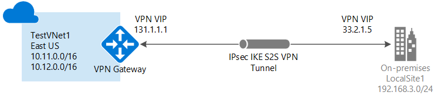

<properties
   pageTitle="建立與使用 Azure 傳統入口網站的網站-VPN 閘道連線的虛擬網路 |Microsoft Azure"
   description="使用跨內部部署 S2S VPN 閘道連線建立 VNet 和混合式組態使用傳統的部署模型。"
   services="vpn-gateway"
   documentationCenter=""
   authors="cherylmc"
   manager="carmonm"
   editor=""
   tags="azure-service-management"/>

<tags
   ms.service="vpn-gateway"
   ms.devlang="na"
   ms.topic="hero-article"
   ms.tgt_pltfrm="na"
   ms.workload="infrastructure-services"
   ms.date="10/14/2016"
   ms.author="cherylmc"/>

# 建立 VNet 使用 Azure 傳統入口網站的連線

> [AZURE.SELECTOR]
- [資源管理員-Azure 入口網站](vpn-gateway-howto-site-to-site-resource-manager-portal.md)
- [資源管理員-PowerShell](vpn-gateway-create-site-to-site-rm-powershell.md)
- [傳統-傳統入口網站](vpn-gateway-site-to-site-create.md)

本文會引導您建立虛擬網路和網站-VPN 閘道器連線到內部部署網路使用傳統的部署模型和 [傳統] 入口網站。 跨內部部署與混合式用於網站的連線設定。

### 部署模型和網站的連線的方法

[AZURE.INCLUDE [deployment models](../../includes/vpn-gateway-deployment-models-include.md)] 

下表顯示目前可用的部署模型和網站的網站設定的方法。 當有包含設定步驟的文章時，我們連結直接從這個資料表。

[AZURE.INCLUDE [vpn-gateway-table-site-to-site-table](../../includes/vpn-gateway-table-site-to-site-include.md)]

#### 其他設定 

如果您想要連接 VNets 在一起，請參閱[設定傳統部署模型 VNet-VNet 連線](virtual-networks-configure-vnet-to-vnet-connection.md)。 如果您想要新增至網站連線至 VNet 已有連線，請參閱[新增現有的 VPN 閘道器連線 VNet S2S 連線](vpn-gateway-multi-site.md)。
 
## 開始之前

確認您有下列項目，才能開始設定。

- 相容的 VPN 裝置，可以設定讓它的人。 請參閱[關於 VPN 裝置](vpn-gateway-about-vpn-devices.md)。 如果您不熟悉設定您要有 vpn 才能的裝置，或不熟悉 IP 位址範圍位於您的內部部署網路設定，您需要進行共同作業的人可以為您提供這些詳細資料。

- 對外公開 IP 位址 VPN 裝置。 Nat 找不到這個 IP 位址

- Azure 的訂閱。 如果您還沒有 Azure 的訂閱，您可以啟動您的[MSDN 訂閱者優惠](https://azure.microsoft.com/pricing/member-offers/msdn-benefits-details/)或註冊設定[免費的帳戶](https://azure.microsoft.com/pricing/free-trial/)。

## 建立虛擬網路

1. [Azure 傳統入口網站](https://manage.windowsazure.com/)登入。

2. 在螢幕的左下角，按一下 [**新增**]。 在功能窗格] 中按一下**網路服務**]，然後按一下 [**虛擬網路**。 按一下 [開始設定精靈的 [**建立自訂**]。

3. 若要建立您 VNet，請在下列頁面上輸入您設定的設定︰

## 虛擬網路詳細資料] 頁面

輸入下列資訊︰

- **名稱**︰ 虛擬網路的名稱。 例如， *EastUSVNet*。 當您部署您 Vm 和 PaaS 的執行個體，因此可能不想讓過於複雜的名稱，您會使用這個虛擬網路名稱。
- **位置**︰ 位置與直接相關，實體位置 （區域），您希望資源 (Vm) 所在的位置。 例如，如果您想 Vm 您部署實體位於*東亞美國*此虛擬網路時，選取該位置。 您無法變更建立後，您的虛擬網路與相關聯的區域。

## DNS 伺服器及 VPN 連線] 頁面

輸入下列資訊，，然後按一下 [上右下方的下一個箭號。

- **DNS 伺服器**︰ 輸入的 DNS 伺服器名稱及 IP 位址，或從快顯功能表中選取先前已註冊的 DNS 伺服器。 此設定不會建立 DNS 伺服器。 其可讓您指定您想要使用這個虛擬網路名稱解析 DNS 伺服器。
- **設定網站-VPN**︰**設定網站-VPN**選取核取方塊。
- **區域網路**︰ 區域網路代表您實體內部部署的位置。 您可以選取您先前已建立，區域網路或您可以建立新的本機網路。 不過，如果您選取要使用您先前建立的區域網路，請移至 [**區域網路**設定] 頁面，並確認 [VPN 裝置的 VPN 裝置 IP 位址 （公用具 IPv4 位址） 正確無誤。

## 連線至網站頁面

如果您要建立新的本機網路，您會看到 [**連線至網站**] 頁面。 如果您想要使用您先前建立的區域網路，此頁面將不會出現在精靈中，您可以移到下一節。

輸入下列資訊，，然後按一下 [下一步的箭號。

-   **名稱**︰ 您要撥打您的本機 （內部部署） 的名稱網路網站。
-   **VPN 裝置的 IP 位址**︰ 您用來連線到 Azure 的內部部署 VPN 裝置的公用具 IPv4 位址。 Nat 找不到的 VPN 裝置
-   **位址空間**︰ 包含啟動 IP 和 CIDR （地址計數）。 您指定 range(s) 您想要透過虛擬網路閘道器至您的本機內部部署位置傳送的地址。 如果目的地 IP 位址是由您在此處所指定的範圍之內，它被經由虛擬網路閘道器。
-   **新增地址空間**︰ 如果您有多個您想要透過虛擬網路閘道器傳送的位址範圍，指定每個額外的位址範圍。 您可以新增或移除**的區域網路**頁面上的更新版本的範圍。

## 虛擬網路位址空白頁面

指定您想要用於虛擬網路位址範圍。 這些是動態 IP 位址 (DIPS)，會指派 Vm 及其他您部署到這個虛擬網路的角色執行個體。

務必選取範圍不會重疊使用的用於您的內部網路的範圍。 您需要進行共同作業與您的網路系統管理員。 您的網路系統管理員可能需要設想的 IP 位址範圍從您的內部部署網路位址空間，讓您用於虛擬網路。

輸入下列資訊，，然後按一下 [設定您的網路右下的核取記號。

- **位址空間**︰ 包含啟動 IP 和地址計數。 請確認您所指定的地址空格不致重疊任何您在內部部署網路有位址空間。
- **新增子網路**︰ 包含啟動 IP 和地址計數。 其他的子網路且並非必要，但您可能會想要的靜態 DIPS Vm 建立不同的子網路。 要與其他角色執行個體是分開的子網路中有您 Vm 或者。
- **新增閘道器子網路**︰ 按一下以新增閘道器子網路。 閘道器子網路僅用於虛擬網路閘道器，此設定的需要。

按一下 [在頁面底部的核取記號，會開始建立您的虛擬網路。 完成之後，您會看到**建立**列出 [Azure 傳統入口網站中的 [**網路**] 頁面上的 [**狀態**] 下。 建立 VNet 之後，您可以然後設定您的虛擬網路閘道器。

[AZURE.INCLUDE [vpn-gateway-no-nsg](../../includes/vpn-gateway-no-nsg-include.md)] 

## 設定您的虛擬網路閘道器

設定虛擬網路閘道器至建立安全網站的連線。 請參閱[Azure 傳統入口網站中的虛擬網路閘道器設定](vpn-gateway-configure-vpn-gateway-mp.md)。

## 後續步驟

完成您的連線之後，您可以新增到您的虛擬網路的虛擬機器。 如需詳細資訊的[虛擬機器](https://azure.microsoft.com/documentation/services/virtual-machines/)文件，請參閱。
