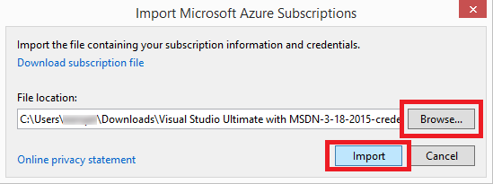

<properties 
   pageTitle="存取與 Visual Studio 私人 Azure 雲朵 |Microsoft Azure"
   description="瞭解如何使用 Visual Studio 存取私人雲端資源。"
   services="visual-studio-online"
   documentationCenter="na"
   authors="TomArcher"
   manager="douge"
   editor="" />
<tags 
   ms.service="multiple"
   ms.devlang="dotnet"
   ms.topic="article"
   ms.tgt_pltfrm="na"
   ms.workload="multiple"
   ms.date="08/15/2016"
   ms.author="tarcher" />

# 存取與 Visual Studio 私人 Azure 雲朵

##概觀

根據預設，Visual Studio 支援公用 Azure 雲端其餘結束點。 這可能是有問題，不過，如果您使用 Visual Studio 與私人 Azure 雲端。 若要設定 Visual Studio 存取私人 Azure 雲端其餘結束點，您可以使用的憑證。 您可以取得這些憑證透過 Azure 您發佈的設定檔。

## 若要存取私人的 Azure Visual Studio 中的雲端

1. 在[Azure 傳統入口網站](http://go.microsoft.com/fwlink/?LinkID=213885)的私人雲端，下載您發佈的設定檔，或連絡您的系統管理員以發佈設定檔。 公用版本上，連結以下載這是 azure 的[https://manage.windowsazure.com/publishsettings/](https://manage.windowsazure.com/publishsettings/)。 （您下載的檔案應該有.publishsettings 副檔名）。

1. 在 Visual Studio 中**伺服器總管**] 中，選擇**Azure**節點，然後在快顯功能表中，選擇 [**管理訂閱**] 命令。

    ![管理訂閱] 命令](./media/vs-azure-tools-access-private-azure-clouds-with-visual-studio/IC790778.png)

1. 在 [**管理 Microsoft Azure 訂閱**] 對話方塊中，選擇 [**憑證**] 索引標籤，然後選擇 [**匯入**] 按鈕。

    

1. 在 [**匯入 Microsoft Azure 訂閱**] 對話方塊中，瀏覽至資料夾位置儲存發佈設定檔案並選擇檔案]，然後選擇 [**匯入**] 按鈕。 這會匯入 Visual studio 發佈設定檔中的憑證 您現在應該可以與您私人雲端資源互動。

    

## 後續步驟

[從 Visual Studio 發佈至 Azure 雲端服務](https://msdn.microsoft.com/library/azure/ee460772.aspx)

[如何︰ 下載並匯入發佈設定及訂閱資訊](https://msdn.microsoft.com/library/dn385850(v=nav.70).aspx)

