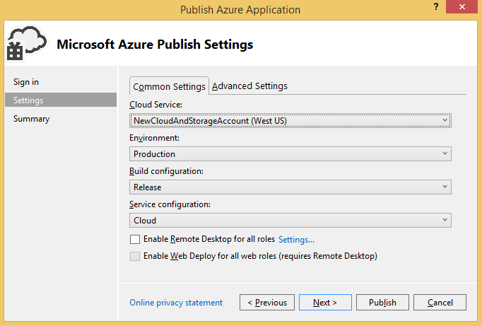

<properties
   pageTitle="準備發佈或部署從 Visual Studio Azure 應用程式 |Microsoft Azure"
   description="了解設定雲端和儲存帳戶服務，並設定 Azure 應用程式的程序。"
   services="visual-studio-online"
   documentationCenter="na"
   authors="TomArcher"
   manager="douge"
   editor="" />
<tags
   ms.service="multiple"
   ms.devlang="dotnet"
   ms.topic="article"
   ms.tgt_pltfrm="na"
   ms.workload="multiple"
   ms.date="08/15/2016"
   ms.author="tarcher" />

# 準備發佈或部署從 Visual Studio Azure 應用程式

## 概觀

您可以發佈雲端服務專案之前，您必須設定下列服務︰

- 若要執行您的角色 Azure 環境中的**雲端服務**

- **儲存帳戶**提供的存取權的 Blob 與佇列中，表格的服務。

若要設定這些服務，並設定您的應用程式中使用下列程序

## 建立雲端服務

若要發佈至 Azure 的雲端服務，您必須先建立雲端服務，Azure 的環境中執行您的角色。 **建立使用 Azure 傳統入口網站在雲端服務**，本主題稍後的一節所述，您可以在[Azure 傳統入口網站](http://go.microsoft.com/fwlink/?LinkID=213885)中，建立雲端服務。 您也可以在 Visual Studio 建立雲端服務，使用發佈精靈。

### 若要使用 Visual Studio 建立雲端服務

1. 開啟 Azure 專案的快顯功能表，然後選擇 [**發佈]**。

    

1. 如果您尚未登入，使用您的使用者名稱和密碼登入，Microsoft 帳戶或組織的 Azure 訂閱相關聯的帳戶。

1. 選擇 [**下一步**] 按鈕，移至 [**設定**] 頁面。

    

1. 在**雲端服務**] 清單中，選擇 [**建立新檔案**]。 **建立 Azure 服務**] 對話方塊隨即出現。

1. 輸入您的雲端服務的名稱。 名稱表單服務 URL 的一部分，因此必須是全域唯一。 名稱不區分大小寫。

### 若要使用 Azure 傳統入口網站建立雲端服務

1. 登入 Microsoft 網站上[Azure 傳統入口網站](http://go.microsoft.com/fwlink/?LinkId=253103)。

1. （選用）若要顯示您已建立的雲端服務的清單，選擇 [雲端服務上的 [連結左側的頁面]。

1. 選擇 [**+**中左下角的圖示角，]，然後選擇 [在隨後出現的功能表上的 [**雲端服務**。 兩個選項，**快速建立**和**自訂建立**另一個畫面會出現。 如果您選擇**快速建立**，您可以建立雲端服務，只要藉由指定 URL 和位置，將實際裝載的區域。 如果您選擇**自訂建立**，您可以立即發佈雲端服務，指定套件 （.cspkg 檔案）、 設定 (.cscfg) 檔案和憑證。 如果您想要發佈您的雲端服務 Azure 專案中使用 [**發佈**] 命令，自訂建立不需要。 Azure 專案的快顯功能表上，使用 [**發佈**] 命令。

1. 選擇 [**快速建立**使用 Visual Studio 發佈您的雲端服務]。

1. 指定您雲端服務的名稱。完整的 URL 名稱旁出現。

1. 在清單中，選擇 [大部分的使用者地區]。

1. 在視窗底部，選擇 [**建立雲端服務**的連結]。

## 建立儲存的帳戶

儲存帳戶提供存取 Blob 與佇列中，表格服務。 您可以建立儲存帳戶使用 Visual Studio 或[Azure 傳統入口網站](http://go.microsoft.com/fwlink/?LinkId=253103)。

### 若要使用 Visual Studio 建立儲存帳戶

1. 在**方案總管]**中，開啟 [**儲存**] 節點的快顯功能表，然後選擇**建立儲存帳戶**。

    

1. 選取或**建立儲存帳戶**] 對話方塊中輸入新的儲存空間帳戶的下列資訊。
    - 您要新增的儲存空間帳戶 Azure 訂閱。
    - 您想要使用的新儲存體帳戶名稱。
    - 區域或相關性群組 （例如西美國或中式地址）。
    - 您想要使用的儲存空間帳戶，例如地理重複試驗的類型。

1. 當您完成時，請選擇 [**建立**]。新的儲存空間帳戶會出現在**伺服器總管**] 中的 [**儲存**] 清單中。

### 若要建立儲存帳戶使用 Azure 傳統入口網站

1. 登入 Microsoft 網站上[Azure 傳統入口網站](http://go.microsoft.com/fwlink/?LinkId=253103)。

1. （選用）若要檢視您儲存的帳戶，請選擇 [在頁面左側面板中的 [**儲存**連結]。

1. 在頁面的左下角，選擇 [**+**圖示。

1. 在隨後出現的功能表，選擇 [**儲存**]，然後選擇**快速建立**。

1. 提供儲存帳戶的名稱會產生唯一的 url。

1. 為您的雲端服務的名稱。 完整的 URL 名稱旁出現。

1. 在清單中的區域，選擇您的使用者的大部分的所在位置的區域。

1. 指定您是否要啟用地理複寫。 如果您啟用地理複寫，資料會儲存在多個實體的位置，以減少遺失的可能性。 此功能可讓您儲存比較昂貴，但您可以藉由建立，而不是稍後新增功能的儲存空間帳戶時，啟用地理位置降低成本。 如需詳細資訊，請參閱[地理複寫](http://go.microsoft.com/fwlink/?LinkId=253108)。

1. 在視窗底部，選擇 [**建立儲存帳戶**連結]。

建立您儲存的帳戶後，您會看到您可以用來存取中每個 Azure 儲存服務，以及您的帳戶主要和次要便捷鍵的資源的 Url。 您可以使用這些按鍵來驗證所做的儲存空間服務的要求。

>[AZURE.NOTE] 第二個便捷鍵提供相同的存取您儲存的帳戶為主要便捷鍵，並產生當成備份您的主要便捷鍵會洩漏。 此外，建議您重新產生定期您便捷鍵。 您可以修改連線字串] 設定，若要使用的第二個機碼您重新產生的主索引鍵，然後您可以修改它在您重新產生的次要索引鍵的同時，使用重新產生的主索引鍵。

## 設定您的應用程式使用的儲存空間帳戶所提供的服務

您必須設定存取儲存服務使用 Azure 儲存服務您所建立的任何角色。 若要這麼做，您可以使用多個服務設定 Azure 專案。 根據預設，兩個中建立的 Azure 專案。 藉由使用多個服務設定，您可以在您的程式碼中使用相同的連接字串，但有連線字串的不同值中每個服務設定。 例如，您可以使用一個服務設定執行，以及偵錯本機使用 Azure 儲存模擬器應用程式及其他服務設定發佈 Azure 應用程式。 如需有關服務設定的詳細資訊，請參閱[設定您 Azure 專案使用多個服務設定](vs-azure-tools-multiple-services-project-configurations.md)。

### 若要使用的儲存空間帳戶提供的服務應用程式設定

1. 在 Visual Studio 中開啟您 Azure 的解決方案。 在方案總管中開啟 Azure 專案的存取儲存服務中的每一個角色的快顯功能表，然後選擇 [**內容]**。 使用該角色名稱的頁面會顯示在 Visual Studio 編輯器。 此頁面會顯示 [**設定**] 索引標籤的欄位。

1. 在 [角色屬性頁，選擇 [**設定**]。

1. 在 [**服務設定**] 清單中，選擇您想要編輯的服務設定的名稱。 如果您想要對此角色的服務設定的所有變更，您可以選擇**所有的設定**。  如需有關如何更新服務設定的詳細資訊，請參閱**管理儲存帳戶的連線字串**中的主題[設定 Visual Studio Azure 雲端服務的角色](vs-azure-tools-configure-roles-for-cloud-service.md)。

1. 若要修改連線字串的任何設定，請選擇 [ **...** 旁邊的設定] 按鈕。 **建立儲存連線字串**] 對話方塊隨即出現。

1. 在**使用連線**，請選擇 [**訂閱**] 選項。

1. 在**訂閱**清單中，選擇 [訂閱]。 如果訂閱清單不包含所要的項目，請選擇 [**下載發佈設定**連結]。

1. 在 [**帳戶名稱**] 清單中，選擇您儲存體帳戶名稱。 Azure 工具藉由使用.publishsettings 檔案，請以自動取得儲存帳戶認證。 若要手動指定您儲存的帳戶認證，請選擇**手動輸入認證**] 選項，然後再繼續執行此程序。 您可以從[Azure 傳統入口網站](http://go.microsoft.com/fwlink/p/?LinkID=213885)，取得您儲存體帳戶名稱和主索引鍵。 如果您不想要指定儲存空間帳戶設定] 以手動方式，選擇 [關閉] 對話方塊中的 [**確定**] 按鈕。

1. 選擇 [ **Enter 儲存帳戶**認證] 連結。

1. 在 [**帳戶名稱**] 方塊中，輸入您的儲存體帳戶名稱。

    >[AZURE.NOTE] 登入[Azure 傳統入口網站](http://go.microsoft.com/fwlink/?LinkID=213885)，然後選擇 [**儲存**] 按鈕。 入口網站中顯示儲存空間的帳戶的清單。 如果您選擇帳戶時，隨即會開啟該頁面。 您可以從這個頁面複製儲存體帳戶的名稱。 如果您使用的舊版的 [傳統] 入口網站，您儲存的帳戶的名稱會出現在**儲存帳戶**檢視。 複製此名稱，在此檢視中，[**內容**] 視窗中醒目提示，然後選擇 [Ctrl C 鍵。 若要將名稱貼到 Visual Studio 中，選擇**帳戶名稱**] 文字方塊，然後選擇 Ctrl + V 鍵。

1. 在**[帳戶金鑰]**方塊中，輸入您的主索引鍵，或複製並貼從[Azure 傳統入口網站](http://go.microsoft.com/fwlink/?LinkID=213885)。
    若要複製這個機碼︰

    1. 在適當的儲存帳戶的頁面底部，選擇 [**管理金鑰**] 按鈕。

    1. 在 [**管理按鍵存取**] 頁面選取的主索引便捷鍵，文字，然後選擇 Ctrl + C 鍵。

    1. 在 Azure 工具] 中，貼上到 [**帳戶金鑰**] 方塊的金鑰。

    1. 您必須選取下列選項，判斷服務會列印文件的存取，請儲存帳戶其中一項︰
        - **使用 HTTP**。 這是標準的選項。 例如， `http://<account name>.blob.core.windows.net`。
        - **使用 HTTPS**安全連線。 例如， `https://<accountname>.blob.core.windows.net`。
        - 三種服務的每個**指定自訂的結束點**。 然後您可以將這些端點輸入特定服務的欄位。

        >[AZURE.NOTE] 如果您建立自訂的結束點，您可以建立更複雜的連線字串。 當您使用此字串的格式時，您可以指定包含您已經註冊 Blob 服務您儲存帳戶的自訂網域名稱的儲存空間服務端點。 也可以授與存取只在單一容器透過共用的存取簽章的 blob 資源。 如需有關如何建立自訂的結束點的詳細資訊，請參閱[設定 Azure 儲存空間的連接字串](storage-configure-connection-string.md)。

1. 若要儲存這些連線字串的變更，選擇**[確定**] 按鈕，然後選擇工具列] 上的 [**儲存**] 按鈕。 您儲存這些變更之後，您可以在程式碼中取得此連線字串的值，使用[GetConfigurationSettingValue](https://msdn.microsoft.com/library/azure/microsoft.windowsazure.serviceruntime.roleenvironment.getconfigurationsettingvalue.aspx)項目。 當您發佈至 Azure 應用程式時，請選擇 [包含 Azure 儲存體帳戶的連線字串的服務設定]。 發佈您的應用程式之後，請確認 [應用程式運作正常 Azure 儲存服務

## 後續步驟

若要進一步瞭解從 Visual Studio Azure 發佈應用程式，請參閱[發佈使用 Azure 工具雲端服務](vs-azure-tools-publishing-a-cloud-service.md)。
