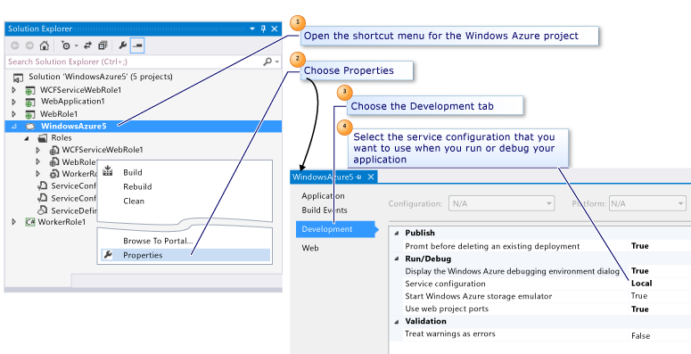

<properties
   pageTitle="設定 Visual Studio Azure 雲端服務專案 |Microsoft Azure"
   description="瞭解如何設定 Visual Studio 中，根據您的需求，該專案的 Azure 雲端服務的專案。"
   services="visual-studio-online"
   documentationCenter="na"
   authors="TomArcher"
   manager="douge"
   editor="" />
<tags
   ms.service="multiple"
   ms.devlang="dotnet"
   ms.topic="article"
   ms.tgt_pltfrm="na"
   ms.workload="multiple"
   ms.date="08/15/2016"
   ms.author="tarcher" />

# 設定 Visual Studio Azure 雲端服務的專案

您可以設定在 Azure 雲端服務的專案，根據您的需求的專案。 您可以設定下列類別的專案的屬性︰

- **將雲端服務發佈至 Azure**

  您可以設定的屬性，請確定沒有不小心刪除現有部署至 Azure 雲端服務。

- **執行或偵錯雲端服務的本機電腦上**

  您可以選取使用，並指出您是否要啟動 Azure 儲存模擬器服務設定。

- **當建立驗證雲端服務套件**

  您可以決定要讓您可以確定沒有任何問題，會部署雲端服務套件任何警告視為錯誤。 如果您部署，然後找出發生失敗，這會減少您等待的時間。

下圖示範如何使用當您執行或偵錯本機的雲端服務的設定。 下圖所示，您可以設定您需要從這個視窗中，專案屬性。

## 若要設定的 Azure 雲端服務的專案

1. 設定雲端服務專案**方案總管]**中的開啟雲端服務專案的快顯功能表，然後選擇 [**內容]**。

  使用雲端服務專案的名稱的頁面會顯示在 Visual Studio 編輯器。

1. 選擇 [**開發**] 索引標籤。

1. 若要確定您沒有不小心刪除 Azure 中的現有部署中的提示，然後才刪除現有的部署清單]，選擇 [ **True**]。

1. 若要選取的服務設定您想要使用當您執行或偵錯雲端服務，在 [**服務設定**] 清單中選擇 [服務設定]。

  >[AZURE.NOTE] 如果您想要建立服務設定使用，請參閱如何︰ 管理服務的安裝和設定。 如果您想要修改的角色服務設定，請參閱[如何設定 Visual Studio Azure 雲端服務的角色](vs-azure-tools-configure-roles-for-cloud-service.md)。

1. 若要啟動 Azure 儲存模擬器，當您執行，或在**啟動 Azure 儲存模擬器**中偵錯雲端服務，選擇 [ **True**]。

1. 若要確保您無法發佈是否有套件驗證錯誤，在**警告視為錯誤**，請選擇 [ **True**]。

1. 若要確定您的 web 角色使用相同的連接埠每次啟動本機的 IIS Express 中**使用 web 專案連接埠**，, 選擇 [ **True**]。 若要使用特定的連接埠特定 web 專案，開啟 web 專案的快顯功能表，選擇 [**屬性**] 索引標籤、 選擇 [**網站**] 索引標籤，然後變更**IIS Express** ] 區段中的**Project Url**設定的連接埠號碼。 例如，輸入`http://localhost:14020`為專案的 URL。

1. 若要儲存至雲端服務專案的屬性，您所做的任何變更，請選擇工具列上的 [**儲存**] 按鈕。

## 後續步驟

若要進一步瞭解如何在 Visual Studio 中設定 Azure 雲端服務專案，請參閱[使用多個服務設定的設定您的 Azure 專案](vs-azure-tools-multiple-services-project-configurations.md)。
