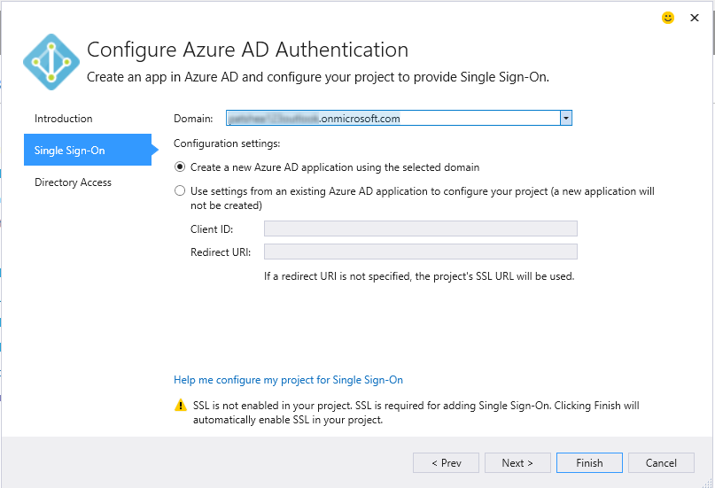

<properties 
   pageTitle="使用 Visual Studio 中的 [已連線服務新增 Azure Active Directory |Microsoft Azure"
   description="使用 Visual Studio 新增已連線服務] 對話方塊中新增 Azure Active Directory"
   services="visual-studio-online"
   documentationCenter="na"
   authors="TomArcher"
   manager="douge"
   editor="" />
<tags 
   ms.service="active-directory"
   ms.devlang="multiple"
   ms.topic="article"
   ms.tgt_pltfrm="na"
   ms.workload="na"
   ms.date="08/15/2016"
   ms.author="tarcher" />

# 使用 Visual Studio 中的 [已連線服務新增 Azure Active Directory 

##概觀
藉由使用 Azure Active Directory (Azure AD)，您可以 ASP.NET MVC web 應用程式，或在網頁 API 服務 AD 驗證支援單一登入 (SSO)。 Azure AD 驗證]，您的使用者可以使用自己的帳戶，從 Azure AD 連線到您的 web 應用程式。 Azure AD 驗證的 Web API 的優點包括增強型的資料的安全性，公開 API 從 web 應用程式時。 Azure AD，與您沒有管理自己的帳戶和使用者管理分隔驗證系統。

## 支援的專案類型

連線至 Azure AD 下列專案類型，您可以使用 [已連線服務] 對話方塊。

- ASP.NET MVC 專案

- ASP.NET Web API 專案

### 使用 [已連線服務] 對話方塊的 Azure ad 連線

1. 請確定您有 Azure 帳戶。 如果您沒有安裝 Azure 帳戶，您可以註冊[免費試用版](http://go.microsoft.com/fwlink/?LinkId=518146)。

1. 在 Visual Studio 中，開啟專案中的 [**參考**] 節點的快顯功能表，然後選擇 [**新增已連線服務**。
1. 選取 [ **Azure AD 驗證**]，然後選擇 [**設定**。

    

1. 在**設定 Azure AD 驗證**的第一個頁面上，核取**設定單一登入使用 Azure AD**。

    如果您的專案設定另一個驗證設定，則會精靈，警告您繼續將會停用先前的設定。

    

1.  在第二個頁面上，請從 [**網域**] 下拉式清單中選取網域。 包含列在 [帳戶設定] 對話方塊中的帳戶存取所有網域的網域清單。 或者，您可以輸入網域名稱，如果找不到您正在尋找的例如 mydomain.onmicrosoft.com 的項目。 您可以選擇建立新的選項 Azure AD 應用程式，或使用現有的 Azure AD 應用程式的設定。 

    

1. 在精靈的第三個頁面上，確定已核取**讀取目錄的資料**。 精靈會填入 [**用戶端 [私人**]。 

    

1. 選擇 [**完成**] 按鈕。 必要的設定代碼並啟用 Azure AD 驗證專案的參照，則會將] 對話方塊。 您可以在[Azure 入口網站](http://go.microsoft.com/fwlink/p/?LinkID=525040)，請參閱 AD 網域。

1. 檢閱，在下一個步驟，以瀏覽器中出現的快速入門頁面及有何改變頁面，請參閱如何修改您的專案。 如果您想要查看所有項目正常運作，開啟其中一個已修改的設定檔並確認有發生什麼事中所提及的設定。 例如，主要 web.config ASP.NET MVC 專案中的會有新增這些設定︰

        <appSettings> 
            <add key="ida:ClientId" value="ClientId from the new Azure AD App" />
            <add key="ida:AADInstance" value="https://login.windows.net/" />
            <add key="ida:Domain" value="Your selected domain" />
            <add key="ida:TenantId" value="The Id of your selected Azure AD Tenant" />
            <add key="ida:PostLogoutRedirectUri" value="The default redirect URI from the project" />
        </appSettings>

## 如何修改您的專案

當您執行精靈時，Visual Studio 新增 Azure AD 與專案的參照。 若要新增的 Azure AD 支援也修改設定檔和程式碼專案中的檔案。 Visual Studio 可讓您的特定修改專案類型而定。 如需如何修改 ASP.NET MVC 專案的詳細資訊，請參閱[什麼發生 – MVC 專案](http://go.microsoft.com/fwlink/p/?LinkID=513809)。 Web API 專案，請參閱[有何改變 – Web API 專案](http://go.microsoft.com/fwlink/p/?LinkId=513810)。

##後續步驟

提出問題並取得協助。

 - [MSDN 論壇︰ Azure AD](https://social.msdn.microsoft.com/forums/azure/home?forum=WindowsAzureAD)

 - [Azure AD 文件](https://azure.microsoft.com/documentation/services/active-directory/)

 - [Azure AD 的部落格文章︰ 簡介](http://blogs.msdn.com/b/brunoterkaly/archive/2014/03/03/introduction-to-windows-azure-active-directory.aspx)

