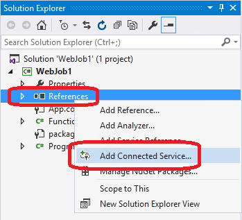

<properties 
   pageTitle="使用 Visual Studio 中的 [已連線服務新增 Azure 儲存體 |Microsoft Azure"
   description="使用 Visual Studio 新增已連線服務] 對話方塊，將 Azure 儲存空間新增至您的應用程式"
   services="visual-studio-online"
   documentationCenter="na"
   authors="TomArcher"
   manager="douge"
   editor="" />
<tags 
   ms.service="storage"
   ms.devlang="na"
   ms.topic="article"
   ms.tgt_pltfrm="na"
   ms.workload="na"
   ms.date="08/15/2016"
   ms.author="tarcher" />

# 使用 Visual Studio 已連線服務新增 Azure 儲存體

## 概觀

與 Visual Studio 2015，您可以連線任何 C# 雲端服務、.NET 後端行動訊息服務、 ASP.NET 網站或服務、 ASP.NET 5 服務或 Azure WebJob 服務至 Azure 儲存體藉由**新增已連線服務**] 對話方塊。 已連線的服務功能加入所有需要的參考和連線的程式碼，並會適當地修改您的設定檔。 對話方塊也會帶您到文件，會告訴您的下一個步驟是開始 blob 儲存體、 佇列和表格。

## 支援的專案類型

您可以使用 [已連線服務] 對話方塊中的下列專案類型連線至 Azure 儲存體。

- ASP.NET Web 專案

- ASP.NET 5 專案

- .NET 雲端服務 Web 角色和工作者角色專案

- .NET 行動服務專案

- Azure WebJob 專案

## 連線至 Azure 儲存體使用 [已連線服務] 對話方塊

1. 請確定您有 Azure 帳戶。 如果您沒有安裝 Azure 帳戶，您可以註冊[免費試用版](http://go.microsoft.com/fwlink/?LinkId=518146)。 Azure 帳戶之後，您可以建立儲存帳戶、 建立行動裝置的服務，並設定 Azure Active Directory。

1. Visual Studio 中開啟專案，在方案總管中開啟 [**參考**] 節點的操作功能表，然後選擇**新增連線的服務**。

    

1. 在 [**新增連線服務**] 對話方塊中，選擇**Azure 儲存體**]，然後選擇 [**設定**] 按鈕。 您可能會提示您登入 Azure，如果您還沒有這麼做。

    ![新增連線服務] 對話方塊的 [儲存空間](./media/vs-azure-tools-connected-services-storage/IC796703.png)

1. 在**Azure 儲存體**] 對話方塊中，選取現有的儲存空間帳戶，然後選取 [**新增**]。

    如果您要建立新的儲存空間帳戶，請移至下一個步驟。 否則，請跳至步驟 6。

    ![Azure 儲存體] 對話方塊](./media/vs-azure-tools-connected-services-storage/IC796704.png)

1. 若要建立新的儲存空間帳戶︰ 

    1. 選擇 [**建立新的儲存空間帳戶**] 按鈕，底部的 [Azure 儲存體] 對話方塊。

    1. 填寫 [**建立儲存帳戶**] 對話方塊，然後選擇 [**建立**] 按鈕。
    
        ![Azure 儲存體] 對話方塊](./media/vs-azure-tools-connected-services-storage/create-storage-account.png)

        當您再次**Azure 儲存體**] 對話方塊中時，新的儲存空間出現在清單中。

    1. 在清單中，選取新的儲存空間，然後選取 [**新增**]。

1. 儲存已連線服務會出現 [WebJob 專案服務參考節點。

    

1. 檢閱會出現 [快速入門] 頁面，並了解如何修改您的專案。 每當您新增連線的服務，快速入門] 頁面會顯示在瀏覽器。 您可以檢閱建議的後續步驟和程式碼範例，或切換到有何改變頁面，請參閱什麼參照已新增至您的專案，以及如何修改您的程式碼和設定檔案。

## 如何修改您的專案

當您完成對話方塊時，Visual Studio 新增參照，並修改設定的特定檔案。 特定變更專案類型而定。 

 - ASP.NET 專案，請參閱[有何改變 – ASP.NET 專案](http://go.microsoft.com/fwlink/p/?LinkId=513126)。 
 - ASP.NET 5 專案，請參閱[有何改變 – ASP.NET 5 專案](http://go.microsoft.com/fwlink/p/?LinkId=513124)。 
 - 雲端服務專案 （web 角色及工作角色），請參閱[有何改變 – 雲端服務的專案](http://go.microsoft.com/fwlink/p/?LinkId=516965)。 
 - WebJob 專案，請參閱[有何改變-WebJob 專案](./storage/vs-storage-webjobs-what-happened.md)。

## 後續步驟

1. 使用輔助線的快速入門的程式碼範例，建立您要的儲存空間的類型，並開始撰寫程式碼，以存取您儲存的帳戶 ！

1. 提出問題並取得說明
     - [MSDN 論壇︰ Azure 儲存體](https://social.msdn.microsoft.com/forums/azure/home?forum=windowsazuredata)

     - [Azure 儲存體小組部落格](http://blogs.msdn.com/b/windowsazurestorage/)

     - [Azure.microsoft.com 儲存空間](https://azure.microsoft.com/services/storage/)

     - [Azure.microsoft.com 儲存文件](https://azure.microsoft.com/documentation/services/storage/)

