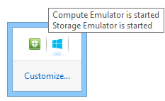

<properties 
    pageTitle="Azure 雲端服務或 Visual Studio 中的虛擬機器偵錯 |Microsoft Azure"
    description="偵錯雲端服務或 Visual Studio 中的虛擬機器"
    services="visual-studio-online"
    documentationCenter="na"
    authors="TomArcher"
    manager="douge"
    editor="" />
<tags 
    ms.service="visual-studio-online"
    ms.devlang="multiple"
    ms.topic="article"
    ms.tgt_pltfrm="multiple"
    ms.workload="na"
    ms.date="08/15/2016"
    ms.author="tarcher" />

# Azure 雲端服務或 Visual Studio 中的虛擬機器偵錯

Visual Studio 可讓您偵錯 Azure 雲端服務與虛擬機器不同的選項。

## 為您的雲端服務，在您的本機電腦上的偵錯

您可以節省時間，並使用 Azure 金錢計算模擬器偵錯您在本機電腦上的雲端服務。 本機偵錯服務時，才能將其部署中，您可以改善可靠性和效能不支付計算時間。 不過，一些可能會發生錯誤只有當您執行雲端服務中 Azure 本身。 如果您啟用遠端偵錯發佈您的服務，然後再將偵錯工具附加至角色執行個體，您可以偵錯這些錯誤。

模擬器模擬計算 Azure 服務，並執行您的本機環境中，使您可以測試偵錯雲端服務，再將其部署。 模擬器控點的生命週期的角色執行個體，並提供存取模擬的資源，例如本機的儲存空間。 當您偵錯，或從 Visual Studio 執行您的服務時，它會自動啟動模擬器，做為背景的應用程式，然後模擬器部署您的服務。 若要檢視您的服務，在本機的環境中執行時，您可以使用模擬器。 您可以執行完整版本或模擬器快速版本。 （從 Azure 2.3 開始，快速模擬器版本是預設值）。請參閱[使用模擬器 Express 執行和偵錯本機雲端服務](https://msdn.microsoft.com/library/dn339018.aspx)。

### 若要為您的雲端服務，在您的本機電腦上的偵錯

1. 在功能表列中，選擇 [**偵錯**，**啟動偵錯**執行 Azure 雲端服務專案。 或者，您可以按 F5。 您會看到一則訊息，開始計算模擬器。 模擬器啟動時，系統匣圖示可確認它。

    

1. 計算模擬器中顯示的使用者介面的通知區域中，開啟 [Azure] 圖示的快顯功能表，然後選取 [**顯示計算模擬器 ui**。

    UI 的左的窗格會顯示目前已部署至計算模擬器和角色執行個體執行每個服務的服務。 您可以選擇的服務或顯示生命週期、 記錄及診斷資訊在右窗格中的角色。 如果您將焦點放在包含視窗的上方邊界時，它會展開以填滿右窗格中。

1. 您可以選取**偵錯**] 功能表上的命令，在程式碼中設定中斷點步驟透過應用程式。 逐步執行偵錯工具中的應用程式，應用程式的目前狀態會更新窗格。 當您停止偵錯時，會刪除應用程式部署。如果您的應用程式包含網頁角色，而且您已設定開始的網頁瀏覽器的 [啟動巨集指令] 屬性，Visual Studio 會在瀏覽器中啟動 web 應用程式。如果您要變更的服務設定的角色的執行個體數目，您必須停止雲端服務，然後重新 [偵錯，好讓您可以偵錯這些新的執行個體的角色。

    **附註︰**當您停止執行或偵錯時，您的服務時，無法停止本機計算模擬器] 和 [儲存模擬器。 您必須防止這些明確通知區域。

## 偵錯 Azure 中的雲端服務

若要偵錯遠端電腦的雲端服務，您必須啟用該功能明確當您部署您的雲端服務，以便所需執行角色執行個體虛擬機器上已安裝的服務 (例如 msvsmon.exe)。 如果您未啟用遠端偵錯發佈服務時，您必須啟用遠端偵錯發佈服務。

如果您啟用遠端偵錯的雲端服務，它不會表現降級的效能或造成其他的費用。 您不應使用遠端偵錯生產服務，因為客戶使用服務可能會影響。

>[AZURE.NOTE] 當您發佈的 Visual Studio 雲端服務時，您可以啟用**IntelliTrace**的任何角色該服務的.NET Framework 4 或.NET Framework 4.5 目標。 藉由使用**IntelliTrace**，您可以檢查過去的角色執行個體中發生的事件，然後重新從該時間的內容。 請參閱[偵錯 IntelliTrace 與 Visual Studio 已發佈的雲端服務](http://go.microsoft.com/fwlink/?LinkID=623016)，以及[使用 IntelliTrace](https://msdn.microsoft.com/library/dd264915.aspx)。

### 若要啟用遠端偵錯的雲端服務

1. 開啟 Azure 專案的快顯功能表，然後選取 [**發佈]**。

1. 選取 [**臨時**環境和**偵錯**設定]。

    這是的指導方針。 您可以選擇生產環境中執行您測試環境。 不過，您可能會影響使用者如果您啟用遠端偵錯生產環境。 您可以選擇的發行版本設定，但是偵錯組態偵錯更容易。

    

1. 按照平常的步驟，但選取 [**進階設定**] 索引標籤上的 [**啟用遠端偵錯工具的所有角色**] 核取方塊。

    

### 若要將偵錯工具附加到雲端服務中 Azure

1. 在 [伺服器總管展開節點雲端服務。

1. 開啟您要附加的檔案，角色執行個體的角色的快顯功能表，然後選取 [**附加偵錯工具**。

    如果您偵錯角色，Visual Studio 偵錯工具附加至該角色的每個執行個體。 偵錯工具會在第一個角色執行個體的執行那一行程式碼，符合該中斷點的任何條件中斷點中斷。 如果您偵錯執行個體，只有該執行個體和線中斷點的特定的執行個體執行那一行程式碼，符合中斷點的條件時，才偵錯工具附加。

    

1. 偵錯工具附加至執行個體，偵錯像往常一樣。偵錯工具會自動附加至您的角色適當主機處理程序。 根據角色是什麼，偵錯工具將附加至 w3wp.exe、 WaWorkerHost.exe 或 WaIISHost.exe。 若要確認要附加偵錯工具的程序，請展開伺服器總管] 中的執行個體節點。 如需有關 Azure 程序，請參閱[Azure 角色架構](http://blogs.msdn.com/b/kwill/archive/2011/05/05/windows-azure-role-architecture.aspx)。

    ![選取 [程式碼 [類型] 對話方塊](./media/vs-azure-tools-debug-cloud-services-virtual-machines/IC718346.png)

1. 若要識別要附加偵錯工具的處理程序，請開啟 [處理程序] 對話方塊，在功能表列，選擇 [偵錯、 Windows、 程序。 (鍵盤︰ Ctrl + Alt + Z)中斷連結特定的程序，開啟捷徑功能表，然後按一下**卸離的程序**。 或者，找出執行個體節點伺服器總管] 中，尋找程序、 開啟其快顯功能表，，然後選取**卸離的程序**。

    

>[AZURE.WARNING] 避免在中斷點時遠端長停駐點偵錯。 Azure 將會停止超過為短時間無反應幾分鐘的時間，而停止傳送流量的執行個體的程序。 如果您停止的時間太長，msvsmon.exe 中斷連結程序。

若要在執行個體或角色分離所有處理程序偵錯工具，開啟您正在偵錯的執行個體的角色的快顯功能表，然後選取**卸離偵錯工具**。

## 遠端偵錯 Azure 中的限制

從 Azure SDK 2.3 遠端偵錯有以下的限制。

- 遠端啟用偵錯，您無法發佈雲端服務中的任何的角色具有 25 個以上的執行個體。

- 偵錯工具使用連接埠 30400 至 30424 31400 至 31424 與 32400 至 32424。 如果您嘗試使用任何這些連接埠，您將無法發佈您的服務，其中一個下列錯誤訊息會出現在活動記錄中的 Azure: 

    - 驗證對.csdef 檔.cscfg 檔案時發生錯誤。 
    保留連接埠範圍 '範圍' 端點 Microsoft.WindowsAzure.Plugins.RemoteDebugger.Connector 的角色 」 角色' 和重疊的已定義的連接埠或範圍。
    - 配置失敗。 請稍後再試，請嘗試減少的虛擬記憶體大小或數量角色執行個體，或嘗試部署至不同的區域。

## 偵錯 Azure 虛擬機器

您可以偵錯 Visual Studio 中使用伺服器總管 Azure 虛擬機器上執行的程式。 當您啟用遠端偵錯 Azure 虛擬機器上時，Azure 的虛擬機器上安裝遠端偵錯副檔名。 然後，您可以附加至虛擬機器上的程序，並偵錯像平常一樣。

>[AZURE.NOTE] 建立透過 Azure 資源管理員堆疊的虛擬機器才能進行遠端偵錯在 Visual Studio 2015 中使用雲端檔案總管。 如需詳細資訊，請參閱[管理 Azure 資源雲端的檔案總管](http://go.microsoft.com/fwlink/?LinkId=623031)。

### 若要偵錯 Azure 虛擬機器

1. 在 [伺服器總管展開虛擬機器節點並選取您要偵錯虛擬機器中的節點。

1. 開啟快顯功能表，然後選取 [**啟用偵錯**。 當系統詢問您是否確定如果您想要啟用偵錯虛擬機器上，選取 [**是**]。

    Azure 虛擬機器啟用偵錯上安裝遠端偵錯副檔名。

    ![虛擬機器啟用偵錯] 命令](./media/vs-azure-tools-debug-cloud-services-virtual-machines/IC746720.png)

    

1. 遠端偵錯的副檔名] 完成安裝之後，開啟虛擬機器的快顯功能表，然後選取 [**附加偵錯工具...**

    Azure 虛擬機器上取得處理程序的清單，並顯示其在 [附加至程序] 對話方塊。

    ![附加偵錯工具] 命令](./media/vs-azure-tools-debug-cloud-services-virtual-machines/IC746722.png)

1. 在 [**附加至程序**] 對話方塊中，選取 [**選取**要限制只顯示您想要偵錯的程式碼的類型的 [結果] 清單。 您可以偵錯 32 或 64 位元 managed 程式碼、 原生的程式碼，或兩者。

    ![選取 [程式碼 [類型] 對話方塊](./media/vs-azure-tools-debug-cloud-services-virtual-machines/IC718346.png)

1. 選取您想要在虛擬機器上偵錯]，然後選取 [**附加**的處理程序。 例如，您可以選擇 w3wp.exe 程序，如果您想要偵錯虛擬機器上的在 web 應用程式。 如需詳細資訊，請參閱偵錯的[一或多個程序，在 Visual Studio](https://msdn.microsoft.com/library/jj919165.aspx)和[Azure 角色架構](http://blogs.msdn.com/b/kwill/archive/2011/05/05/windows-azure-role-architecture.aspx)。

## 建立 web 專案及偵錯虛擬機器

Azure 專案之前，您可能會發現的支援偵錯和測試案例中，而且您可以在此安裝測試和監視程式所包含的環境中測試它。 若要執行此動作的其中一個方法是從遠端偵錯虛擬機器應用程式。

Visual Studio ASP.NET 專案會提供選項，以便建立方便的虛擬機器您可以用來測試應用程式。 虛擬機器包含例如 PowerShell、 遠端桌面，然後 WebDeploy 經常所需的結束點。

### 若要建立 web 專案和偵錯虛擬機器

1. 在 Visual Studio 中，建立新的 ASP.NET Web 應用程式。

1. 在 [新的 ASP.NET 專案] 對話方塊中 Azure] 區段中，選擇 [**虛擬機器**中的下拉式清單方塊]。 將選取的 [**建立遠端資源**] 核取方塊。 選取**[確定**] 以繼續進行。

    [**建立 Azure 虛擬機器**] 對話方塊隨即出現。

    ![建立 ASP.NET web 專案] 對話方塊](./media/vs-azure-tools-debug-cloud-services-virtual-machines/IC746723.png)

    **附註︰**系統會要求您如果您沒有登入 Azure 帳戶登入。

1. 選取虛擬機器各項設定，然後再選取**[確定**]。 如需詳細資訊，請參閱[虛擬機器]( http://go.microsoft.com/fwlink/?LinkId=623033)。

    您的 DNS 名稱輸入的名稱會虛擬機器的名稱。 

    ![Azure] 對話方塊上建立虛擬機器](./media/vs-azure-tools-debug-cloud-services-virtual-machines/IC746724.png)

    Azure 虛擬機器然後之條款所建立並設定端點，例如遠端桌面和 Web 部署

1. 虛擬機器完全設定之後，請伺服器總管] 中選取虛擬機器中的節點。

1. 開啟快顯功能表，然後選取 [**啟用偵錯**。 當系統詢問您是否確定如果您想要啟用偵錯虛擬機器上，選取 [**是**]。 

    Azure 虛擬機器啟用偵錯安裝遠端偵錯副檔名。

    ![虛擬機器啟用偵錯] 命令](./media/vs-azure-tools-debug-cloud-services-virtual-machines/IC746720.png)

    

1. 發佈專案中所述[如何︰ 部署 Web 專案使用一-按一下 [發佈] 在 Visual Studio](https://msdn.microsoft.com/library/dd465337.aspx)。 因為您想要偵錯虛擬機器，在**發佈網站**在精靈的 [**設定**] 頁面上選取 [設定為 [**偵錯**]。 這可確保程式碼符號會出現在偵錯時。

    

1. 在**檔案發佈選項**中，選取 [**移除目的地的其他檔案**如果專案已部署在較早的時間。

1. 發佈專案，在 [伺服器總管虛擬機器的快顯功能表上之後選取**附加偵錯工具...**

    Azure 虛擬機器上取得處理程序的清單，並顯示其在 [附加至程序] 對話方塊。

    ![附加偵錯工具] 命令](./media/vs-azure-tools-debug-cloud-services-virtual-machines/IC746722.png)

1. 在 [**附加至程序**] 對話方塊中，選取 [**選取**要限制只顯示您想要偵錯的程式碼的類型的 [結果] 清單。 您可以偵錯 32 或 64 位元 managed 程式碼、 原生的程式碼，或兩者。

    ![選取 [程式碼 [類型] 對話方塊](./media/vs-azure-tools-debug-cloud-services-virtual-machines/IC718346.png)

1. 選取您想要在虛擬機器上偵錯]，然後選取 [**附加**的處理程序。 例如，您可以選擇 w3wp.exe 程序，如果您想要偵錯虛擬機器上的在 web 應用程式。 如需詳細資訊，請參閱[偵錯一或多個 Visual Studio 中的程序](https://msdn.microsoft.com/library/jj919165.aspx)。

## 後續步驟

- 使用**Intellitrace**收集發行伺服器的電話和事件記錄檔。 請參閱[偵錯 IntelliTrace 與 Visual Studio 已發佈的雲端服務](http://go.microsoft.com/fwlink/?LinkID=623016)。
- 使用**Azure 診斷**記錄從角色中執行的程式碼的詳細的資訊，是否開發環境中或 Azure 中執行的角色。 請參閱[收集的資料使用 Azure 診斷記錄](http://go.microsoft.com/fwlink/p/?LinkId=400450)。
