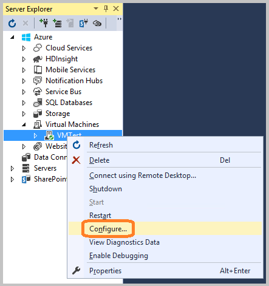
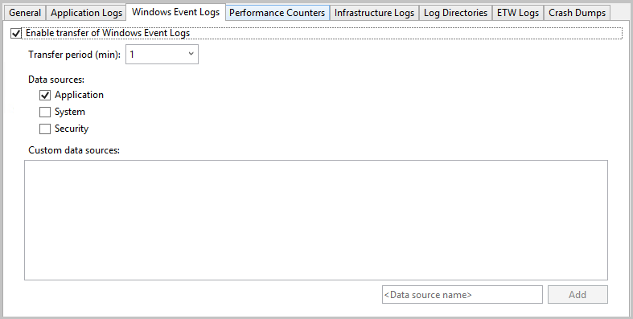

<properties
   pageTitle="設定診斷 Azure 雲端服務和虛擬機器 |Microsoft Azure"
   description="說明如何設定的偵錯 Azure cloude 服務和 Visual Studio 中的虛擬機器 (Vm) 的診斷資訊。"
   services="visual-studio-online"
   documentationCenter="na"
   authors="TomArcher"
   manager="douge"
   editor="" />
<tags
   ms.service="multiple"
   ms.devlang="dotnet"
   ms.topic="article"
   ms.tgt_pltfrm="na"
   ms.workload="multiple"
   ms.date="08/15/2016"
   ms.author="tarcher" />

# <a name="configuring-diagnostics-for-azure-cloud-services-and-virtual-machines"></a>設定診斷 Azure 雲端服務和虛擬機器

當您需要疑難排解 Azure 雲端服務或 Azure 虛擬機器時，您可以使用 Visual Studio 更輕鬆地設定 Azure 診斷。 Azure 診斷擷取系統和記錄的虛擬機器及執行您的雲端服務的虛擬機器執行個體上的資料，並將該資料轉至您所選擇的儲存空間帳戶。 如需診斷記錄 Azure 中的相關資訊，請參閱[啟用診斷記錄 Azure 應用程式服務中的 web 應用程式](./app-service-web/web-sites-enable-diagnostic-log.md)。

本主題說明如何啟用和設定 Azure 診斷在 Visual Studio 中，同時之前和之後的部署，以及 Azure 虛擬機器中。 它也會顯示如何選取收集的診斷資訊的類型，以及如何檢視後，會收集的資訊。

您可以透過下列方式來設定 Azure 診斷︰

- 您可以變更診斷程式設定的設定透過 Visual Studio 中的 [**診斷設定**] 對話方塊。 設定會儲存在名 diagnostics.wadcfgx (diagnostics.wadcfg 中 Azure SDK 2.4 或更舊版本) 的檔案。 或者，您可以直接修改設定檔。 如果您手動更新檔案時，設定變更生效下一次部署雲端至 Azure 服務，或在模擬器中執行服務。

- 使用**雲端的檔案總管**] 或 [**伺服器總管**Visual Studio 來變更執行雲端服務的虛擬機器診斷程式設定。

## <a name="azure-26-diagnostics-changes"></a>Azure 2.6 診斷變更

在 Visual Studio 中 Azure SDK 2.6 專案，下列進行變更。 （這些變更也適用於較新版本的 Azure SDK。）

- 本機模擬器現在支援診斷。 這表示您可以收集診斷資料，並確保您的應用程式時您是開發及測試 Visual Studio 中建立的右追蹤。 連接字串`UseDevelopmentStorage=true`啟用診斷資料集合，當您執行的雲端服務專案 Visual Studio 中使用 Azure 儲存模擬器。 在 （開發儲存區） 儲存帳戶收集所有診斷資料。

- 診斷儲存帳戶連線字串 (Microsoft.WindowsAzure.Plugins.Diagnostics.ConnectionString) 會再次儲存於 [服務設定 (.cscfg) 檔案。 Azure SDK 2.5 中 diagnostics.wadcfgx 檔案中指定的診斷儲存帳戶。

有的連接字串的處理方式在 Azure SDK 2.4 及舊版和其如何運作在 Azure SDK 2.6 及更新版本的一些主要差異。

- 在 Azure SDK 2.4 及更早版本，連接字串作為執行階段診斷外掛程式取得轉接診斷記錄儲存帳戶資訊。

- 在 Azure SDK 2.6 及更新版本，診斷連線字串使用 Visual Studio 來設定診斷副檔名發行期間的適當的儲存帳戶資訊。 連接字串，可讓您定義不同的儲存為不同的服務設定 Visual Studio 用來發佈的帳戶。 不過，因為 （後 Azure SDK 2.5) 已不再提供診斷外掛程式，單獨.cscfg 檔案無法啟用診斷副檔名。 您必須啟用分別透過工具，例如 Visual Studio 或 PowerShell 副檔名。

- 若要簡化透過 PowerShell 設定診斷副檔名的程序，Visual Studio 封裝的輸出也包含公用設定 XML 針對每一個角色的診斷副檔名。 Visual Studio 會使用的診斷連接字串來填入公用設定中的儲存空間帳戶資訊。 公用設定檔案會建立在 [延伸] 資料夾，然後依照 PaaSDiagnostics 的模式。&lt;角色名稱 >。PubConfig.xml。 任何 PowerShell 基礎部署可以使用這個模式對應至角色的每個設定。

- [Azure 入口網站](http://go.microsoft.com/fwlink/p/?LinkID=525040)也使用.cscfg 檔案中的連接字串來存取診斷資料，讓它可以出現在**監視**] 索引標籤。 若要設定顯示在入口網站的詳細資訊的監控資料服務需要連線字串。

## <a name="migrating-projects-to-azure-sdk-26-and-later"></a>移轉至 Azure SDK 2.6 及更新版本中的專案

時從 Azure SDK 2.5 Azure SDK 2.6 或更新版本、 升級，如果您有.wadcfgx 檔案中所指定的診斷儲存帳戶，然後將其會留在那裡。 若要利用使用不同的儲存設定不同的儲存帳戶的彈性，您必須手動新增至專案的 [連線字串。 如果您在從 Azure SDK 2.4 或更舊版本 Azure SDK 2.6 遷移專案，會保留診斷連接字串。 不過，請注意如何連接字串會被視為 Azure SDK 2.6 中指定前一節中的變更。

### <a name="how-visual-studio-determines-the-diagnostics-storage-account"></a>Visual Studio 如何判斷診斷儲存帳戶

- 如果.cscfg 檔案中指定診斷連線字串，則 Visual Studio 會用它來設定診斷分機號碼，發佈時，與期間包裝產生公用設定 xml 檔案時。

- 如果沒有診斷連接字串指定.cscfg 檔案中，然後 Visual Studio 回到使用.wadcfgx 檔案中所指定的儲存空間帳戶設定診斷副檔名為發佈，並產生公用設定 xml 檔案時包裝。

- 診斷連接字串.cscfg 檔案中的優先於.wadcfgx 檔案中的儲存空間帳戶。 如果.cscfg 檔案中指定診斷連線字串，則 Visual Studio 就會使用的檔案，並忽略.wadcfgx 中的儲存空間帳戶中。

### <a name="what-does-the-update-development-storage-connection-strings-checkbox-do"></a>「 更新開發儲存空間的連接字串...」 功能 核取方塊嗎？

**更新開發儲存空間的診斷與使用 Microsoft Azure 儲存體帳戶認證在發行到 Microsoft Azure 快取的連接字串**] 核取方塊可讓您方便的方式來發佈期間所指定的 Azure 儲存體帳戶以更新任何開發儲存帳戶的連線字串。

例如，假設您選取此核取方塊，並診斷連線字串指定`UseDevelopmentStorage=true`。 當您將專案發佈至 Azure 時，Visual Studio 會自動與您在 [發佈] 精靈中指定的儲存空間帳戶更新診斷連線字串。 不過，如果真實儲存體帳戶已指定為診斷連線字串，然後該帳戶會使用。

## <a name="diagnostics-functionality-differences-between-azure-sdk-24-and-earlier-and-azure-sdk-25-and-later"></a>診斷 Azure SDK 2.4 與先前和 Azure SDK 2.5 及更新版本之間的功能差異

如果您從 Azure SDK 2.4 至 Azure SDK 2.5 或更新版本升級您的專案，您應該謹記下列診斷程式的功能差異。

- **設定 Api 已遭取代**– 診斷程式設定用於 Azure SDK 2.4 或舊版中，但功能已遭取代在 Azure SDK 2.5 及更新版本。 如果您的診斷設定目前定義在程式碼，必須重新設定在移轉專案中的 [診斷從頭這些設定，以繼續工作。 Azure SDK 2.4 的診斷設定檔是 diagnostics.wadcfg，與 diagnostics.wadcfgx Azure SDK 2.5 或更新版本。

- **診斷雲端服務應用程式只能在角色層級，不在執行個體層級設定。**

- **每當您部署應用程式，更新診斷設定**– 如果您從伺服器總管變更診斷設定，然後重新部署您的應用程式，這可能會導致不一致性致歉問題。

- **設定中 Azure SDK 2.5 及更新版本、 當機傾印在診斷設定檔中，不在程式碼**– 如果您有損毀傾印設定程式碼中，您必須以手動方式傳輸設定程式碼的設定檔中，因為損毀傾印不會移轉過程傳輸至 Azure SDK 2.6。

## <a name="enable-diagnostics-in-cloud-service-projects-before-deploying-them"></a>部署之前啟用診斷在雲端服務的專案

在 Visual Studio 中，您可以選擇收集診斷資料，當您在模擬器中執行服務部署之前執行 Azure 中的角色。 在 Visual Studio 診斷程式設定的所有變更會都儲存在 diagnostics.wadcfgx 設定檔。 這些設定的設定指定儲存帳戶診斷資料儲存在部署您的雲端服務。

### <a name="to-enable-diagnostics-in-visual-studio-before-deployment"></a>若要啟用診斷程式 Visual Studio 中的部署之前

1. 在您感興趣的角色的快顯功能表，選擇 [**內容**]，然後選擇 [**設定**] 索引標籤角色的 [**屬性**] 視窗中。

1. 在 [**診斷**] 區段中，請確定已選取 [**啟用診斷**] 核取方塊。

    ![存取 [啟用診斷] 選項](./media/vs-azure-tools-diagnostics-for-cloud-services-and-virtual-machines/IC796660.png)

1. 選擇省略符號 （...）] 按鈕，以指定您要儲存的診斷資料的儲存空間帳戶。 您選擇的儲存空間帳戶會儲存診斷資料的位置。

    

1. 在 [**建立儲存連線字串**] 對話方塊中，指定您是否要連接使用 Azure 儲存模擬器 Azure 的訂閱，或手動輸入認證。

    ![儲存帳戶] 對話方塊](./media/vs-azure-tools-diagnostics-for-cloud-services-and-virtual-machines/IC796662.png)

  - 如果您選擇的 Microsoft Azure 儲存模擬器] 選項，[連線字串是設定為 [UseDevelopmentStorage = true。

  - 如果您選擇您訂閱的選項，您可以選擇您想要使用的 Azure 訂閱和帳戶名稱。 您可以選擇 [管理帳戶] 按鈕，來管理您的 Azure 訂閱。

  - 如果您選擇 [手動輸入的認證] 選項時，系統提示您輸入 [名稱] 和 [索引鍵，您想要使用的 Azure 帳戶。

1. 選擇 [**設定**] 按鈕，檢視 [**診斷設定**] 對話方塊。 每個索引標籤 （除了**一般**和**記錄目錄**） 代表您可以收集診斷的資料來源。 [預設] 索引標籤**一般**，提供下列診斷資料集合選項︰**只錯誤**、**所有資訊**，以及**自訂計劃**。 [預設] 選項，**只錯誤**，因為它不會傳送警告或追蹤訊息，會最少的儲存空間量。 所有的 [資訊] 選項傳送大部分的資訊，因此，儲存而言最高的選項。

    

1. 此範例中，選取**自訂計劃**] 選項，讓您可以自訂收集的資料。

1. [ **Mb 的配額**] 方塊中指定要配置儲存帳戶中的診斷資料的空間。 如果您想要您可以變更預設值。

1. 診斷您想要的資料收集每個索引標籤，選取其**啟用傳輸的<log type>**] 核取方塊。 例如，如果您想要收集應用程式的記錄，選取 [**應用程式記錄檔**] 索引標籤上的 [**啟用傳輸的應用程式記錄**] 核取方塊。 此外，指定所需的每一個診斷資料類型的其他資訊。 請參閱**設定診斷資料來源**的設定資訊本主題稍後的每個索引標籤。

1. 啟用所有您想要的診斷資料收集後，選擇**[確定**] 按鈕。

1. 像往常一樣在 Visual Studio 中執行 Azure 雲端服務專案。 使用您的應用程式時，啟用記錄資訊會儲存至您指定的 Azure 儲存體帳戶。

## <a name="enable-diagnostics-in-azure-virtual-machines"></a>啟用診斷 Azure 虛擬機器中

在 Visual Studio 中，您可以選擇收集 Azure 虛擬機器診斷資料。

### <a name="to-enable-diagnostics-in-azure-virtual-machines"></a>若要啟用診斷 Azure 虛擬機器中

1. 在 [**伺服器總管]**中，選擇 [Azure 節點，然後連線至 Azure 訂閱，如果您未連線。

1. 展開的**虛擬機器**節點。 您可以建立新的虛擬機器，或選取 [已經存在的。

1. 在虛擬機器您感興趣的快顯功能表，選擇 [**設定**]。 這會顯示虛擬機器的 [設定] 對話方塊。

    

1. 如果尚未安裝，請將 [Microsoft 監控代理程式診斷延伸。 至此分機] 可讓您收集 Azure 虛擬機器診斷資料。 在安裝副檔名] 清單中，選擇 [選取可用的副檔名下拉式功能表，然後選擇 Microsoft 監控代理程式診斷。

    

    >[AZURE.NOTE] 其他診斷延伸可供您的虛擬機器。 如需詳細資訊，請參閱 Azure VM Extensions 和功能。

1. 選擇 [新增擴充功能，以及檢視其**診斷程式設定**] 對話方塊的 [**新增**] 按鈕。

1. 選擇 [**設定**] 按鈕，指定儲存帳戶，然後選擇 [**確定**] 按鈕。

    每個索引標籤 （除了**一般**和**記錄目錄**） 代表您可以收集診斷的資料來源。

    

    [預設] 索引標籤**一般**，提供下列診斷資料集合選項︰**只錯誤**、**所有資訊**，以及**自訂計劃**。 [預設] 選項，**只錯誤**，因為它不會傳送警告或追蹤訊息，會最少的儲存空間量。 **所有的資訊**] 選項傳送大部分的資訊，因此，儲存而言最高的選項。

1. 此範例中，選取**自訂計劃**] 選項，讓您可以自訂收集的資料。

1. [ **Mb 的配額**] 方塊中指定要配置儲存帳戶中的診斷資料的空間。 如果您想要您可以變更預設值。

1. 診斷您想要的資料收集每個索引標籤，選取其**啟用傳輸的<log type>**] 核取方塊。

    例如，如果您想要收集應用程式的記錄，選取 [**應用程式記錄檔**] 索引標籤上的 [**啟用傳輸的應用程式記錄**] 核取方塊。 此外，指定所需的每一個診斷資料類型的其他資訊。 請參閱**設定診斷資料來源**的設定資訊本主題稍後的每個索引標籤。

1. 啟用所有您想要的診斷資料收集後，選擇**[確定**] 按鈕。

1. 儲存更新的專案。

    您會看到**Microsoft Azure 活動記錄**視窗中的訊息，已更新虛擬機器。

## <a name="configure-diagnostics-data-sources"></a>設定診斷資料來源

啟用診斷資料收集之後，您可以選擇您要收集完全哪些資料來源，並會收集哪些資訊。 以下是在 [**診斷設定**對話方塊，表示每個設定選項] 索引標籤的清單。

### <a name="application-logs"></a>應用程式的記錄

**應用程式記錄**包含所產生的 web 應用程式的診斷資訊。 如果您想要擷取的應用程式的記錄，請選取 [**啟用傳輸的應用程式記錄**] 核取方塊。 您可以增加或減少您儲存的帳戶的應用程式記錄時傳送的分鐘數，藉由變更**傳輸期間 （分鐘）**值。 您也可以變更的記錄中擷取記錄層級值設定的資訊。 例如，您可以選擇以取得詳細資訊，或選擇 [**要徑**擷取只嚴重錯誤的**詳細資訊**。 如果您有特定的診斷提供者發出應用程式的記錄，您可以藉由新增至 [**提供者 GUID** ] 方塊的提供者的 GUID 擷取它們。

  

  如需相關應用程式的記錄資訊，請參閱[啟用診斷記錄 Azure 應用程式服務中的 web 應用程式](./app-service-web/web-sites-enable-diagnostic-log.md)。

### <a name="windows-event-logs"></a>Windows 事件記錄檔

如果您想要擷取 Windows 事件記錄檔，請選取 [**啟用傳輸的 Windows 事件記錄檔**] 核取方塊。 您可以增加或減少您儲存的帳戶的事件記錄檔中的傳輸時的分鐘數，藉由變更**傳輸期間 （分鐘）**值。 選取您想要追蹤的事件類型核取方塊。

  

如果您使用的 Azure SDK 2.6 或更新版本，並想要指定自訂資料來源，請輸入中**<Data source name>**文字] 方塊，然後選擇 [旁邊的 [**新增**] 按鈕。 資料來源會新增至 diagnostics.cfcfg 檔案。

如果您使用的 Azure SDK 2.5，想要指定自訂資料來源時，您可以新增以`WindowsEventLog`檔案的 diagnostics.wadcfgx] 區段，例如如下列範例所示。

```
<WindowsEventLog scheduledTransferPeriod="PT1M">
   <DataSource name="Application!*" />
   <DataSource name="CustomDataSource!*" />
</WindowsEventLog>
```
### <a name="performance-counters"></a>效能計數器

效能計數器資訊可協助您找出系統瓶頸和微調系統和應用程式的效能。 如需詳細資訊，請參閱[建立及使用效能計數器 Azure 應用程式中](https://msdn.microsoft.com/library/azure/hh411542.aspx)。 如果您想要擷取的效能計數器，請選取 [**啟用傳輸的效能計數器**] 核取方塊。 您可以增加或減少您儲存的帳戶的事件記錄檔中的傳輸時的分鐘數，藉由變更**傳輸期間 （分鐘）**值。 選取您想要追蹤的效能計數器核取方塊。

  

若要追蹤效能計數器未列，輸入該使用建議的語法，然後選擇 [**新增**] 按鈕。 虛擬機器上的作業系統會決定您可以追蹤哪些效能計數器。 如需有關語法的詳細資訊，請參閱[指定計數器路徑](https://msdn.microsoft.com/library/windows/desktop/aa373193.aspx)。

### <a name="infrastructure-logs"></a>基礎結構的記錄

如果您想要擷取基礎結構的記錄，其中包含 Azure 診斷基礎結構、 遠端存取模組和 RemoteForwarder 模組的相關資訊，請選取 [**啟用傳輸的基礎結構記錄**] 核取方塊。 您可以依增加或減少時傳送記錄檔的分鐘數您儲存的帳戶變更傳輸期間 （分鐘） 值。

  

  如需詳細資訊，請參閱[收集依據使用 Azure 診斷記錄的資料](https://msdn.microsoft.com/library/azure/gg433048.aspx)。

### <a name="log-directories"></a>記錄檔目錄

如果您想要擷取記錄目錄，其中包含從網際網路服務 (IIS) 要求的記錄檔目錄收集資料，無法要求]，或資料夾，您選擇，請選取 [**啟用傳送記錄檔目錄**] 核取方塊。 您可以依增加或減少時傳送記錄檔的分鐘數您儲存的帳戶變更**傳輸期間 （分鐘）**值。

您可以選取您要收集，例如**IIS 記錄**，以及**無法要求**記錄的記錄的方塊。 預設儲存容器的名稱會提供，但如果您想要您可以變更名稱。

此外，您可以擷取記錄的任何資料夾。 只在**絕對的目錄中的記錄**] 區段中指定的路徑，然後選擇 [**新增目錄**] 按鈕。 若要指定容器會擷取記錄。

  

### <a name="etw-logs"></a>ETW 記錄

如果您使用[的 Windows 事件追蹤](https://msdn.microsoft.com/library/windows/desktop/bb968803(v=vs.85).aspx)(ETW)，並想要擷取 ETW 記錄，請選取 [**啟用傳輸的 ETW 記錄**] 核取方塊。 您可以依增加或減少時傳送記錄檔的分鐘數您儲存的帳戶變更**傳輸期間 （分鐘）**值。

事件會擷取事件來源與您所指定的事件資訊清單。 若要指定事件來源、 輸入**事件來源**區段內的名稱，然後選擇 [**新增事件來源**] 按鈕。 同樣地，您可以在 [**事件資訊清單**] 區段中指定的事件資訊清單，然後選擇 [**新增事件資訊清單**] 按鈕。

  

  ASP.NET 支援 ETW 架構透過類別中 [System.Diagnostics.aspx] （https://msdn.microsoft.com/library/system.diagnostics (v=vs.110) 命名空間。 繼承，並將延伸標準 [System.Diagnostics.aspx] Microsoft.WindowsAzure.Diagnostics 命名空間 (https://msdn.microsoft.com/library/system.diagnostics (v=vs.110) 類別，可以使用 [System.Diagnostics.aspx] (為 Azure 環境中的記錄架構 https://msdn.microsoft.com/library/system.diagnostics (v=vs.110)。 如需詳細資訊，請參閱[記錄的記錄控制項和 Microsoft Azure 中的追蹤](https://msdn.microsoft.com/magazine/ff714589.aspx)和[Azure 雲端服務與虛擬機器中的 [啟用診斷](./cloud-services/cloud-services-dotnet-diagnostics.md)。

### <a name="crash-dumps"></a>損毀傾印

如果您想要擷取時當機角色執行個體的相關資訊，請選取 [**啟用傳輸損毀傾印**] 核取方塊。 （ASP.NET 處理大部分的例外狀況，因為這是通常僅適用於工作者角色）。您可以增加或減少的儲存空間配置給損毀傾印百分比變更**目錄配額 （%）**值。 您可以變更位置儲存損毀傾印，且您可以選取是否要擷取的**完整**或**迷你**傾印存放容器。

列出目前正在追蹤的程序。 選取您想要擷取的處理程序的核取方塊。 若要將另一個處理程序新增至清單中，輸入程序名稱，然後選擇 [**新增程序**] 按鈕。

  

  請參閱[記錄的記錄控制項與 Microsoft Azure 中的追蹤](https://msdn.microsoft.com/magazine/ff714589.aspx)及[Microsoft Azure 診斷第 4 部分︰ 自訂記錄元件和 Azure 診斷 1.3 變更](http://justazure.com/microsoft-azure-diagnostics-part-4-custom-logging-components-azure-diagnostics-1-3-changes/)如需詳細資訊。

## <a name="view-the-diagnostics-data"></a>檢視診斷資料

您所收集到雲端服務的虛擬機器診斷資料之後，您就可以進行檢視。

### <a name="to-view-cloud-service-diagnostics-data"></a>若要檢視雲端服務診斷資料

1. 部署您主要的雲端服務，然後執行。

1. 您可以檢視診斷資料的 Visual Studio 會產生報表或表格中，在您儲存的帳戶。 若要在報表中檢視資料，請開啟**雲端檔案總管**或**伺服器檔案總管]**，開啟角色感興趣的節點的快顯功能表，然後選擇**檢視診斷資料**。

    

    顯示可用的資料的報表會出現。

    

    如果沒有出現最新的資料，您可能必須等候傳輸期間停用。

    選擇 [立即更新資料**重新整理**連結，或選擇 [自動更新的資料，**自動重新整理**下拉式清單方塊中的 [時間間隔。 若要匯出的錯誤資料，選擇 [**匯出為 CSV** ] 按鈕，來建立逗點分隔值檔案，您可以開啟試算表]。

    在**雲端的檔案總管**或**伺服器總管]**中，開啟 [部署與相關聯的儲存空間帳戶。

1. 在表格檢視器中，開啟 [診斷資料表，然後檢閱您收集的資料。 IIS 記錄，以及自訂的記錄，您可以開啟 blob 容器。 檢閱下表，您可以找到含有您感興趣的資料的資料表或 blob 容器。 記錄檔的資料，除了表格項目會包含 EventTickCount、 DeploymentId、 角色及 RoleInstance，可協助您識別哪些虛擬機器和角色產生的資料和時間。 

  	|診斷資料|描述|位置|
  	|---|---|---|
  	|應用程式的記錄|您的程式碼，則可電話 System.Diagnostics.Trace 類別的方法所產生的記錄。|WADLogsTable|
  	|事件記錄檔|此資料是來自虛擬機器上的 Windows 事件記錄檔。 Windows 將資訊儲存在記錄檔，但應用程式與服務也報告錯誤，或者使用記錄的資訊。|WADWindowsEventLogsTable|
  	|效能計數器|您可以使用虛擬機器的任何效能計數器收集資料。 作業系統提供效能計數器，其中包含許多統計資料，例如記憶體使用量和處理器時間。|WADPerformanceCountersTable|
  	|基礎結構的記錄|從 [診斷基礎結構本身的記錄檔。|WADDiagnosticInfrastructureLogsTable|
  	|IIS 記錄檔|這些記錄的 web 要求。 如果您的雲端服務取得大量的資料傳輸，這些記錄可以很長的時間，因此您應該收集及儲存此資料，您需要它時，才。|您可以找到失敗要求登入 blob 之下容器 wad-iis-failedreqlogs 下該部署、 角色，以及執行個體的路徑。 您可以找到記錄 iis wad 檔底下的完整記錄。 WADDirectories 資料表中建立的每個檔案的項目。|
  	|損毀傾印|這項資訊會提供您的雲端服務的程序 （通常是工作者角色） 的二進位圖像。|wad 殲擊-傾印 blob 容器|
  	|自訂的記錄檔|您預先定義的資料的記錄。|您可以指定在程式碼自訂的記錄檔的位置，在您儲存的帳戶。 例如，您可以指定自訂 blob 容器。|

1. 如果任何類型的資料會取至整數，則可以嘗試增加緩衝資料類型或縮短傳送資料從虛擬機器您儲存的帳戶之間的間隔。

1. （選用）從儲存帳戶有時候減少整體的儲存空間成本中清除資料。

1. 當您執行完整的部署時，diagnostics.cscfg 檔案 (如 Azure SDK 2.5.wadcfgx) 會更新 Azure 中，而且您的雲端服務挑選您診斷程式設定的任何變更。 如果您，不過，更新現有的部署，.cscfg 檔案並未更新 Azure 中。 您仍然可以變更診斷程式設定下, 一節中的步驟進行。 如需執行完整的部署及更新現有的部署的詳細資訊，請參閱[發佈 Azure 應用程式精靈](vs-azure-tools-publish-azure-application-wizard.md)。

### <a name="to-view-virtual-machine-diagnostics-data"></a>若要檢視的虛擬機器診斷資料

1. 在虛擬機器的快顯功能表，選擇 [**檢視診斷資料**]。

    

    這會開啟 [**診斷摘要**] 視窗。

      

    如果沒有出現最新的資料，您可能必須等候傳輸期間停用。

    選擇 [立即更新資料**重新整理**連結，或選擇 [自動更新的資料，**自動重新整理**下拉式清單方塊中的 [時間間隔。 若要匯出的錯誤資料，選擇 [**匯出為 CSV** ] 按鈕，來建立逗點分隔值檔案，您可以開啟試算表]。

## <a name="configure-cloud-service-diagnostics-after-deployment"></a>設定雲端服務診斷部署之後

如果您正在調查問題雲端服務的已執行，您可能會收集您未指定的資料您最初部署角色之前。 在此情況下，您可以開始使用設定伺服器總管] 中收集的資料。 您可以設定診斷單一例項或所有執行個體中的角色，根據您是否從執行個體或角色的捷徑功能表開啟診斷程式設定] 對話方塊。 如果您設定的角色節點，任何變更會套用至所有執行個體。 如果您設定的執行個體節點，任何變更會套用僅在該執行個體。

### <a name="to-configure-diagnostics-for-a-running-cloud-service"></a>若要設定診斷執行雲端服務

1. 在 [伺服器總管展開**雲端服務**] 節點，然後再展開節點，找出角色或您想要調查的執行個體或兩者。

    

1. 在執行個體節點或角色節點的快顯功能表，選擇 [**更新診斷程式設定**]，然後選擇您想要收集的診斷設定。

    有關設定的設定，請參閱本主題中的**設定診斷資料來源**。 有關如何檢視診斷資料，請參閱本主題中的**檢視診斷資料**。

    如果您變更資料收集**伺服器總管**] 中的，這些變更都有效，除非您完全重新部署您的雲端服務。 如果您使用的預設發佈設定，不會覆寫變更，因為預設發佈設定是更新現有的部署，而不是執行完整重新部署。 若要確保設定清除部署時，移至 [發佈精靈] 中的 [**進階設定**] 索引標籤，然後清除**部署的更新**] 核取方塊。 當您重新部署與清除該核取方塊時，設定將透過內容編輯器角色的設定還原成.wadcfgx （或.wadcfg） 檔案中的。 如果您要更新您的部署，Azure 會保留舊的設定。

## <a name="troubleshoot-azure-cloud-service-issues"></a>Azure 雲端服務的疑難排解

如果您遇到問題雲端服務專案，例如卡在 [狀態為 「 忙碌 」 角色重複回收，或擲回內部伺服器錯誤，請有工具和診斷和修正這些問題，您可以使用的技巧。 常見的問題和解決方案的特定範例，以及概念和診斷和修復這類錯誤工具的概觀，請參閱[Azure PaaS 計算診斷資料](http://blogs.msdn.com/b/kwill/archive/2013/08/09/windows-azure-paas-compute-diagnostics-data.aspx)。

## <a name="q--a"></a>問與答

**什麼是緩衝大小，以及如何大型應該？**

在每個虛擬機器執行個體，配額限制診斷資料量可以儲存在本機檔案系統。 此外，您可以指定每一種診斷資料所提供的緩衝大小。 此緩衝大小的行為類似個別配額的資料類型。 檢查] 對話方塊的底部，您可以決定的整體配額和保持不變的記憶體數量。 如果您指定更大的緩衝時間或其他類型的資料，您會處理的整體配額。 您可以修改 diagnostics.wadcfg/.wadcfgx 設定檔，以變更整體配額。 診斷資料儲存在相同的檔案系統，為您的應用程式的資料，因此如果您的應用程式使用大量的磁碟空間，您不應增加的整體診斷配額。

**什麼是傳輸期間]，以及多久應該？**

傳輸期間會擷取資料之間的經過的時間量。 每個傳輸過後，資料會從移本機檔案系統虛擬機器您儲存的帳戶中的表格。 如果會收集的資料量超過配額傳輸期間結束之前，捨棄舊的資料。 您可能會想要減少傳輸期間，如果您要保留資料，因為您的資料超過緩衝大小或整體配額。

**哪些時區的時間戳記，在？**

時間戳記位於本機裝載您的雲端服務資料中心的時區。 使用下列三個時間戳記資料表中的資料記錄。

  - **PreciseTimeStamp**是 ETW 事件的時間戳記。 就是從用戶端記錄事件的時間。

  - **時間戳記**是 PreciseTimeStamp 下捨入為上傳頻率邊界。 因此，如果您上傳的頻率，5 分鐘數與事件時間 12:00 17︰ 時間戳記會 00:15:00。

  - **時間戳記**是 Azure 資料表的建立實體的時間戳記。

**如何收集診斷資訊時管理成本？**

最小化成本的設計 （設定為 [**錯誤****記錄層級**和**傳輸期間**設定為 [ **1 分鐘**） 的預設設定。 如果您收集診斷的詳細資料，或減少傳輸期間，會增加您計算的成本。 不會收集您需要而且別忘了停用資料集合，當您不再需要的更多資料。 您可以隨時再次啟用此，甚至是在執行階段前, 一節中所示。

**如何從 IIS 中收集失敗要求記錄？**

根據預設，IIS 不會收集無法要求記錄檔。 您可以設定 IIS，如果您編輯您的 web 角色 web.config 收集它們。

**我無法從 RoleEntryPoint 方法，例如 OnStart 收到追蹤資訊。問題是什麼？**

WAIISHost.exe，IIS 的內容中，稱為 RoleEntryPoint 的方法。 因此，設定中的資訊以正常方式，不能啟用追蹤的 web.config。 若要解決這個問題，.config 檔案新增至網頁角色專案，並以符合包含 RoleEntryPoint 程式碼的輸出組件的檔案名稱。 在 [預設網頁角色專案.config 檔案的名稱會 WAIISHost.exe.config。 此檔案，然後新增下列行︰

```
<system.diagnostics>
  <trace>
      <listeners>
          <add name “AzureDiagnostics” type=”Microsoft.WindowsAzure.Diagnostics.DiagnosticMonitorTraceListener”>
              <filter type=”” />
          </add>
      </listeners>
  </trace>
</system.diagnostics>
```

現在，請在 [**內容**] 視窗中，**複製到輸出目錄**屬性設**永遠複製**。

## <a name="next-steps"></a>後續步驟

若要進一步瞭解診斷記錄 Azure 中，請參閱[Azure 雲端服務與虛擬機器中的 [啟用診斷](./cloud-services/cloud-services-dotnet-diagnostics.md)和[啟用診斷記錄 Azure 應用程式服務中的 web 應用程式](./app-service-web/web-sites-enable-diagnostic-log.md)。
