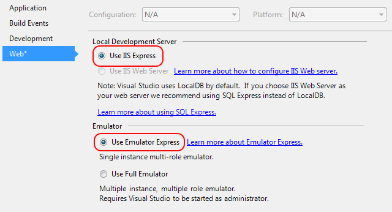

<properties
   pageTitle="使用 [執行和偵錯雲端服務的本機電腦上的 [模擬器 Express |Microsoft Azure"
   description="使用 [執行和偵錯雲端服務的本機電腦上的 [模擬器 Express"
   services="visual-studio-online"
   documentationCenter="n/a"
   authors="TomArcher"
   manager="douge"
   editor="" />
<tags
   ms.service="visual-studio-online"
   ms.devlang="multiple"
   ms.topic="article"
   ms.tgt_pltfrm="multiple"
   ms.workload="na"
   ms.date="08/15/2016"
   ms.author="tarcher" />

# 使用 [執行和偵錯雲端服務的本機電腦上的 [模擬器 Express

藉由使用模擬器 Express，您可以測試並不需要以系統管理員身分執行 Visual Studio 偵錯雲端服務。 您可以設定專案設定為使用模擬器 Express 或完整模擬器，根據您的雲端服務的需求。 如需完整的模擬器的詳細資訊，請參閱[執行計算模擬器中 Azure 應用程式](./storage/storage-use-emulator.md)。 Azure SDK 2.1，第一次包含模擬器 Express，迄 Azure SDK 2.3，它是預設模擬器。

## 在 Visual Studio IDE 使用模擬器 Express

當您建立新的專案中 Azure SDK 2.3 或更新版本時，已選取模擬器 Express。 建立與舊版 SDK 的現有專案，請遵循下列步驟來選取模擬器 Express。

### 若要設定為使用模擬器 Express 專案

1. 在 Azure 專案的快顯功能表，選擇 [**內容**]，然後選擇 [**網站**] 索引標籤。

1. 在**本機開發伺服器**] 底下選擇 [**使用 IIS Express 選項**] 按鈕。 模擬器 Express 不相容於 IIS 網頁伺服器。

1. 在**模擬器**中，選擇 [**使用模擬器 Express**選項] 按鈕。

    

## 在命令提示字元中啟動 [模擬器 Express

在命令提示字元中，您可以使用 /useemulatorexpress 選項來啟動 Azure 計算模擬器 csrun.exe，快速版本。

## 限制

您可以使用模擬器 Express 之前，您應該注意的一些限制︰

- 模擬器 Express 不相容於 IIS 網頁伺服器。

- 您的雲端服務最多可以包含多個角色，但每一個角色有限一個執行個體。

- 您無法存取下方 1000年的連接埠號碼。 例如，如果您使用通常使用連接埠下方 1000年的驗證提供者，您可能需要將此值變更為高於 1000年的連接埠號碼。

- 套用至 Azure 計算模擬器任何限制也適用於模擬器 Express。 例如，您不能超過 50 個角色執行個體，每部署。 請參閱[執行計算模擬器中的 Azure 應用程式](http://go.microsoft.com/fwlink/p/?LinkId=623050)

## 後續步驟

[偵錯雲端服務](https://msdn.microsoft.com/library/azure/ee405479.aspx)
