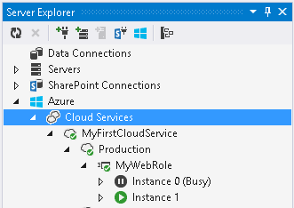

<properties 
   pageTitle="偵錯已發佈的雲端服務 IntelliTrace 與 Visual Studio |Microsoft Azure"
   description="偵錯 IntelliTrace 與 Visual Studio 已發佈的雲端服務"
   services="visual-studio-online"
   documentationCenter="n/a"
   authors="TomArcher"
   manager="douge"
   editor="" />
<tags 
   ms.service="visual-studio-online"
   ms.devlang="multiple"
   ms.topic="article"
   ms.tgt_pltfrm="multiple"
   ms.workload="na"
   ms.date="08/15/2016"
   ms.author="tarcher" />

# 偵錯 IntelliTrace 與 Visual Studio 已發佈的雲端服務

##概觀

使用 IntelliTrace，您可以在 Azure 中執行時記錄角色執行個體的擴充偵錯的資訊。 如果您需要找出問題的原因，您可以使用 IntelliTrace 記錄如同執行 Azure 中從 Visual Studio 逐步執行程式碼。 實際上，IntelliTrace 記錄關鍵執行程式碼和環境資料 Azure 應用程式以雲端服務中 Azure 執行，並可讓您重新執行從 Visual Studio 記錄的資料。 或者，您可以使用遠端偵錯時，若要直接附加至雲端服務中 Azure 執行。 請參閱[偵錯雲端服務](http://go.microsoft.com/fwlink/p/?LinkId=623041)。

>[AZURE.IMPORTANT] IntelliTrace 適用於僅偵錯案例，並不應該用於生產部署。

>[AZURE.NOTE] 您可以使用 IntelliTrace，如果您有安裝的 Visual Studio 企業和您 Azure 應用程式的目標.NET Framework 4 或更新版本。 IntelliTrace 會收集您 Azure 角色的資訊。 這些角色的虛擬機器一律會執行 64 位元作業系統。

## 若要設定 IntelliTrace Azure 應用程式

若要啟用 IntelliTrace Azure 應用程式，您必須建立並發佈從 Visual Studio Azure 專案的應用程式。 您將它發佈到 Azure 之前，您必須設定 IntelliTrace Azure 應用程式。 如果您沒有設定 IntelliTrace 發佈您的應用程式，但然後決定您想要執行這項作業，您必須發行一次從 Visual Studio 應用程式。 如需詳細資訊，請參閱[發佈使用 Azure 工具雲端服務](http://go.microsoft.com/fwlink/p/?LinkId=623012)。

1. 當您準備好部署 Azure 應用程式時，請確認您的專案建立目標設定為**偵錯**。

1. 在方案總管中開啟 Azure 專案的快顯功能表，然後選擇 [**發佈]**。
 
    發佈 Azure 應用程式精靈會出現。

1. 若要發佈在雲端時，「 收集 IntelliTrace 記錄您的應用程式，選取 [**啟用 IntelliTrace**核取方塊。

    >[AZURE.NOTE] 您可以啟用 IntelliTrace 或設定檔時發行 Azure 應用程式。 您無法啟用兩者。

1. 若要自訂基本 IntelliTrace 設定，請選擇 [**設定**] 超連結]。

    [IntelliTrace 設定] 對話方塊隨即出現，如下圖所示。 您可以指定哪些事件記錄檔、 是否收集通話資訊、 哪些模組和處理程序來收集記錄，以及要配置給錄製的空間量。 如需有關 IntelliTrace 的詳細資訊，請參閱[使用 IntelliTrace 偵錯](http://go.microsoft.com/fwlink/?LinkId=214468)。

    

IntelliTrace 記錄是循環 （的預設大小為 250 MB） IntelliTrace 設定中指定的最大的記錄檔。 IntelliTrace 記錄收集檔案系統的虛擬機器中的檔案。 當您要求的記錄時，快照的時間點，而下載至您的本機電腦。

Azure 應用程式已發行至 Azure 之後，您可以判斷 IntelliTrace 是否已啟用從 Azure 計算中的節點伺服器總管] 中，如下圖所示︰

## 下載 IntelliTrace 記錄的角色執行個體

您可以從**伺服器總管**] 中的**雲端服務**節點下載 IntelliTrace 記錄的角色執行個體。 展開**雲端服務**節點，直到您找出您感興趣的執行個體開啟此執行個體的快顯功能表，選擇 [**檢視 IntelliTrace 記錄檔**。 IntelliTrace 記錄會下載至目錄中的檔案，在您的本機電腦上。 每當您要求 IntelliTrace 記錄，建立新的快照。

下載的記錄，當 Visual Studio 便會顯示 Azure 活動記錄視窗中作業的進度。 下圖所示，您可以展開項目，以查看更多詳細資料的作業。

您可以繼續在 Visual Studio 工作，而下載 IntelliTrace 記錄。 記錄檔完成下載後，就會自動開啟 Visual Studio 中。

>[AZURE.NOTE] IntelliTrace 記錄可能包含架構產生及後續處理的例外狀況。 內部架構程式碼會產生所正常啟動角色，因此您可能會忽略這些這些例外狀況。

## 另請參閱

[偵錯雲端服務](https://msdn.microsoft.com/library/ee405479.aspx)

