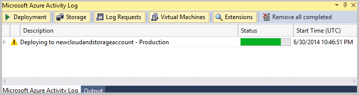
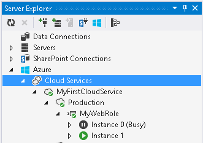

<properties
   pageTitle="如何移轉及發佈從 Visual Studio Azure 雲端服務的 Web 應用程式 |Microsoft Azure"
   description="瞭解如何移轉，並使用 Visual Studio 發佈 web 應用程式至 Azure 雲端服務。"
   services="visual-studio-online"
   documentationCenter="na"
   authors="TomArcher"
   manager="douge"
   editor="" />
<tags
   ms.service="multiple"
   ms.devlang="dotnet"
   ms.topic="article"
   ms.tgt_pltfrm="na"
   ms.workload="multiple"
   ms.date="08/15/2016"
   ms.author="tarcher" />

# <a name="how-to-migrate-and-publish-a-web-application-to-an-azure-cloud-service-from-visual-studio"></a>如何︰ 移轉及發佈從 Visual Studio Azure 雲端服務的 Web 應用程式

若要取回代管服務的優點與延展性 Azure，您可能要移轉及發佈 web 應用程式至 Azure 雲端服務。 您可以執行的 web 應用程式 Azure 中的最小變更現有應用程式。

>[AZURE.NOTE] 本主題是關於部署至雲端服務，不到網站。 部署至網站的相關資訊，請參閱[部署 Azure 應用程式服務中的 web 應用程式](./app-service-web/web-sites-deploy.md)。

支援的 Visual C# 和 Visual Basic 的特定範本的清單，請參閱本主題稍後的區段**支援專案範本**。

您必須先啟用 Azure 您 web 應用程式從 Visual Studio。 下圖顯示發佈您現有的 web 應用程式新增以用於部署 Azure 專案的主要步驟。 此程序會將 Azure 專案所需的 web 角色加入至您的方案。 根據您的 web 專案的類型，專案屬性的組件也會更新如果服務套件部署需要額外的組件。


>[AZURE.NOTE] **轉換**，**轉換成 Azure 雲端服務專案**] 命令會顯示僅適用於您的方案中的 web 專案。 例如命令不適用於您的方案中的 Silverlight 專案。
當您建立服務套件，或發佈您的應用程式 Azure 時，可能會發生警告或錯誤訊息。 這些警告和錯誤可協助您部署至 Azure 前修正問題。 例如，您可能會收到警告遺失的組件。 如需有關如何將任何警告視為錯誤的詳細資訊，請參閱[設定與 Visual Studio Azure 雲端服務專案](vs-azure-tools-configuring-an-azure-project.md)。 如果您建立您的應用程式、 執行本機使用計算模擬器，或將它發佈到 Azure，您可能會看到**錯誤清單**] 視窗中的下列錯誤︰**指定的 path、 檔案名稱，或是兩者都太長**。 因為的完整 Azure 專案名稱長度太長，就會發生這個錯誤。 專案名稱，包括完整路徑長度不能超過 146 字元。 例如，這是完整的專案名稱包括 Azure 專案 Silverlight 應用程式所建立的檔案路徑︰ `c:\users\<user name>\documents\visual studio 2015\Projects\SilverlightApplication4\SilverlightApplication4.Web.Azure.ccproj`。 您可能必須將您的方案移到不同的目錄有較短的路徑，以減少的完整的專案名稱長度。

若要移轉並發佈至 Azure 從 Visual Studio web 應用程式，請遵循下列步驟。

## <a name="enable-a-web-application-for-deployment-to-azure"></a>部署至 Azure 啟用 Web 應用程式

### <a name="to-enable-a-web-application-for-deployment-to-azure"></a>若要啟用以供部署至 Azure web 應用程式

1. 若要啟用以供部署至 Azure web 應用程式，在您的方案中開啟 web 專案的捷徑功能表然後選擇新增 Azure 部署專案。

    發生下列動作︰

    - Azure 專案稱為`<name of the web project>.Azure`會新增至應用程式的解決方案。

    - Web 專案 web 角色會新增至此 Azure 的專案。

    - **複製到本機**的屬性設定為 true 的所需的第 2 MVC MVC 3 MVC 的組件，4 和 Silverlight 商務應用程式。 此服務套件部署用來新增這些組件。

  >[AZURE.IMPORTANT] 如果您有其他的組件或檔案所需的此 web 應用程式，您必須以手動方式設定這些檔案的內容。 如需如何設定這些屬性的資訊，請參閱本文稍後的區段**包含服務套件檔案**。

  >[AZURE.NOTE] 如果在解決方案中，**將轉換**，Azure 專案中已經有特定的 web 專案 web 角色**轉換成 Azure 雲端服務專案**動作並不會顯示這個 web 專案快顯功能表上。

  如果您有多個網頁專案 web 應用程式中，您想要建立的每個 web 專案的 web 角色，您必須執行每個網頁專案此程序的步驟。 這樣會建立不同的 Azure 專案，為每個網頁角色。 每個 web 專案可以分別發行。 或者，您可以手動新增另一個網頁角色的現有 Azure 專案 web 應用程式中。 若要這麼做，請開啟 Azure 專案中的 [**角色**] 資料夾的快顯功能表，選擇 [**新增**]，然後**Web 角色專案解決方案中**，選擇 [新增網頁角色，為專案，然後選擇 [ **[確定**] 按鈕。

## <a name="use-an-azure-sql-database-for-your-application"></a>應用程式的使用 Azure SQL 資料庫

如果您使用內部部署的 SQL Server 資料庫的 web 應用程式的連線字串，您必須變更此連線字串，若要使用的 SQL 資料庫執行個體 Azure 主控改為。

>[AZURE.IMPORTANT] 您的訂閱，必須先啟用您將 SQL 資料庫。 如果您是從[Azure 傳統入口網站](http://go.microsoft.com/fwlink/?LinkID=213885)存取您的訂閱，您可以判斷您的訂閱所提供的服務。 下列指示套用至發行[Azure 傳統入口網站](http://go.microsoft.com/fwlink/?LinkID=213885)。 如果您使用的[Azure 入口網站](http://portal.microsoft.com)，跳至下一個程序。

### <a name="to-use-a-sql-database-instance-in-your-web-role-for-your-connection-string"></a>SQL 資料庫執行個體中您網站的角色使用您的連線字串

1. 若要建立 SQL 資料庫的執行個體中[Azure 傳統入口網站](http://go.microsoft.com/fwlink/?LinkID=213885)，請遵循下列文章中的步驟︰[建立 SQL 資料庫伺服器](http://go.microsoft.com/fwlink/?LinkId=225109)。

    >[AZURE.NOTE] 當您執行個體的 SQL 資料庫設定防火牆規則時，您必須選取 [**允許存取此伺服器其他 Azure 服務**的核取方塊。

1. 若要建立的 SQL 資料庫來使用您的連線字串的執行個體，請依照下列文件中的 [下一步] 區段中的步驟︰[建立 SQL 資料庫](http://go.microsoft.com/fwlink/?LinkId=225110)。

1. 若要將用於您的連線字串的 ADO.NET 連接字串，請在 [ [Azure 傳統入口網站](http://go.microsoft.com/fwlink/?LinkID=213885)中執行下列步驟。  

  1. 選擇 [**資料庫**] 按鈕，然後開啟 [節點您用來建立 SQL 資料庫的執行個體的訂閱。

  1. 若要顯示的 SQL 資料庫可用的執行個體，請選擇 [ **SQL 資料庫**] 節點。

  1. 若要顯示的內容資料庫，選擇 [資料庫]。 [**屬性**] 檢視會顯示。

      >[AZURE.NOTE] 如果沒有出現 [**內容**] 檢視，您可能需要將其開啟使用分隔線。

  1. 若要顯示的連接字串，請選擇 [檢視] 旁的省略符號 （...）] 按鈕。

    [**連線字串**] 對話方塊隨即出現。

  1. 若要複製 ADO.NET 連線字串，醒目提示文字]，然後選擇 [Ctrl + C 鍵。

  1. 若要關閉對話方塊，請選擇 [**關閉**] 按鈕。

1. 若要取代 web.config 使用此執行個體的 SQL 資料庫中的連接字串，開啟 web.config、 醒目提示 [現有連線字串的項目，然後選擇 Ctrl + V 鍵。 SQL 資料庫的執行個體的 ADO.NET 連接字串來取代現有的連線字串。

1. 您也必須將參數`MultipleActiveResultSets=True`連線字串。 連接字串應該有下列格式︰

    ```
    connectionString=”Server=tcp:<database_server>.database.windows.net,1433;Database=<database_name>;User ID=<user_name>@<database_server>;Password=<myPassword>;Trusted_Connection=False;Encrypt=True;MultipleActiveResultSets=True"
    ```

1. （選用）變更 [連線字串，直接在 web.config 檔案中的替代方法是將其中一個 web.config 轉換檔案，取決於您用來建立您的服務套件組建設定的某一節。 開啟 Web.Debug.Config 檔案或 Web.Release.Config 檔案。 將此檔案中的下一節︰

    ```
    XMLCopy<connectionStrings><addname="DefaultConnection"connectionString="Server=tcp:<database_server>.database.windows.net,1433;Database=<database_name>;User ID=<user_name>@<database_server>;Password=<myPassword>;Trusted_Connection=False;Encrypt=True;MultipleActiveResultSets=True"xdt:Transform="SetAttributes"xdt:Locator="Match(name)"/></connectionStrings>
    ```

1. 儲存您修改過的檔案，並重新發佈應用程式。

### <a name="to-use-an-instance-of-sql-database-by-using-the-azure-classic-portal"></a>若要使用的 SQL 資料庫執行個體使用 Azure 傳統入口網站

1. 在[Azure 傳統入口網站](http://go.microsoft.com/fwlink/?LinkID=213885)中，選擇 [SQL 資料庫] 節點。

  - 如果您想要使用的 SQL 資料庫的執行個體出現，請選擇將其開啟。

  - 如果您還沒有建立任何執行個體，選擇適當的連結，然後再建立 [執行個體。

1. 您開啟或建立資料庫的執行個體之後，選擇 [**連線字串**] 連結。

1. 在頁面底部，選擇連結至設定防火牆設定，並接受預設值或設定您需要的值。

1. 複製 ADO.NET 連線字串，貼上到 web.config 檔案舊的連接字串，內部部署的資料庫，請務必將`MultipleActiveResultSets=True`。

## <a name="publish-a-web-application-to-azure"></a>發佈 Azure 的 Web 應用程式

### <a name="to-publish-a-web-application-to-azure"></a>若要發佈 Azure 的 Web 應用程式

1. 若要測試應用程式在本機的開發環境使用 Azure 計算模擬器，開啟網頁角色的 Azure 專案的捷徑功能表並選擇**設定為啟動專案**。 然後選擇 [**偵錯**，**啟動偵錯**(鍵盤︰ **F5**)。

    **啟動 Azure 偵錯環境**] 對話方塊隨即開啟，並在瀏覽器中啟動應用程式。 有關如何啟動 web 應用程式的每個類型計算模擬器中有特定的詳細資訊，請參閱本節中的資料表。

1. 若要設定您的應用程式發佈至 Azure 服務，您必須以 Microsoft 帳戶和 Azure 的訂閱。 使用下列主題中的步驟，設定您的服務︰[準備發佈或部署 Visual Studio Azure 應用程式](vs-azure-tools-cloud-service-publish-set-up-required-services-in-visual-studio.md)。

1. 若要發佈 Azure web 應用程式，請開啟 web 專案的快顯功能表並選擇 [**發佈至 Azure。**

    **發佈 Azure 應用程式**] 對話方塊隨即開啟，並 Visual Studio 啟動部署程序。 如需有關如何發佈應用程式的詳細資訊，請參閱 [[發佈] 使用 Azure 工具雲端服務](vs-azure-tools-publishing-a-cloud-service.md)中的 [**發佈從 Visual Studio Azure 應用程式**] 區段。

    >[AZURE.NOTE] 您也可以發佈 web 應用程式從 Azure 專案。 若要這麼做，請開啟 Azure 專案的快顯功能表，並選擇 [**發佈**。

1. 若要查看部署的進度，您可以檢視**Azure 活動記錄**視窗。 部署程序啟動時，此記錄會自動顯示。 您可以展開 [行中的項目活動記錄，以顯示詳細的資訊，如下列圖例中所示︰

    

1. （選用）若要取消部署程序，活動記錄中開啟的快顯功能表項目並選擇**取消及移除**。 這會停止部署程序，並從 Azure 刪除部署環境。

    >[AZURE.NOTE] 若要移除此部署環境中，將其部署之後，您必須使用[Azure 傳統入口網站](http://go.microsoft.com/fwlink/?LinkID=213885)。

1. （選用）啟動您的角色執行個體之後，Visual Studio 就會自動顯示部署環境中**Azure 計算**中的節點**雲端的檔案總管**或**伺服器檔案總管]**。 從這裡開始，您可以檢視個別角色執行個體的狀態。

    下圖顯示**伺服器總管**] 中的角色執行個體，仍中初始化狀態時︰

    

1. 若要存取您的應用程式部署後，您的部署旁的箭號時選擇的**已完成**狀態會出現在**Azure 活動記錄**中。 Azure 中顯示的 web 應用程式的 URL。 請參閱下表中的 [從 Azure 開始特定類型的 web 應用程式的相關詳細資料。

    下表列出來從 Azure 啟動特定的 web 應用程式，或執行或偵錯本機使用 Azure 計算模擬器 web 應用程式的相關詳細資料︰

  	|Web 應用程式類型|執行/偵錯本機使用計算模擬器|Azure 中執行|
  	|---|---|---|
  	|ASP.NET Web 應用程式|在功能表列中，選擇 [**偵錯**，**啟動偵錯**(鍵盤︰ 選擇**F5**鍵。)。|選擇 [ **Azure 活動記錄**載入瀏覽器中的 [開始] 頁面的 [**部署**] 索引標籤中顯示的 URL 超連結]。|
  	|ASP.NET MVC 2 Web 應用程式|在功能表列中，選擇 [**偵錯**，**啟動偵錯**(鍵盤︰ 選擇**F5**鍵。)。|選擇 [ **Azure 活動記錄**載入瀏覽器中的 [開始] 頁面的 [**部署**] 索引標籤中顯示的 URL 超連結]。|
  	|ASP.NET MVC 3 Web 應用程式|在功能表列中，選擇 [**偵錯**，**啟動偵錯**(鍵盤︰ 選擇**F5**鍵。)。|選擇 [ **Azure 活動記錄**載入瀏覽器中的 [開始] 頁面的 [**部署**] 索引標籤中顯示的 URL 超連結]。|
  	|ASP.NET MVC 4 Web 應用程式|在功能表列中，選擇 [**偵錯**，**啟動偵錯**(鍵盤︰ 選擇**F5**鍵。)。|選擇 [ **Azure 活動記錄**載入瀏覽器中的 [開始] 頁面的 [**部署**] 索引標籤中顯示的 URL 超連結]。|
  	|ASP.NET 空白 Web 應用程式|在您設定為 [開始] 頁面，web 專案的應用程式中，您必須新增.aspx 頁面。 然後在功能表列中，選擇 [**偵錯**，**啟動偵錯**(鍵盤︰ 選擇**F5**鍵。)。|如果您有應用程式中的預設.aspx 頁面，選擇 [在瀏覽器中載入**Azure 活動記錄**，以及此頁面顯示在 [**部署**] 索引標籤中的 URL 超連結]。 如果您有不同的.aspx 頁面時，您需要瀏覽至您的 url 中使用下列格式此特定頁面︰`<url for deployment>/<name of page>.aspx`|
  	|Silverlight 應用程式|在功能表列中，選擇 [**偵錯**，**啟動偵錯**(鍵盤︰ 選擇**F5**鍵。)。|您需要瀏覽至您的 url 中使用下列格式的應用程式的特定頁面︰`<url for deployment>/<name of page>.aspx`|
  	|Silverlight 商務應用程式|在功能表列中，選擇 [**偵錯**，**啟動偵錯**(鍵盤︰ 選擇**F5**鍵。)。|您需要瀏覽至您的 url 中使用下列格式的應用程式的特定頁面︰`<url for deployment>/<name of page>.aspx`|
  	|Silverlight 導覽應用程式|在功能表列中，選擇 [**偵錯**，**啟動偵錯**(鍵盤︰ 選擇**F5**鍵。)。|您需要瀏覽至您的 url 中使用下列格式的應用程式的特定頁面︰`<url for deployment>/<name of page>.aspx`|
  	|WCF 服務應用程式|您必須設定為 [開始] 畫面的.svc 檔案，WCF 服務專案。 然後在功能表列中，選擇 [**偵錯**，**啟動偵錯**(鍵盤︰ 選擇**F5**鍵。)。|您需要瀏覽至您的 url 中使用下列格式的應用程式 svc 檔案︰`<url for deployment>/<name of service file>.svc`|
  	|WCF 工作流程服務應用程式|您必須設定為 [開始] 畫面的.svc 檔案，WCF 服務專案。 然後在功能表列中，選擇 [**偵錯**，**啟動偵錯**(鍵盤︰ 選擇**F5**鍵。)。|您需要瀏覽至您的 url 中使用下列格式的應用程式 svc 檔案︰`<url for deployment>/<name of service file>.svc`|
  	|ASP.NET 動態項目|在功能表列中，選擇 [**偵錯**，**啟動偵錯**(鍵盤︰ 選擇**F5**鍵。)。|您必須更新連線字串 （請參閱下一節）。 您也需要瀏覽至您的 url 中使用下列格式的應用程式的特定頁面︰`<url for deployment>/<name of page>.aspx`|
  	|ASP.NET 動態資料 Linq to SQL|在功能表列中，選擇 [**偵錯**，**啟動偵錯**(鍵盤︰ 選擇**F5**鍵。)。|您必須遵循此程序中的步驟進行︰ 使用您的應用程式的 SQL Azure 資料庫 （請參閱本主題中的前一節）。 您也需要瀏覽至您的 url 中使用下列格式的應用程式的特定頁面︰`<url for deployment>/<name of page>.aspx`|

## <a name="update-a-connection-string-for-aspnet-dynamic-entities"></a>ASP.NET 動態實體更新連線字串

### <a name="to-update-a-connection-string-for-aspnet-dynamic-entities"></a>若要更新的 ASP.NET 動態實體的連線字串

1. 若要建立可用於 ASP.NET 動態實體 web 應用程式的 SQL Azure 資料庫，請依照下列程序中**使用應用程式的 SQL Azure 資料庫**之前在本主題中的步驟。

1. 新增表格和欄位，您需要從[Azure 傳統入口網站](http://go.microsoft.com/fwlink/?LinkID=213885)此資料庫。

1. 這種應用程式的連接字串 web.config 檔案中有下列格式︰  

    ```
    <addname="tempdbEntities"connectionString="metadata=res://*/Model1.csdl|res://*/Model1.ssdl|res://*/Model1.msl;provider=System.Data.SqlClient;provider connection string=&quot;data source=<server name>\SQLEXPRESS;initial catalog=<database name>;integrated security=True;multipleactiveresultsets=True;App=EntityFramework&quot;"providerName="System.Data.EntityClient"/>
    ```

    更新的*連接字串*值與 SQL Azure 資料庫的 ADO.NET 連接字串，如下所示︰

    ```
    XMLCopy<addname="tempdbEntities"connectionString="metadata=res://*/Model1.csdl|res://*/Model1.ssdl|res://*/Model1.msl;provider=System.Data.SqlClient;provider connection string=&quot;Server=tcp:<SQL Azure server name>.database.windows.net,1433;Database=<database name>;User ID=<user name>;Password=<password>;Trusted_Connection=False;Encrypt=True;multipleactiveresultsets=True;App=EntityFramework&quot;"providerName="System.Data.EntityClient"/>
    ```

1. 若要儲存 web.config 使用連接字串，在功能表列上所做的變更，選擇 [**檔案**]**儲存 web.config**。

## <a name="supported-project-templates"></a>支援的專案範本

若要發佈 Azure 的 web 應用程式，應用程式必須使用其中一項專案範本 C# 或 Visual Basic 中下表所列的。

|專案範本] 群組|專案範本|
|---|---|
|網頁|ASP.NET Web 應用程式|
|網頁|ASP.NET MVC 2 Web 應用程式|
|網頁|ASP.NET MVC 3 Web 應用程式|
|網頁|ASP.NET MVC4 Web 應用程式|
|網頁|ASP.NET 空白 Web 應用程式|
|網頁|ASP.NET MVC 2 空白 Web 應用程式|
|網頁|ASP.NET 動態資料實體 Web 應用程式|
|網頁|ASP.NET 動態資料 Linq SQL Web 應用程式|
|Silverlight|Silverlight 應用程式|
|Silverlight|Silverlight 商務應用程式|
|Silverlight|Silverlight 導覽應用程式|
|WCF|WCF 服務應用程式|
|WCF|WCF 工作流程服務應用程式|
|工作流程|WCF 工作流程服務應用程式|

## <a name="next-steps"></a>後續步驟
如需有關發佈的詳細資訊，請參閱[準備發佈或部署 Visual Studio Azure 應用程式](vs-azure-tools-cloud-service-publish-set-up-required-services-in-visual-studio.md)。 此外，請參考[設定設定命名驗證認證](vs-azure-tools-setting-up-named-authentication-credentials.md)。
