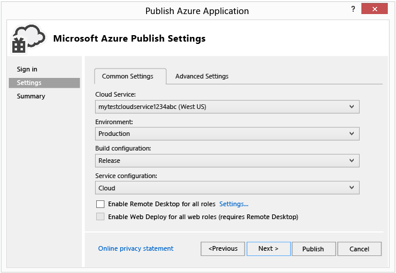

<properties 
   pageTitle="發佈 Azure 應用程式精靈 |Microsoft Azure"
   description="發佈 Azure 應用程式精靈"
   services="visual-studio-online"
   documentationCenter="na"
   authors="TomArcher"
   manager="douge"
   editor="" />
<tags 
   ms.service="multiple"
   ms.devlang="multiple"
   ms.topic="article"
   ms.tgt_pltfrm="na"
   ms.workload="na"
   ms.date="08/15/2016"
   ms.author="tarcher" />

# 發佈 Azure 應用程式精靈

## 概觀

開發 Visual Studio 中的 web 應用程式之後，您可以使用 [**發佈 Azure 應用程式**精靈中發佈更輕鬆地 Azure 雲端服務的應用程式。 第一段說明的步驟，您必須先完成您使用精靈，及其他章節說明精靈的功能。

>[AZURE.NOTE] 本主題是關於部署至雲端服務，不到網站。 部署至網站的相關資訊，請參閱[如何部署 Azure 網站](https://social.msdn.microsoft.com/Search/windowsazure?query=How%20to%20Deploy%20an%20Azure%20Web%20Site&Refinement=138&ac=4#refinementChanges=117&pageNumber=1&showMore=false)。

## 必要條件

您可以發佈 Azure web 應用程式之前，您必須具備 Microsoft 帳戶和 Azure 的訂閱，，而且您擁有關聯 Azure 雲端服務的 web 應用程式。 如果您已經完成這些工作，您可以直接跳到下一節。

1. 取得 Microsoft 帳戶和 Azure 的訂閱。 您可以嘗試的免費的 1 個月免費 Azure 訂閱[以下](https://azure.microsoft.com/pricing/free-trial/)

1. 在 Azure 雲端服務和儲存帳戶。 您可以從伺服器總管 Visual Studio 中，或使用[Azure 傳統入口網站](http://go.microsoft.com/fwlink/?LinkID=213885)來執行這個動作。

1. 啟用 Azure 的 web 應用程式。 若要啟用發佈到 Azure 從 Visual Studio web 應用程式，必須將其關聯 Visual Studio 的 Azure 雲端服務專案。 若要建立相關聯的雲端服務專案，開啟的專案 web 應用程式的捷徑功能表，然後選擇轉換，**轉換成 Azure 雲端服務的專案**。

1. 雲端服務專案會新增至您的方案之後，再次開啟相同的快顯功能表，然後選擇 [**發佈]**。 如需有關如何啟用 Azure 的應用程式的詳細資訊，請參閱[如何︰ 移轉及發佈 Web 應用程式至 Azure 雲端服務的 Visual Studio](https://msdn.microsoft.com/library/azure/hh420322.aspx)。

>[AZURE.NOTE] 請務必 Visual Studio 開始系統管理員認證 （以系統管理員身分執行）。

1. 當您準備好要發佈您的應用程式時，請開啟 Azure 雲端服務專案的快顯功能表，然後選擇 [**發佈]**。 下列步驟顯示發佈 Azure 應用程式精靈。

## 選擇您的訂閱

### 若要選擇訂閱

1. 在您第一次使用精靈之前，您必須登入。 選擇 [**登入**] 連結。 出現提示時，[Azure 入口網站登入，並提供您 Azure 的使用者名稱和密碼。 

    

    訂閱清單中填入您的帳戶相關聯的訂閱。 您也可能會看到您先前匯入任何訂閱檔案的訂閱。

1. **選擇您的訂閱**清單中，選擇 [使用此部署訂閱]。

   如果您選擇**<...管理 >**，**管理訂閱**] 對話方塊隨即出現，而且您可以選擇您想要使用的訂閱和使用者帳戶。 [**帳戶**] 索引標籤會顯示所有您的帳戶，然後 [**訂閱**] 索引標籤會顯示所有訂閱相關聯的帳戶。 您也可以選擇要使用 Azure 資源，以及建立或匯入您的訂閱的憑證從 Azure 入口網站的區域。 如果從訂閱檔案匯入任何訂閱，相關聯的憑證會出現在 [**憑證**] 索引標籤下。 當您完成時，選擇 [**關閉**] 按鈕。

    

    >[AZURE.NOTE] 訂閱檔案可以包含多個訂閱。

1. 選擇 [**下一步**] 按鈕，繼續]。 

    如果您的訂閱中沒有任何雲端服務，您需要建立 Azure 裝載您的專案中的雲端服務。 [**建立雲端服務，儲存帳戶**] 對話方塊隨即出現。

    指定雲端服務的新名稱。 名稱必須是唯一 Azure 中。 然後指定地區或您或您的用戶端的最接近的資料中心的相關性群組。 Azure 建立雲端服務的新儲存帳戶也使用這個名稱。

1. 修改任何設定您想要用於此部署，然後將它發佈選擇 （下一節會提供各種設定詳細資料） 的 [**發佈**]。 若要檢閱之前發佈的設定，請選擇 [**下一步**] 按鈕。

    >[AZURE.NOTE] 如果您在此步驟中選擇 [發佈]，您可以監視 Visual Studio 中部署的狀態。

您可以使用 [**發佈 Azure 應用程式**精靈修改部署的常見與進階設定。 例如，您可以選擇之後，再放開其部署到測試環境的應用程式的設定。 下圖顯示的 Azure 部署的 [**一般設定**] 索引標籤。

## 設定您發佈設定

### 若要設定發佈設定

1. 在**雲端服務**清單中，執行下列步驟之一︰

   1. 在下拉式清單方塊中，選擇 [現有的雲端服務]。 服務的資料中心位置會顯示。 您應該記下此位置，並確定您儲存帳戶位置位於相同的資料中心。

    1. 選擇 [**建立新**建立的雲端服務 Azure 主控。 在 [**建立雲端服務**] 對話方塊中，提供服務的名稱，然後指定地區或相關性] 群組中，指定您想要主控這項雲端服務資料中心的位置。 名稱必須是唯一 Azure 中。

1. 在**環境**清單中，選擇 [**生產**或**執行**]。 如果您想要部署到測試環境的應用程式，請選擇 [執行環境]。 您可以將您的應用程式生產環境更新版本。

1. **建立設定**清單中，選擇 [**偵錯**] 或 [**發行**]。

1. 在 [**服務設定**] 清單中，選擇 [**雲端**] 或 [**本機**。

    如果您想要能夠遠端連線至服務，請選取 [**啟用所有角色的遠端桌面**核取方塊。 這個選項，主要用於疑難排解。 當您選取此核取方塊時，會出現 [**遠端桌面設定**] 對話方塊。 選擇 [設定] 連結，以變更的設定。

    選取 [**啟用所有網頁角色都部署網頁**] 核取方塊，以啟用 web 服務的部署]。 您必須啟用遠端桌面] 來使用此功能。 如需詳細資訊，請參閱[[發佈使用 Azure 工具雲端服務](https://msdn.microsoft.com/library/azure/ff683672.aspx)](https://msdn.microsoft.com/library/azure/ff683672.aspx)。 如需有關 Web 部署的詳細資訊，請參閱[[發佈使用 Azure 工具雲端服務](https://msdn.microsoft.com/library/azure/ff683672.aspx)](https://msdn.microsoft.com/library/azure/ff683672.aspx)。

1. 選擇 [**進階設定**] 索引標籤。 在 [**部署標籤**] 欄位中，接受預設名稱，或輸入您所選擇的名稱。 若要將日期新增至部署標籤，請保留核取方塊。

    ![[發佈] 精靈的第三個畫面](./media/vs-azure-tools-publish-azure-application-wizard/IC749014.png)

1. 在**儲存帳戶**] 清單中，選擇儲存帳戶使用此部署。 您可以比較您的雲端服務及您儲存的帳戶的資料中心的位置。 理想的情況下，這些位置應相同。

    >[AZURE.NOTE] Azure 儲存體帳戶儲存應用程式部署套件。 部署應用程式之後，封裝移除從儲存的帳戶。

1. 如果您想要部署更新的元件，請選取 [**部署的更新**] 核取方塊。 這種部署可以是較快，完整的部署。 選擇 [**設定**] 連結，以開啟 [**部署更新設定**] 對話方塊，如下圖所示。 

    

    您可以選擇其中一個更新部署增量或同時兩個選項。 累加部署更新一次一個部署的執行個體，以便在線上且有空給使用者，仍會保留您的應用程式。 同時部署一次更新所有已部署的執行個體。 同時更新較快，累加更新，但如果您選擇此選項時，您的應用程式可能無法使用更新程序期間。

    您應該選取核取方塊，如果無法更新部署，請執行完整的部署，如果您想要採取的位置會自動更新部署失敗的完整部署。 完整的部署，重設雲端服務的虛擬 IP (VIP) 地址。 如需詳細資訊，請參閱[如何︰ 在雲端服務的保留常數的虛擬 IP 位址](https://msdn.microsoft.com/library/azure/jj614593.aspx)。

1. 若要偵錯您的服務，選取 [**啟用 IntelliTrace**核取方塊，或如果您部署**偵錯**的設定，並且想要偵錯雲端服務 Azure 中的，選取 [要部署遠端偵錯服務**啟用遠端偵錯工具的所有角色**核取方塊。

2. 若要設定檔應用程式，選取 [**啟用分析**核取方塊，，然後選擇 [**設定**] 連結，即可顯示分析選項。 

    >[AZURE.NOTE] 您必須使用 Visual Studio 最終啟用 IntelliTrace 或層互動分析 （秘訣），而且您不能同時在同一時間。

    如需詳細資訊，請參閱[偵錯發佈雲端服務 IntelliTrace 與 Visual Studio](https://msdn.microsoft.com/library/azure/ff683671.aspx)和[測試效能的雲端服務](https://msdn.microsoft.com/library/azure/hh369930.aspx)。

1. 選擇 [**下一步**檢視應用程式的 [摘要] 頁面。

## 發佈您的應用程式

1. 您可以選擇從您選擇的設定建立發佈的設定檔。 例如，您可能會建立測試環境的設定檔，另一個用於生產。 若要儲存此設定檔，請選擇 [**儲存**] 圖示。 精靈會建立設定檔，並將它儲存在 Visual Studio 專案。 若要修改的設定檔名稱，開啟 [**目標設定檔**] 清單，然後選擇**<...管理 >**。

    

    >[AZURE.NOTE] 發佈的設定檔會顯示在 Visual Studio 中，在方案總管中，設定檔設定會寫入到.azurePubxml 副檔名的檔案。 設定會儲存為 XML 標記的屬性。

1. 選擇 [**發佈**] 發佈您的應用程式]。 您可以監視 Visual Studio 中**輸出**視窗中的程序狀態。

## 另請參閱

[如何︰ 移轉及發佈從 Visual Studio Azure 雲端服務的 Web 應用程式](https://msdn.microsoft.com/library/azure/hh420322.aspx)

[發佈雲端服務使用 Azure 工具](https://msdn.microsoft.com/library/azure/ff683672.aspx)

[偵錯 IntelliTrace 與 Visual Studio 已發佈的雲端服務](https://msdn.microsoft.com/library/azure/ff683671.aspx)

[測試雲端服務的效能](https://msdn.microsoft.com/library/azure/hh369930.aspx)

