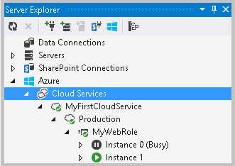

<properties
   pageTitle="發佈雲端服務使用 Azure 工具 |Microsoft Azure"
   description="瞭解如何使用 Visual Studio 發佈 Azure 雲端服務的專案。"
   services="visual-studio-online"
   documentationCenter="na"
   authors="TomArcher"
   manager="douge"
   editor="" />
<tags
   ms.service="multiple"
   ms.devlang="dotnet"
   ms.topic="article"
   ms.tgt_pltfrm="na"
   ms.workload="multiple"
   ms.date="08/15/2016"
   ms.author="tarcher" />

# 發佈雲端服務使用 Azure 工具

使用 Microsoft Visual studio Azure 工具，您可以發佈直接從 Visual Studio Azure 應用程式。 Visual Studio 支援臨時或生產環境的雲端服務整合式的發佈。

您可以發佈 Azure 應用程式之前，您必須有 Azure 訂閱。 您也必須使用您的應用程式設定雲端儲存空間的服務與帳戶。 您可以將這些設定， [Azure 傳統入口網站](http://go.microsoft.com/fwlink/?LinkID=213885)。

>[AZURE.IMPORTANT] 發佈時，您可以選取部署環境雲端服務。 您也必須選取的儲存空間帳戶用來儲存以供部署應用程式套件。 部署之後，會移除應用程式套件，從儲存的帳戶。

當您是開發並測試 Azure 應用程式時，您可以使用 Web 部署您的 web 角色的累加發佈變更。 發佈您的部署環境的應用程式後，網頁部署可讓您直接部署虛擬機器正在網頁角色進行的變更。 您沒有封裝並發佈整個 Azure 應用程式每當您想要更新您的 web 角色，若要測試所做的變更。 使用這個方法您可以讓您使用的網頁角色變更雲端測試不必等候有發佈至部署環境的應用程式中。

若要發佈 Azure 應用程式，並使用 Web 部署更新 web 角色，請使用下列程序︰

- 發佈或封裝從 Visual Studio Azure 應用程式

- 更新網頁角色屬於開發和測試循環圖

## 發佈或封裝從 Visual Studio Azure 應用程式

當您發佈 Azure 應用程式時，您可以執行下列工作其中一項︰

- 建立服務套件︰ 您可以使用此封裝並服務設定檔發佈您的應用程式部署環境[Azure 傳統入口網站](http://go.microsoft.com/fwlink/?LinkID=213885)。

- 發佈 Azure 從 Visual Studio 專案︰ 若要發佈您直接 Azure 的應用程式，您可以使用 [發佈精靈。 如需的資訊，請參閱[發佈 Azure 應用程式精靈](vs-azure-tools-publish-azure-application-wizard.md)。

### 若要從 Visual Studio 建立服務套件

1. 當您準備好要發佈您的應用程式時，開啟方案總管] 中，開啟包含您的角色的 Azure 專案的捷徑功能表並選擇 [發佈。

1. 若要建立服務套件，請遵循下列步驟︰  

  1. Azure 專案的快顯功能表，選擇 [**套件**]。

  1. 在 [**封裝 Azure 應用程式**] 對話方塊中，選擇您要建立的套件，服務設定]，然後選擇建立設定。

  1. （選用）若要遠端桌面中，開啟後，請在發佈雲端服務中，選取 [**啟用所有角色的遠端桌面**核取方塊，，然後選取 [**設定**]，以設定遠端桌面。 如果要偵錯雲端服務，請在發佈之後，請開啟遠端偵錯時，選取 [**啟用遠端偵錯工具的所有的角色**。

      如需詳細資訊，請參閱[使用遠端桌面 Azure 角色](vs-azure-tools-remote-desktop-roles.md)。

  1. 若要建立套件時，選擇 [**套件**] 連結。

      檔案總管] 中顯示新建立的套件檔案的位置。 您可以複製這個位置，以便您可以使用它從[Azure 傳統入口網站](http://go.microsoft.com/fwlink/?LinkID=213885)。

  1. 若要將此封裝發佈部署環境中，您必須為封裝位置使用此位置，當您建立雲端服務，並將此套件部署至[Azure 傳統入口網站](http://go.microsoft.com/fwlink/?LinkID=213885)的環境。

1. （選用）若要取消部署程序，快顯功能表上的行中的項目活動記錄中，選擇 [**取消並移除**]。 這會停止部署程序，並從 Azure 刪除部署環境。

    >[AZURE.NOTE] 若要移除此部署環境中，將其部署之後，您必須使用[Azure 傳統入口網站](http://go.microsoft.com/fwlink/?LinkID=213885)。

1. （選用）啟動您的角色執行個體之後，Visual Studio 就會自動顯示部署環境中伺服器總管] 中的**雲端服務**節點。 從這裡開始，您可以看到個別的角色執行個體的狀態。 請參閱[管理 Azure 資源雲端的檔案總管](vs-azure-tools-resources-managing-with-cloud-explorer.md)。下圖顯示角色執行個體，同時仍在起始狀態︰

    

## 更新網頁角色屬於開發和測試循環圖

如果您的應用程式後端基礎結構內都會很穩定，但 web 角色需要更多程度應更新，您可以使用 Web 部署在您的專案中更新 web 角色。 當您不想要重建並重新部署的後端工作者角色]，或如果您有多個網頁角色，且您想要更新其中一個網頁角色，這是方便。

### 需求

以下是使用 Web 部署更新您的 web 角色的需求︰

- **開發和測試使用︰**變更直接虛擬機器正在網頁角色。 如果此虛擬機器回收，因為您發佈的原始封裝用來重新建立虛擬機器角色所做的變更會遺失。 您必須重新發佈應用程式，以取得最新變更的網頁角色。

- **可以更新只 web 角色︰**無法更新工作者角色。 此外，您無法更新中 web role.cs RoleEntryPoint。

- **只能支援網頁角色一個執行個體︰**在您的部署環境中不能有多個執行個體的任何 web 角色。 不過，多個網頁角色每個只有一個執行個體是受支援。

- **您必須啟用遠端桌面連線︰**讓網頁部署可以使用使用者和密碼連線至虛擬機器部署至伺服器執行網際網路服務 (IIS) 的所做的變更，這是必要。 此外，您可能需要連線至虛擬機器上這個虛擬機器 IIS 新增受信任的憑證。 （這可確保遠端連線所使用的網頁部署 iis 安全。）

下列程序假設您使用的**發佈 Azure 應用程式**精靈。

### 若要啟用網站時部署發佈您的應用程式

1. 若要啟用**啟用 Web 部署**所有網頁角色] 核取方塊，您必須先設定遠端桌面連線。 選取所有角色**啟用遠端桌面**，然後提供 [會用來連線遠端在出現的**遠端桌面設定**] 方塊中的認證。 如需詳細資訊，請參閱[Azure 角色與使用遠端桌面](vs-azure-tools-remote-desktop-roles.md)。

1. 要部署 Web 應用程式中的所有網頁角色，請選取 [**啟用所有網頁角色都部署網頁**]。

    黃色警告三角形隨即出現。 Web 部署使用不受信任的自我簽署憑證，根據預設，建議您不要傳機密資料。 如果您需要保護機密資料的處理程序，您可以新增的 SSL 憑證，以用於部署網頁的連線。 這個憑證必須受信任的憑證。 瞭解如何進行此動作的資訊，請參閱本主題稍後的**來進行網頁部署安全**的區段。

1. 選擇 [**下一步**顯示 [**摘要**] 畫面，然後選擇 [**發佈**部署雲端服務。

    發佈雲端服務。 建立虛擬機器具有 IIS，讓網頁部署可以用來更新您的 web 角色，而不重新啟用遠端連線。

    >[AZURE.NOTE] 如果您有多個執行個體 web 角色的設定，會出現警告訊息，指出每個網頁角色會侷限於只能在建立發佈您的應用程式套件的執行個體之一。 選取**[確定**] 以繼續。 需求一節所述，您可以有多個網頁角色，但只有一個執行個體的每一個角色。

### 若要使用更新您的 Web 角色部署網頁

1. 若要使用 Web 部署，變更程式碼專案的任何您想要發佈，然後以滑鼠右鍵按一下 [此專案節點，在您的方案，並指向 [**發佈**的 Visual Studio 中您網站的角色。 **發佈網站**] 對話方塊隨即出現。

1. （選用）如果您新增使用 iis 遠端連線的受信任的 SSL 憑證，您可以清除 [**允許受信任的憑證**] 核取方塊。 瞭解如何新增憑證以進行部署網頁的安全的資訊，請參閱本主題稍後的 [**若要讓網頁部署安全性**] 區段。

1. 若要使用 Web 部署，發佈機制需要使用者名稱和密碼，您設定遠端桌面連線時您第一次發佈套件。

  1. 在 [**使用者名稱**] 中，輸入使用者名稱。

  1. 在 [**密碼**] 中，輸入密碼。

  1. （選用）如果您想要將密碼儲存在這個設定檔中，選擇 [**儲存密碼**]。

1. 若要發佈變更至您網站的角色，選擇 [**發佈**]。

    狀態列會顯示**發佈開始**。 發佈完成後，**發佈成功**] 會出現。 變更現在已經部署到您的虛擬機器的 web 角色。 現在您可以開始 Azure 應用程式中 Azure 環境以測試您的變更。

### 若要讓網頁部署安全

1. Web 部署使用不受信任的自我簽署憑證，根據預設，建議您不要傳機密資料。 如果您需要保護機密資料的處理程序，您可以新增的 SSL 憑證，以用於部署網頁的連線。 這個憑證必須受信任的憑證，您取得從憑證授權單位 (CA)。

    若要讓網頁部署每個虛擬機器安全的每個您網站的角色，您必須上傳的信任的憑證，您想要使用的網頁部署至[Azure 傳統入口網站](http://go.microsoft.com/fwlink/?LinkID=213885)。 這可確保已新增至虛擬機器發佈您的應用程式時，針對網頁角色所建立的憑證。

1. 若要新增 IIS 使用遠端連線的受信任的 SSL 憑證，請遵循下列步驟︰

  1. 若要連線到虛擬機器執行網頁角色，選取網頁角色的執行個體**雲端總管**或**伺服器總管**] 中，然後選擇 [**使用遠端桌面連線**] 命令。 如需詳細了解如何連線到虛擬機器的詳細步驟，請參閱[使用遠端桌面 Azure 角色](vs-azure-tools-remote-desktop-roles.md)。

      在瀏覽器會提示您下載。RDP 檔案。

  1. 若要新增的 SSL 憑證，開啟 [管理服務中 IIS 管理員]。 在 IIS 管理員中，開啟 [**動作**] 窗格中的**繫結**連結啟用 SSL。 **新增網站繫結**] 對話方塊隨即出現。 選擇 [**新增**]，然後在 [**類型**] 下拉式清單中選取 [HTTPS。 在 [ **SSL 憑證**] 清單中，選擇 [SSL 憑證，您必須登入 ca，並且您上傳至[Azure 傳統入口網站](http://go.microsoft.com/fwlink/?LinkID=213885)]。 如需詳細資訊，請參閱[設定管理服務的連線設定](http://go.microsoft.com/fwlink/?LinkId=215824)。

      >[AZURE.NOTE] 如果您在新增受信任的 SSL 憑證，黃色警告三角形不會再出現在**發佈精靈**。

## 服務套件中包含的檔案

您可能需要在服務套件中包含特定檔案，以便針對角色所建立的虛擬電腦上。 例如，您可能要新增.exe 或.msi 檔案所使用的啟動指令碼至您的服務套件。 或者，您可能需要將 web 角色或背景工作角色專案所需的組件。 若要包括的檔案必須加入 Azure 應用程式的解決方案。

### 若要在服務套件中包含檔案

1. 若要新增組件至服務套件，請使用下列步驟︰

  1. 在**方案總管**中開啟專案節點，就會缺少參考的組件的專案。

  1. 若要新增到專案的組件，開啟 [**參考資料**] 資料夾的快顯功能表，然後選擇**加入參考**。 [新增參考] 對話方塊隨即出現。

  1. 選擇您想要新增，然後選擇 [**確定**] 按鈕的參照。

      參照會新增至 [**參考資料**] 資料夾底下的清單。

  1. 開啟您所新增的組件的快顯功能表，然後選擇 [**內容]**。 [**屬性**] 視窗隨即出現。

      包含此服務套件中，**複製到本機的清單**中的組件選擇 [ **True**]。

1. 在**方案總管**中開啟專案節點，就會缺少參考的組件的專案。

1. 若要新增到專案的組件，開啟 [**參考資料**] 資料夾的快顯功能表，然後選擇**加入參考**。 [**新增參考**] 對話方塊隨即出現。

1. 選擇您想要新增，然後選擇 [**確定**] 按鈕的參照。

    參照會新增至 [**參考資料**] 資料夾底下的清單。

1. 開啟您所新增的組件的快顯功能表，然後選擇 [**內容]**。 [屬性] 視窗隨即出現。

1. 若要將這個組件在服務套件中，**複製到本機]**清單中，選擇 [ **True**]。

1. 若要在已新增至網頁角色專案服務套件中包含的檔案，開啟檔案的快顯功能表，然後選擇**屬性**。 在 [**屬性**] 視窗中，選擇 [**內容**中的 [**建立巨集指令**] 清單方塊]。

1. 已新增至工作者角色專案服務套件中包含的檔案，開啟檔案] 的快顯功能表，然後選擇**屬性**。 在 [**內容**] 視窗中，選擇 [**複製到輸出目錄**清單方塊的 [**更新**]。

## 後續步驟

若要進一步瞭解發佈至 Azure 從 Visual Studio，請參閱[發佈 Azure 應用程式精靈](vs-azure-tools-publish-azure-application-wizard.md)。
