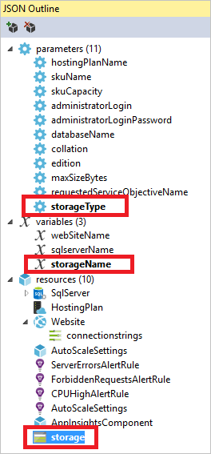

<properties
   pageTitle="Azure 資源群組 Visual Studio 專案 |Microsoft Azure"
   description="使用 Visual Studio 建立 Azure 資源群組專案及部署至 Azure 的資源。"
   services="azure-resource-manager"
   documentationCenter="na"
   authors="tfitzmac"
   manager="timlt"
   editor="tysonn" />
<tags
   ms.service="azure-resource-manager"
   ms.devlang="multiple"
   ms.topic="get-started-article"
   ms.tgt_pltfrm="na"
   ms.workload="na"
   ms.date="09/20/2016"
   ms.author="tomfitz" />

# 建立及部署 Visual Studio 透過 Azure 資源群組

使用 Visual Studio 和[Azure SDK](https://azure.microsoft.com/downloads/)，您可以建立部署至 Azure 的基礎結構和程式碼的專案。 例如，您可以定義 web 主機的網站，與資料庫應用程式，，並部署碼的基礎結構。 或者，您可以定義的虛擬機器、 虛擬網路和儲存的帳戶，並部署以及虛擬機器上執行的指令碼的基礎結構。 **Azure 資源群組**部署專案可讓您將所有所需的資源，在單一、 可重複執行作業。 如需有關部署及管理您的資源的詳細資訊，請參閱[Azure 資源管理員的概觀](azure-resource-manager/resource-group-overview.md)。

Azure 資源群組專案包含 Azure 資源管理員 JSON 範本，定義您部署至 Azure 的資源。 若要進一步瞭解資源管理員範本中的元素，請參閱[撰寫 Azure 資源管理員範本](resource-group-authoring-templates.md)。 Visual Studio 可讓您編輯這些範本]，並提供簡化使用範本的工具。

在本主題中，您可以部署的 web 應用程式和 SQL 資料庫。 不過，步驟會幾乎相同的任何類型的資源。 您可以為輕鬆部署虛擬機器和其相關的資源。 Visual Studio 提供許多不同的起始範本部署常見的案例。

本文將示範 Visual Studio 2015 更新 2 及 Microsoft Azure SDK 的.NET 2.9。 如果您使用 Visual Studio 2013 和 Azure SDK 2.9 時，您的體驗是主要是一樣的。 您可以使用版本 Azure SDK 2.6 或更新版本。不過，您的使用者介面的體驗可能不同的使用者介面，本文中所示。 我們強烈建議您安裝最新版[Azure SDK](https://azure.microsoft.com/downloads/)的啟動步驟之前。 

## 建立 Azure 資源群組專案

此程序，您可以建立 Azure 資源群組專案**Web 應用程式 + SQL**範本。

1. 在 Visual Studio 中，選擇 [**檔案**]、 [**新的專案**中，選擇 [ **C#**或**Visual Basic**。 然後選擇**雲端**，，然後選擇 [ **Azure 資源群組**專案。

    

1. 選擇您想要部署至 Azure 資源管理員的範本。 請注意，那里許多不同的選項根據您要部署的專案的類型。 本主題中，選擇 [ **Web 應用程式 + SQL**範本]。

    

    您所選擇的範本是只的起點。您可以新增和移除資源，以符合您的狀況。

    >[AZURE.NOTE] Visual Studio 擷取線上可用範本的清單。 可能會變更清單。

    Visual Studio 建立 web 應用程式和 SQL 資料庫的資源群組部署專案。

1. 若要查看您所建立，展開部署專案中的節點。

    

    我們之所以選擇這個 Web 應用程式 + SQL 範本，例如，因為您會看到下列檔案︰ 

  	|檔案名稱|描述|
  	|---|---|
  	|部署 AzureResourceGroup.ps1|PowerShell 指令碼叫用部署至 Azure 資源管理員的 PowerShell 命令。 **附註**Visual Studio 會使用這個 PowerShell 指令碼部署您的範本。 您對此指令碼進行任何變更會影響 Visual Studio 中的部署，因此請小心。|
  	|WebSiteSQLDatabase.json|您所要的資源管理員範本定義基礎結構的部署至 Azure，以及您可以在部署期間提供的參數。 也會定義的資源，因此資源管理員部署順序正確無誤資源之間的相依性。|
  	|WebSiteSQLDatabase.parameters.json|參數檔案包含值所需的範本。 您傳入自訂每個部署的參數值。|

    所有資源群組部署專案都包含這些基本的檔案。 在其他專案可能包含支援其他功能的其他檔案。

## 自訂資源管理員範本

您可以修改 JSON 範本描述您要部署的資源，來自訂部署專案。 JSON JavaScript Object Notation，代表，而是很容易使用的序列的資料格式。 JSON 檔案會使用您在每個檔案頂端參照結構描述。 如果您想要瞭解結構描述，您可以下載並加以分析。 結構描述定義哪些項目不正確，與類型] 欄位的格式、 列舉的值，依此類推的可能值。 若要進一步瞭解資源管理員範本中的元素，請參閱[撰寫 Azure 資源管理員範本](resource-group-authoring-templates.md)。

若要使用您的範本，請開啟**WebSiteSQLDatabase.json**。

Visual Studio 編輯器提供工具來協助您編輯資源管理員範本。 **JSON 大綱**視窗可讓您更容易看到定義在範本中的項目。

在大綱中選取任何項目會帶您到範本的一部分，並醒目提示對應 JSON。

選取頂端的 [JSON 大綱視窗] 的 [**新增資源**] 按鈕，或以滑鼠右鍵按一下**資源**，然後選取 [**新增新的資源**，您可以新增資源。

在此教學課程中，選取**儲存的帳戶**，並為它命名。 提供不超過 11 字元，且只包含數字和英文小寫字母的名稱。

請注意，不只是將資源加入，但也類型儲存帳戶的參數，儲存體帳戶名稱的變數。

**StorageType**參數是預先定義允許的類型與預設類型。 您可以將這些值，或編輯這些案例。 如果您不想要部署透過此範本**Premium_LRS**儲存帳戶的任何人，請將其移除允許的類型。 

    "storageType": {
      "type": "string",
      "defaultValue": "Standard_LRS",
      "allowedValues": [
        "Standard_LRS",
        "Standard_ZRS",
        "Standard_GRS",
        "Standard_RAGRS"
      ]
    }

Visual Studio 也會提供 intellisense 協助您瞭解哪些內容時，可編輯的範本。 例如，若要編輯您的應用程式服務方案的摘要資訊，請瀏覽至**HostingPlan**資源，並新增**屬性**的值。 請注意的 intellisense 會顯示可用的值，並說明的值。

您可以設定**numberOfWorkers**為 1。

    "properties": {
      "name": "[parameters('hostingPlanName')]",
      "numberOfWorkers": 1
    }

## 部署資源群組專案至 Azure

您已準備好要部署您的專案。 當您部署 Azure 資源群組專案時，將其部署至 Azure 資源的群組。 資源群組是邏輯群組的共用常見的生命週期的資源。

1. 部署專案節點的快顯功能表，選擇 [**部署** > **新部署**。

    ![部署新的部署] 功能表項目](./media/vs-azure-tools-resource-groups-deployment-projects-create-deploy/deploy.png)

    **部署資源群組**] 對話方塊隨即出現。

    ![部署至 [資源群組] 對話方塊](./media/vs-azure-tools-resource-groups-deployment-projects-create-deploy/show-deployment.png)

1. 在 [**資源群組**] 下拉式清單方塊中，選擇現有的資源群組或建立新的範本。 建立資源群組，請開啟 [**資源群組**] 下拉式清單方塊，並選擇 [**建立新檔案**。

    ![部署至 [資源群組] 對話方塊](./media/vs-azure-tools-resource-groups-deployment-projects-create-deploy/create-new-group.png)

    **建立資源群組**] 對話方塊隨即出現。 提供群組的名稱和位置，然後選取 [**建立**] 按鈕。

    ![建立資源群組] 對話方塊](./media/vs-azure-tools-resource-groups-deployment-projects-create-deploy/create-resource-group.png)
   
1. 選取 [**編輯參數]**按鈕來編輯以供部署參數。

    ![編輯 [參數] 按鈕](./media/vs-azure-tools-resource-groups-deployment-projects-create-deploy/edit-parameters.png)

1. 提供空白的參數的值，然後選取 [**儲存**] 按鈕。 空白的參數是**hostingPlanName**、 **administratorLogin**、 **administratorLoginPassword**和**資料庫名稱**。

    **hostingPlanName**指定要建立的[應用程式服務方案](./app-service/azure-web-sites-web-hosting-plans-in-depth-overview.md)的名稱。 
    
    **administratorLogin**指定 SQL Server 系統管理員的使用者名稱。 不要使用一般的管理員名稱，例如**索**] 或 [**管理員**。 
    
    **AdministratorLoginPassword**指定 SQL Server 系統管理員的密碼。 **另存為純文字參數檔案中的密碼**選項不安全。因此，請選取這個選項。 以純文字不儲存密碼，因為您需要部署過程中再次提供此密碼。 
    
    **資料庫名稱**指定要建立資料庫的名稱。 

    ![編輯 [參數] 對話方塊](./media/vs-azure-tools-resource-groups-deployment-projects-create-deploy/provide-parameters.png)
    
1. 選擇要將專案部署至 Azure [**部署**] 按鈕。 PowerShell 主控台隨即會開啟以外的 Visual Studio 執行個體。 在 PowerShell 主控台出現提示時輸入 SQL Server 系統管理員的密碼。 **您的 PowerShell 主控台可能會隱藏後面的其他項目，或工作列中的最小化。** 這個主控台並加以選取以提供的密碼。

    >[AZURE.NOTE] Visual Studio 可能會要求您安裝的 Azure PowerShell 指令程式。 您必須已成功部署資源群組的 Azure PowerShell 指令程式。 如果出現提示，請安裝。
    
1. 部署可能需要幾分鐘的時間。 在 [**輸出**] 視窗中，您會看到部署的狀態。 部署完成後，最後一封郵件，指出類似的成功部署︰

        ... 
        18:00:58 - Successfully deployed template 'c:\users\user\documents\visual studio 2015\projects\azureresourcegroup1\azureresourcegroup1\templates\websitesqldatabase.json' to resource group 'DemoSiteGroup'.

1. 瀏覽器中，開啟[Azure 入口網站](https://portal.azure.com/)並登入您的帳戶。 若要查看 [資源] 群組中，選取 [**資源群組**與您部署至資源群組。

    

1. 您會看到所有已部署的資源。 請注意，儲存體帳戶名稱不完全什麼您指定在新增的資源。 儲存帳戶必須是唯一的。 範本會自動新增字元的字串，提供一個唯一的名稱您提供的名稱。 

    

1. 如果您進行變更，並想要重新部署您的專案，請選擇 [從 Azure 資源群組專案的快顯功能表的 [現有的資源群組]。 在快顯功能表中，選擇 [**部署**，，然後選擇您部署資源群組。

    

## 部署與您的基礎結構的程式碼

此時，您已經部署基礎結構的應用程式，但沒有實際的程式碼部署與專案。 本主題說明如何將 web 應用程式和 SQL 資料庫表格部署部署期間。 如果您部署虛擬機器，而不是在 web 應用程式，您要在電腦上執行某些程式碼，做為部署的一部分。 部署 web 應用程式，或設定虛擬機器的程式碼的程序是幾乎一樣的。

1. Visual Studio 方案中加入專案。 以滑鼠右鍵按一下方案，然後選取 [**新增** > **新的專案**。

    

1. 新增**ASP.NET Web 應用程式**。 

    
    
1. 選取**MVC** ，然後清除**主機雲端中**的欄位，因為資源群組專案會執行工作。

    
    
1. Visual Studio 建立您的 web 應用程式後，您會看到方案中的兩個專案。

    

1. 現在，您需要，請確定您的資源群組專案知道新的專案。 返回 [資源群組專案 (AzureResourceGroup1)。 以滑鼠右鍵按一下 [**參考資料**，然後選取 [**加入參考**。

    

1. 選取您所建立的 web 應用程式專案。

    
    
    藉由新增參照，您的 web 應用程式專案連結至 [資源群組專案，並自動設定三個主要的屬性。 您會看到這些參照的 [**屬性**] 視窗中的屬性。

      
    
    內容是︰

    - **其他屬性**中包含網頁部署套件執行推入 Azure 儲存的位置。 請注意的資料夾 (ExampleApp) 和檔案 (package.zip)。 部署應用程式時，您將會提供這些值做為參數。 
    - **包含檔案路徑**包含建立套件的位置的路徑。 **包含目標**的內容部署執行的命令。 
    - 建立**的預設值。封裝**可建立並建立網頁部署套件 (package.zip) 部署。  
    
    您不需要發佈設定檔部署建立封裝內容取得所需的資訊。
      
1. 將資源新增至範本。

    

1. 這次選取**Web 部署 Web 應用程式**。 

    
    
1. 重新部署資源群組專案至資源群組。 這次還有一些新的參數。 您不需要為**_artifactsLocation**或**_artifactsLocationSasToken**提供的值，因為 Visual Studio 會自動產生的值。 不過，您必須設定資料夾與檔案名稱包含部署套件 （為**ExampleAppPackageFolder**和**ExampleAppPackageFileName**下圖中顯示） 的路徑。 提供更舊版本中的參照屬性 （**ExampleApp**和**package.zip**） 的值。

    
    
    **成品儲存帳戶**中，選取 [部署與此資源群組的項目]。
    
1. 部署完成後，選取您的 web 應用程式在入口網站。 選取 [瀏覽至網站的 URL。

    

1. 請注意您已成功部署預設 ASP.NET 應用程式。

    

## 後續步驟

- 若要瞭解管理您透過入口網站的資源，請參閱[使用 Azure 入口網站管理 Azure 資源](./azure-portal/resource-group-portal.md)。
- 若要進一步瞭解範本，請參閱[撰寫 Azure 資源管理員範本](resource-group-authoring-templates.md)。
