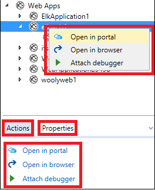

<properties 
   pageTitle="管理雲端的檔案總管 Azure 資源 |Microsoft Azure"
   description="瞭解如何使用雲端檔案總管，瀏覽和管理 Visual Studio 中的 Azure 資源。"
   services="visual-studio-online"
   documentationCenter="na"
   authors="TomArcher"
   manager="douge"
   editor="" />
<tags 
   ms.service="multiple"
   ms.devlang="dotnet"
   ms.topic="article"
   ms.tgt_pltfrm="na"
   ms.workload="multiple"
   ms.date="08/15/2016"
   ms.author="tarcher" />

# 管理雲端的檔案總管 Azure 資源

##概觀

雲端的檔案總管被為了讓您更輕鬆地快速瀏覽和管理內 Visual Studio IDE Azure 資源。 您可以、，例如，將其開啟 Web 應用程式，在[Azure 入口網站](http://go.microsoft.com/fwlink/p/?LinkID=525040)，或瀏覽器中，或以，或您可以檢視 blob 容器的內容，並將其開啟 [Blob 容器編輯器] 中。

Azure 資源管理員堆疊，就像[Azure 入口網站](http://go.microsoft.com/fwlink/p/?LinkID=525040)上建立雲端的檔案總管。 辨識資源，例如 Azure 資源群組和 Azure 服務，例如邏輯應用程式與 API 應用程式，以及支援[角色型存取控制](./active-directory/role-based-access-control-configure.md)(RBAC)。 若要查看新增或變更 Azure 資源，請選擇在雲端的檔案總管] 工具列上的 [**重新整理**] 按鈕。

Azure SDK 2.7 雲端總管安裝 Visual Studio 工具的一部分。 

## 必要條件

- Visual Studio 2015 RTM。

- Azure SDK 的 Visual Studio 工具。 
- 您也必須擁有 Azure 帳戶，並登入以雲端總管] 中檢視 Azure 資源。 如果您沒有帳戶，您可以在幾分鐘的時間來建立一個帳戶。 如果您有 MSDN 訂閱，請參閱[MSDN 訂閱者的 Azure 優勢](https://azure.microsoft.com/pricing/member-offers/msdn-benefits-details/)。 否則，請參閱[建立的免費的試用帳戶](https://azure.microsoft.com/pricing/free-trial/)。

- 如果看不到雲端的檔案總管，您可以選擇**檢視**，在功能表列上的**其他視窗****雲端的檔案總管**來檢視。

## 管理 Azure 帳戶與訂閱

若要查看您在雲端的檔案總管中的 Azure 資源，您需要登入 Azure 帳戶有一或多個作用中的訂閱。 如果您有一個以上的 Azure 帳戶，您可以將其新增在雲端的檔案總管中，然後選擇 [您想要包含在雲端的檔案總管資源檢視中的訂閱。

如果您並未使用 Azure 之前，或您尚未 Visual Studio 中新增必要的帳戶，系統會提示您執行此作業。

## 若要新增 Azure 帳戶至雲端的檔案總管

1. 選擇在雲端的檔案總管] 工具列上的 [設定] 圖示。

1. 選擇 [**新增帳戶**] 連結。 登入 Azure 帳戶您想要瀏覽的資源。 在 [帳戶選擇器] 下拉式清單中，應選取您剛才新增的帳戶。 該帳戶的訂閱會出現在 [帳戶項目。

    

    

1. 選取您想要瀏覽]，然後選擇 [**套用**] 按鈕的帳戶訂閱核取方塊。

    選取訂閱的 Azure 資源會出現在雲端的檔案總管。

## 若要移除 Azure 帳戶

1. 選擇 [**檔案**] 功能表列上的 [**帳戶設定**]。

1. 在 [**帳戶設定**] 對話方塊的 [**所有帳戶**] 區段中，選擇 [**移除**] 命令帳戶旁邊您想要移除。 請注意此命令只從 Visual Studio – it 移除帳戶並不會影響 Azure 帳戶本身。

## 檢視資源類型或群組

若要檢視您 Azure 的資源，您可以選擇 [**資源類型**] 或 [**資源群組**] 檢視。

![資源檢視] 下拉式清單](./media/vs-azure-tools-resources-managing-with-cloud-explorer/IC819516.png)

- **資源類型**] 檢視中，也是[Azure 入口網站](http://go.microsoft.com/fwlink/p/?LinkID=525040)中使用 [一般] 檢視，顯示依其類型，例如 web 應用程式、 儲存帳戶和虛擬機器分類您 Azure 資源。 此方式類似於如何 Azure 的資源將出現在伺服器總管]。

- 資源群組] 檢視將分類 Azure 的資源，其相關的 Azure 資源群組。

 
    資源群組是 Azure 的資源，通常是由特定應用程式套件。 若要進一步瞭解 Azure 資源群組，請參閱[Azure 資源管理員的概觀](./resource-group-overview.md)。

## 檢視並瀏覽資源

若要瀏覽至 Azure 的資源，並在雲端的檔案總管中檢視其資訊，展開的項目類型或相關聯的資源群組，然後選擇 [資源。 當您選擇資源時，資訊會顯示在雲端的檔案總管底部的兩個索引標籤。

- [**動作**] 索引標籤會顯示在雲端的檔案總管中可以採取的動作，選取資源。 您也可以查看資源的快顯功能表上的可用的動作。

- [**屬性**] 索引標籤會顯示資源，例如其類型、 地區設定和資源群組相關聯的內容。

每個資源具有**入口網站中開啟**的動作。 當您選擇這個動作時，雲端總管會顯示所選取的資源在[Azure 入口網站](http://go.microsoft.com/fwlink/p/?LinkID=525040)。 此功能的瀏覽至深度巢狀子資源特別有用。

其他動作]，[屬性值可能也會出現根據 Azure 資源。 例如，web 應用程式與邏輯應用程式也有**瀏覽器中開啟**並**附加偵錯工具**除了**入口網站中開啟**的動作。 當您選擇的儲存空間帳戶 blob、 佇列中或表格時，會出現 [動作] 以開啟編輯器。 Azure 應用程式有**URL** ] 及 [**狀態**] 屬性，而儲存資源索引鍵和連線字串的屬性。

## 搜尋資源

在您 Azure 帳戶的訂閱中，找出特定的名稱的資源，請在雲端的檔案總管中的 [搜尋] 方塊中輸入名稱。

當您在 [搜尋] 方塊中輸入的字元，資源的字元，便會顯示資源樹狀目錄中。

