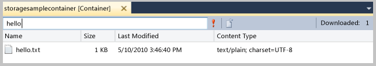

<properties
   pageTitle="瀏覽和管理伺服器檔案總管的儲存空間資源 |Microsoft Azure"
   description="瀏覽和管理伺服器檔案總管的儲存空間資源"
   services="visual-studio-online"
   documentationCenter="na"
   authors="TomArcher"
   manager="douge"
   editor="" />
<tags
   ms.service="storage"
   ms.devlang="multiple"
   ms.topic="article"
   ms.tgt_pltfrm="na"
   ms.workload="na"
   ms.date="07/18/2016"
   ms.author="tarcher" />

# 瀏覽和管理伺服器檔案總管的儲存空間資源

[AZURE.INCLUDE [storage-try-azure-tools](../includes/storage-try-azure-tools.md)]

## 概觀
如果您已安裝 Microsoft Visual Studio Azure 工具，您可以檢視 blob 與佇列中，表格資料從儲存帳戶 Azure。 Azure 儲存體節點伺服器總管] 中的顯示您的本機存放區模擬器帳戶和其他 Azure 儲存體帳戶中的資料。

若要在 Visual Studio 中，檢視伺服器總管，在功能表列上，選擇 [**檢視**，**伺服器總管**]。 儲存節點會顯示所有之下每個 Azure 訂閱/憑證您已連線到儲存帳戶。 如果您儲存的帳戶沒有出現，您可以依照下列指示[本主題稍後的](#add-storage-accounts-by-using-server-explorer)自行新增。

從 Azure SDK 2.7 開始，您也可以使用新的雲端瀏覽器來檢視和管理 Azure 資源。 如需詳細資訊，請參閱[管理 Azure 資源雲端的檔案總管](./vs-azure-tools-resources-managing-with-cloud-explorer.md)。

## 檢視及管理 Visual Studio 中的儲存空間資源

伺服器總管就會自動顯示二進位大型物件、 佇列和資料表的清單，在您儲存模擬器帳戶。 儲存模擬器帳戶會列為伺服器總管] 中的儲存空間節點下**開發**節點。

若要查看儲存空間模擬器帳戶的資源，請展開**開發**節點。 如果尚未開始儲存模擬器展開**開發**節點時，它會自動啟動。 這可能需要幾秒鐘的時間。 您可以繼續在其他方面的 Visual Studio 工作，而儲存模擬器隨即啟動。

若要檢視資源儲存帳戶，展開伺服器總管] 中的儲存空間帳戶的節點。 下列子節點出現︰

- 二進位大型物件

- 佇列

- 表格

## 使用 Blob 資源

二進位大型物件節點顯示選取的儲存帳戶的容器的清單。 Blob 容器包含 blob 檔案，而且您可以將這些 blob 組織成資料夾及子資料夾。 如需詳細資訊，請參閱[如何使用從.NET Blob 儲存體](./storage/storage-dotnet-how-to-use-blobs.md)。

### 若要建立 blob 容器

1. 開啟 [ **Blob**節點的快顯功能表，然後選擇 [**建立 Blob 容器**。

1. 在**建立 Blob 容器**] 對話方塊中輸入新的容器的名稱，然後選擇 [**確定]**

    >[AZURE.NOTE] Blob 容器名稱必須開始的數字 (0-9) 或小寫字母 (a 到 z)。

### 若要刪除 blob 容器

- 開啟您要移除，然後選擇 [**刪除**的 blob 容器的捷徑功能表。

### 若要顯示的 blob 容器中包含的項目清單

- 在清單中開啟的快顯功能表 blob 容器名稱，然後選擇 [**檢視 Blob 容器**。

    當您檢視 blob 容器中的內容時，它會出現在稱為 「 blob 容器檢視] 索引標籤。

    

    您可以執行下列作業二進位大型物件在右上角的 blob 容器檢視使用的按鈕︰

    - 輸入篩選值，並將其套用

    - 重新整理 blob 容器中的清單

    - 上傳檔案

    - 刪除 blob

      >[AZURE.NOTE] 刪除 blob 容器中的檔案不會刪除基礎的檔案。它只會從 blob 容器。

    - 開啟 blob

    - Blob 儲存至本機電腦

### 若要建立 blob 容器中的資料夾或子資料夾

1. 選擇 [伺服器總管] 中的 [blob 容器]。 在 [容器] 視窗中，選擇 [**上傳 Blob** ] 按鈕。

    

1. 在 [**上傳新檔案**] 對話方塊中，選擇 [**瀏覽**] 按鈕，以指定您想要上傳的檔案，然後在 [**資料夾 （選用）**方塊中輸入資料夾名稱。

    您可以新增容器資料夾中的子資料夾，以相同的程序。 如果您不指定的資料夾名稱，將檔案上傳至 blob 容器的最上層中。檔案會出現在容器中指定的資料夾。

    

1. 按兩下資料夾，或按 ENTER 來查看資料夾的內容。 當您在容器的資料夾時，您可以導覽返回容器的根目錄，選擇 [**開啟父目錄**（向上箭號）] 按鈕。

### 若要刪除的容器資料夾

 - 刪除所有資料夾中的檔案

    >[AZURE.NOTE] Blob 容器中的資料夾是虛擬資料夾，因為您無法建立空白的資料夾，也可以刪除資料夾以刪除檔案內容。 您需要刪除整個資料夾以刪除資料夾的內容。

### 若要篩選容器中的二進位大型物件

您可以篩選顯示指定共同的前置字元的二進位大型物件。

例如，如果您輸入前置詞`hello`篩選文字] 方塊，然後選擇 [**執行**（**！**）] 按鈕，以 「 認識 」 開頭的 blob 會顯示。

>[AZURE.NOTE] [篩選] 欄位是區分大小寫，並不支援使用萬用字元進行篩選。 二進位大型物件只可以篩選的前置字元。 如果您組織 blob 虛擬階層中的使用的分隔符號，前置詞可能包括分隔符號。 例如，篩選的前置詞 HelloFabric / 會傳回所有與該字串開頭的二進位大型物件。

### 若要下載 blob 資料

- **伺服器總管**] 中開啟一或多個二進位大型物件的捷徑功能表，然後選擇 [**開啟**] 或選擇 blob 名稱然後選擇 [**開啟**] 按鈕，或按兩下 blob 名稱。

    **Azure 活動記錄**視窗中顯示 blob 下載的進度。

    Blob 隨即會開啟該檔案類型的預設編輯器中。 如果作業系統識別的檔案類型，隨即會開啟檔案的本機安裝的應用程式。否則，系統提示您選擇的應用程式，適合 blob 的檔案類型。 下載 blob 時建立本機檔案已經標示為唯讀。

    Blob 資料是在本機快取，並檢查 blob 的上次修改的時間 Blob 服務。 如果已更新 blob 上次下載之後，它不會下載一次。否則 blob 會載入從本機磁碟。 依預設 blob 會下載至暫存的目錄。 若要下載二進位大型物件至特定的目錄，請開啟的快顯功能表選取的 blob 名稱並選擇 [**另存新檔**。 當您將 blob 以這種方式，blob 檔案沒有開啟，，以讀寫屬性建立本機的檔案。

### 若要上傳二進位大型物件

- 容器 blob 容器檢視中的檢視開啟時，請選擇 [**上傳 Blob** ] 按鈕。

    您可以選擇要上傳一或多個檔案，您可以上傳任何類型的檔案。 **Azure 活動記錄**會顯示上傳的進度。 如需有關如何使用 blob 資料的詳細資訊，請參閱[如何使用 Azure Blob 儲存體中的服務.NET](http://go.microsoft.com/fwlink/p/?LinkId=267911)。

### 若要檢視轉移到 blob 的記錄

- 如果您使用 Azure 診斷記錄從 Azure 應用程式的資料，您已將記錄轉移到您儲存的帳戶，您會看到 Azure 建立這些記錄的容器。 在 [伺服器總管] 中檢視這些記錄是輕鬆找出您的應用程式的問題，尤其是如果已部署至 Azure。 如需有關 Azure 診斷的詳細資訊，請參閱[收集依據使用 Azure 診斷記錄的資料](https://msdn.microsoft.com/library/azure/gg433048.aspx)。

### 若要取得 blob 的 URL

- 開啟 blob 的快顯功能表，然後選擇 [**複製 URL**。

### 若要編輯 blob

- 選取 blob，然後選擇 [**開啟 Blob** ] 按鈕。

    檔案會下載至暫存的位置，然後在 [本機電腦上開啟。 進行變更之後，您必須再次上載 blob。

## 使用佇列中的資源

儲存服務佇列會裝載於 Azure 儲存體帳戶，您可以使用這些允許您的雲端服務的郵件傳遞機制通訊與彼此以及與其他服務的角色。 您可以透過雲端服務，以及透過 web 服務的外部用戶端以程式控制方式存取佇列。 您也可以直接在 Visual Studio 中使用伺服器檔案總管來存取佇列。

開發時使用佇列雲端服務，您可能會想要使用 Visual Studio 建立佇列並與其互動的方式運作，在開發與測試您的程式碼。

在 [伺服器總管，您可以檢視佇列儲存帳戶、 建立及刪除佇列、 開啟佇列來檢視其的郵件，並加入佇列中的郵件。 當您開啟檢視佇列中時，您可以檢視個別郵件，並可以使用的按鈕左上角佇列上執行下列動作︰

- 重新整理佇列中的檢視

- 新增至佇列中的訊息

- 取消佇列最上層的訊息。

- 清除整個佇列中

下圖顯示包含兩個訊息。

深入瞭解儲存服務佇列，請參閱[如何︰ 使用佇列中儲存服務](http://go.microsoft.com/fwlink/?LinkID=264702)。 儲存服務佇列 web 服務的相關資訊，請參閱[佇列服務概念](http://go.microsoft.com/fwlink/?LinkId=264788)。 如需如何傳送郵件給儲存服務佇列中，使用 Visual Studio，請參閱[傳送的郵件儲存空間服務佇列](https://msdn.microsoft.com/library/azure/jj649344.aspx)資訊。

>[AZURE.NOTE] 儲存服務佇列是有別於服務匯流排佇列項目。 如需有關服務匯流排佇列的詳細資訊，請參閱服務匯流排佇列主題，以及訂閱。

## 使用表格資源

Azure 資料表儲存服務儲存了大量的結構化資料。 服務是 NoSQL 資料存放區可接受驗證的來電內部和外部 Azure 雲端。 Azure 資料表非常適合儲存結構化、 非關聯式資料。

### 若要建立表格

1. 在 [伺服器總管選取的儲存空間帳戶的 [**資料表**] 節點，然後選擇**建立表格**。

1. 在 [**建立表格**] 對話方塊中，輸入資料表的名稱。

### 若要檢視表格資料

1. 在伺服器總管] 中，開啟 [ **Azure**節點，然後再開啟**儲存**節點。

1. 開啟您感興趣的儲存空間帳戶節點，然後開啟 [**資料表**] 節點，看到一份資料表儲存體帳戶。

1. 開啟表格的快顯功能表，然後選擇 [ **View 表格**。

    

表格被組織的實體 （顯示在 [資料列） 和 （顯示在資料行） 的屬性。 例如下, 圖顯示列在 [**資料表設計工具**中的項目︰

### 若要編輯的表格資料

1. 在**資料表設計工具**中，開啟捷徑功能表的實體 （單一資料列） 或屬性 （單一儲存格），然後選擇**編輯**。

    

    在單一資料表中的項目不一定要有相同的一組屬性 （欄）。 請記住下列限制上檢視及編輯表格資料。
    - 您無法檢視或編輯二進位資料 （類型 byte[])，但您可以將其儲存為資料表中。

    - 您無法編輯**PartitionKey**或**RowKey**值，因為中 Azure 資料表儲存體不支援的作業。

    - 您無法建立名為時間戳記的屬性，Azure 儲存體服務使用屬性的名稱。

    - 如果您輸入的日期時間值，您必須追蹤您的電腦的地區和語言設定適當的格式 (例如，MM/DD/YYYY ss [AM |PM] 美式英文版)。

### 若要新增項目

1. 在**資料表設計工具**中，選擇 [**新增實體**] 按鈕，也就是在表格檢視右上角附近。

    

1. 在 [**新增實體**] 對話方塊中，輸入**PartitionKey**和**RowKey**屬性的值。

    ![新增實體] 對話方塊](./media/vs-azure-tools-storage-resources-server-explorer-browse-manage/IC655335.png)

    請仔細輸入的值，因為您無法變更之後，除非您刪除實體，並再次新增，關閉對話方塊。

### 若要篩選項目

您可以自訂顯示在表格中，如果您使用查詢建立器的實體集。

1. 若要開啟查詢建立器，請開啟檢視的表格。

1. 選擇 [表格] 檢視的工具列上的最右邊的按鈕。

    [**查詢建立器**] 對話方塊隨即出現。 下圖顯示在查詢建立器中的建立的查詢。

    

1. 當您完成建立查詢，關閉對話方塊。 產生文字形式的查詢會出現在文字方塊中，做為 WCF Data Services 篩選。

1. 若要執行查詢時，選擇綠色三角形圖示。

    您也可以篩選會出現在**資料表設計工具]**如果您輸入篩選欄位中，直接 WCF Data Services 篩選字串的實體資料。 這種字串 SQL WHERE 子句類似，但會傳送至伺服器 HTTP 要求。 有關如何建構篩選字串，請參閱[建構篩選字串的 [資料表設計工具](https://msdn.microsoft.com/library/azure/ff683669.aspx)。

    下圖顯示正確的篩選器字串的範例︰

    

### 重新整理儲存的資料

當伺服器總管連線到或取得資料的儲存空間帳戶時，就可能會在到一分鐘才能完成作業。 如果無法連線，作業可能會逾時。 時擷取資料，您可以繼續使用 Visual Studio 的其他部分。 若要取消作業，如果時間太長，請選擇伺服器總管] 工具列上的 [**停止重新整理**] 按鈕。

#### 重新整理 blob 容器資料

- 選取下方**儲存空間**的**二進位大型物件**] 節點並選擇伺服器總管] 工具列上的 [**重新整理**] 按鈕。

- 若要重新整理所顯示的二進位大型物件清單，請選擇 [**執行**] 按鈕。

#### 若要重新整理資料表的資料

- 選取**儲存**下方的 [**資料表**] 節點並選擇 [**重新整理**] 按鈕。

- 若要重新整理**資料表設計工具**中顯示的項目清單，選擇 [**資料表設計工具]**的 [**執行**] 按鈕。

#### 若要重新整理佇列中的資料

- 選取 [**佇列**] 節點，然後選擇 [**重新整理**] 按鈕。

#### 若要重新整理儲存帳戶的所有項目

- 選擇帳戶名稱，然後選擇工具列] 上的 [**重新整理**] 按鈕伺服器總管。

### 使用伺服器總管] 中新增儲存空間帳戶

有兩種方式使用伺服器總管] 中新增儲存空間帳戶。 您可以建立新的儲存空間帳戶中 Azure 訂閱，或您可以附加現有的儲存空間帳戶。

#### 若要建立新的儲存空間帳戶使用伺服器總管

1. 在 [伺服器總管開啟 [儲存] 節點的快顯功能表，然後選擇建立儲存帳戶。

    

1. 選取或**建立儲存帳戶**] 對話方塊中輸入新的儲存空間帳戶的下列資訊。

    - 您要新增的儲存空間帳戶 Azure 訂閱。

    - 您想要使用的新儲存體帳戶名稱。

    - 區域或相關性群組 （例如西美國或中式地址）。

    - 您想要使用的儲存空間帳戶，例如地理重複試驗的類型。

1. 選擇 [**建立**]。

    新的儲存空間帳戶會出現在方案總管] 中的 [**儲存**] 清單中。

#### 若要將現有的儲存空間帳戶附加使用伺服器總管

1. 在 [伺服器總管開啟 [Azure 儲存體] 節點的快顯功能表，然後選擇**附加外部儲存空間**。

    

1. 選取或**建立儲存帳戶**] 對話方塊中輸入新的儲存空間帳戶的下列資訊。

    - 您想要附加的現有儲存體帳戶名稱。 您可以輸入名稱，或從清單中選取。

    - 選取的儲存帳戶索引鍵。 當您選取的儲存空間帳戶時，此值，通常會提供給您。 如果您想要記住的儲存空間帳戶金鑰 Visual Studio，選取 [記住帳戶] 方塊。

    - 若要使用連線至該儲存帳戶，例如 HTTP、 HTTPS 或自訂的端點通訊協定。 如需自訂端點，請參閱[如何設定連線字串](https://msdn.microsoft.com/library/azure/ee758697.aspx)。

### 若要檢視 [第二個端點

- 如果您建立的**讀取權限地理多餘**的複寫選項儲存帳戶時，您可以檢視其次要結束點。 開啟帳戶名稱] 快顯功能表，然後選擇 [**摘要資訊**。

    

### 若要移除伺服器總管] 中的儲存空間帳戶

- 在 [伺服器總管開啟帳戶名稱的快顯功能表，然後選擇**刪除**。 如果您刪除儲存的帳戶，也會移除該帳戶的任何儲存重要資訊。

    >[AZURE.NOTE] 如果您是從伺服器總管刪除儲存的帳戶，不會影響您儲存的帳戶或任何包含的資料時。只會從伺服器總管移除參照。 若要永久刪除儲存的帳戶，請使用[Azure 傳統入口網站](http://go.microsoft.com/fwlink/?LinkID=213885)。

## 後續步驟

若要瞭解更多關於如何使用 Azure 儲存服務，請參閱[存取 Azure 儲存服務](https://msdn.microsoft.com/library/azure/ee405490.aspx)。
