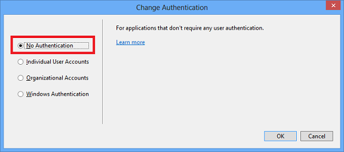

<properties
    pageTitle="在 [markdown 中建立的圖像"
    description="說明如何建立 markdown 依據準則設定 Azure 存放庫中的圖像。"
    services=""
    solutions=""
    documentationCenter=""
    authors="kenhoff"
    manager="ilanas"
    editor="tysonn"/>

<tags
    ms.service="contributor-guide"
    ms.devlang=""
    ms.topic="article"
    ms.tgt_pltfrm=""
    ms.workload=""
    ms.date="06/25/2015"
    ms.author="kenhoff" />

# <a name="create-images-in-markdown"></a>在 [markdown 中建立的圖像

## <a name="image-folder-creation-and-link-syntax"></a>圖像資料夾建立及連結語法

新的文件中，您必須在下列位置建立資料夾︰

    /articles/<service-directory>/media/<article-name>/

例如︰

    /articles/app-service/media/app-service-enterprise-multichannel-apps/

建立資料夾並為其新增的圖像後，使用下列語法，若要建立您的文件中的圖像︰

```

```
範例︰

請參閱[markdown 範本](../markdown%20templates/markdown-template-for-new-articles.md)的範例。  圖像參照中的連結，此 markdown 範本被專為範本的底部。

## <a name="guidelines-specific-to-azuremicrosoftcom"></a>Azure.microsoft.com 特定的指導方針

如果您不能包含問題步驟目前鼓勵螢幕擷取畫面。 撰寫您的內容，使內容可強調不螢幕擷取畫面，如有必要。

使用下列方針時建立及包括圖案中的檔案︰
- 在文件不共用圖案檔案。 複製您需要將其新增至 [媒體] 資料夾中，您的特定主題的檔案。 共用檔案之間，建議因為它是容易移除已遭取代內容並保留 repo 初始狀態的圖像。

- 檔案格式︰ 使用.png 檔案-他們高品質的成品，已進行本地化程序期間大小時維持其品質。 其他檔案格式不會維持以及其品質。 允許，但不是慣用.jpeg 格式。  無動畫的 GIF 檔案中。

- 使用紅色方塊的 [小畫家] 中所提供的預設欄寬 (5 像素) 來突顯特定項目中的螢幕擷取畫面。  

    範例︰

    

- 當這麼做，可以自由裁剪圖像，讓使用者介面項目會顯示在螢幕的大小。 請務必內容明確的使用者，請透過。

- 避免上邊緣的螢幕擷取畫面的空白區域。 如果您要裁剪保留在邊緣的白色背景的方式螢幕擷取畫面，新增一個像素灰色周圍的框線圖像。  如果使用 [小畫家]，使用預設色盤 (0xC3C3C3) 淺灰色。 如果使用的一些其他圖形的應用程式，RGB 色彩是 R195，G195，195。 您可以輕鬆地新增灰色周圍的框線圖像在 Visio 中，請執行下列動作、 選取圖像、 選取線條，並確保正確的色彩設定，並再變更為 1 1/2 pt 的 [線條粗細。  螢幕擷取畫面應有 1 像素寬度灰色框線，以便的螢幕擷取畫面的白色區域不執行模糊網頁。

    範例︰

    
    
    用來自動化程序新增所需的框線，為圖像的工具，請參閱[AddACOMBorder 工具-自動化程序新增必要 1 像素灰色框線，為 ACOM 圖像的方式](https://github.com/Azure/Azure-CSI-Content-Tools/tree/master/Tools/AddACOMImageBorder)。

- 使用空格為開頭的概念性圖像不需要灰色框線。  

    範例︰

    

- 嘗試不太長圖像。  如果太寬圖像就會自動調整大小。 不過，調整大小有時候會使 fuzziness，因此我們建議您限制 780 您圖像的寬度像素，並手動調整圖像，如有必要的送出前。

- 螢幕擷取畫面顯示命令輸出。  如果您的文章包含使用者介面中的使用位置的步驟，很有用的螢幕擷取畫面顯示命令輸出。 在此情況下，通常為關於 72 字元限制您殼層寬度可確保圖像仍 780 像素寬度方針內。 採取輸出的螢幕擷取畫面前,，先調整視窗大小，讓相關的命令和輸出顯示 （您也可以在任一側空白行）。

- 需要 windows 盡可能的整個螢幕擷取畫面。 時採取的在瀏覽器視窗的螢幕擷取畫面，您在瀏覽器調整視窗大小以 780 像素寬或更少，並保留為瀏覽器視窗的高度簡短越好，例如視窗中，符合您的應用程式。

    範例︰

    

- 請謹慎使用中的螢幕擷取畫面所顯示的資訊。  不顯示公司內部資訊或個人資訊。

- 概念圖案或圖表，請在 [雲端版和企業版的符號與圖示集中使用正式的圖示。 使用在 http://aka.ms/CnESymbols 公用的設定。

- 螢幕擷取畫面中的個人或私人資訊取代以方括弧括住的版面配置區文字。 這包含使用者名稱、 訂閱識別碼，以及其他相關的資訊。 個人的名稱取代[核准 fictious 名稱](https://aka.ms/ficticiousnames)（僅員工的連結）。 請勿蠟筆或標記提示小畫家] 中會遮住或模糊個人或私人資訊。

  下列圖像具有正確更新以使用版面配置區的資訊取代實際**訂閱識別碼**︰

  

### <a name="contributors-guide-links"></a>參與者的指南的連結

- [概觀文章](./../README.md)
- [指導文件的索引](./contributor-guide-index.md)
