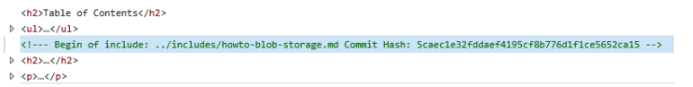
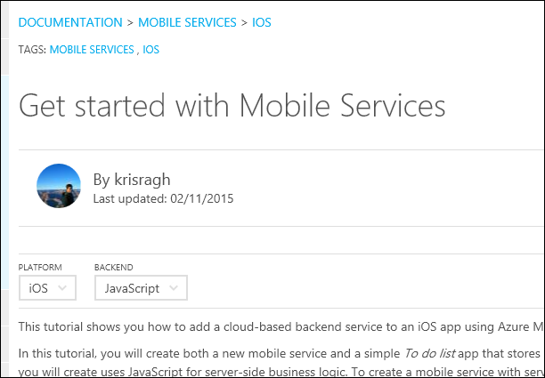

<properties
    title="required"
    pageTitle="我們技術文件中使用自訂 markdown 副檔名"
    description="列出自訂 markdown 延伸，讓內嵌的視訊、 備忘稿和秘訣，可重複使用的內容，以及 azure.microsoft.com 技術文件中的其他項目。"
    services=""
    solutions=""
    documentationCenter=""
    authors="tysonn"
    manager="carolz"
    editor=""/>

<tags
    ms.service="contributor-guide"
    ms.devlang=""
    ms.topic="article"
    ms.tgt_pltfrm=""
    ms.workload=""
    ms.date="01/22/2015"
    ms.author="tysonn"/>

## 針對 Azure.microsoft.com markdown

一般 markdown 提示，請參閱[Markdown 基本概念](https://help.github.com/articles/markdown-basics/)，我們[markdown cheatsheet](./media/documents/markdown-cheatsheet.pdf?raw=true)。 如果您需要 markdown 中建立文章交互連結，請參閱 [連結指南] (。 / create-links-markdown.md#markdown-syntax-for-acom-relative-links.md/)。

Azure.microsoft.com 支援[納入範圍之程式碼區塊](https://help.github.com/articles/github-flavored-markdown/#fenced-code-blocks)和[語法醒目提示](https://help.github.com/articles/github-flavored-markdown/#syntax-highlighting)。 不過，ACOM 支援只有一個語法醒目提示色彩配置，無論您的程式碼區塊中指定的語言。

## 我們技術文件中使用自訂 markdown 副檔名

文章使用 GitHub flavored 的 markdown 大部分文件格式設定-段、 連結、 清單、 標題等。但我們使用自訂 markdown 副檔名我們需要 azure.microsoft.com 呈現頁面中的更豐富格式設定。 以下是我們目前正在使用的擴充功能︰

+ [備忘稿和秘訣]
+ [包含]
+ [內嵌的視訊]
+ [技術與平台選取器]

## 備忘稿和秘訣

您可以選擇 4 的類型的備忘稿和秘訣︰

- AZURE。附註
- AZURE。警告
- AZURE。TIPss
- AZURE。重要

###使用方式
一般而言，使用備忘稿和謹慎整個您的文件的秘訣。 當您使用它們時，選擇適當的記事或提示類型︰

- 使用 AZURE。注意若要醒目提示中性或正資訊強調或補充重點的主要文字。 記事會提供適用於只有在特殊的情況下的資訊。

  

- 使用 AZURE。警告，通知使用者，以在未來可能會導致問題的條件。 例如，選取特定的選項，或進行的特定選項可能會永久鎖定您特定案例。

  

- 使用 AZURE。秘訣若要協助使用者套用的技巧和自己的需求文字中所述的程序。 提示可能也會建議可能不會的替代方法。 秘訣，不過，沒有必要基本的瞭解程度的文字。

  

- 使用 AZURE。重要提供任務的完成不可或缺的資訊。

  

這些筆記和秘訣支援的程式碼區塊、 圖像、 清單及連結，請嘗試簡單且直接保留您的筆記和秘訣。 如果您發現自己建立複雜的筆記包含許多格式設定的可能是登，您只需要主要文字中的文件的另一個區段。 然後太多的備忘稿，請參閱可令人分心的很難掃描或閱讀。

###範例 markdown

所有的範例會示範 AZURE。附註。 若要使用的提示、 警告或重要事項，取代為 「 記事 」 markdown 中︰

    > [AZURE.TIP]

    > [AZURE.WARNING]

    > [AZURE.IMPORTANT]

單一段落︰

    > [AZURE.NOTE] 若要完成此教學課程中，您必須使用中的 Microsoft Azure 帳戶。 如果您沒有帳戶，您可以建立的免費的試用帳戶在幾分鐘。

Multiparagraph:

    > [AZURE.NOTE] 若要完成此教學課程中，您必須使用中的 Microsoft Azure 帳戶。
    >
    > 如果您沒有帳戶，您可以[建立的免費的試用帳戶](http://www.windowsazure.com/pricing/free-trial/)在幾分鐘。

## 包含

我們 GitHub 存放庫中的可重複使用文字位於檔案我們稱為 「 包含 」。 當您需要使用多個文件中的文字時，您會包含該檔案的資訊可重複使用的參考。 包含本身是簡單 markdown (.md) 檔案。 它可以包含任何有效的 markdown，包括文字、 連結和圖像。 所有包含的 markdown 檔案都必須在[/ 包含目錄](https://github.com/Azure/azure-content/tree/master/includes)存放庫的根目錄。 已發佈的文件，包括文字完美整合的已發佈的主題。

- 我們使用特定的語法參照包含。

- 您放置在中包含的媒體檔案必須建立媒體資料夾中包含的特定。 媒體的資料夾包含屬於[azure 內容/包含/媒體的資料夾](https://github.com/Azure/azure-content/tree/master/includes/media)中。 媒體目錄不能包含任何其根目錄中的圖像。 如果包含未與任何圖像，然後對應的媒體目錄就不需要。

###使用方式

- 使用包含您要顯示多個文件中的相同文字的任何位置。

- 包含要用於大量的段落或兩個、 共用的程序或內容共用的區段。 不要使用它們的任何項目小於句子。**不提供的產品名稱**。

- 確定所有以完整的句子或片語，而不必至上一個文字或下列的文字，請參閱參照包含撰寫中包含的文字。 略過此指引線的本地化的體驗的文件中建立 untranslatable 的字串。 

- 不要內嵌在其他包含包含。 他們不支援 DP 發佈系統。

- 不要共用的檔案之間的媒體。 使用唯一的名稱，為每個包含和文件中的另一個檔案。 媒體檔案的資料夾中儲存媒體包含相關聯。

- 不包含作為只內容的文章。  包含是附加到文件的其餘部分中的內容。

- 因為所有包含必須在 / 包括目錄，永遠是文章中包含的路徑

    ..包含 /

- [不要重複連結或圖像檔名參照中的文件，包括同時。 新增 「-包含 「 連結參照或媒體檔案名稱，以避免重複參照至︰

 **連結參照**

 變更︰ 若要 odata.org: odata.org 包含

 **圖像參照**

 變更︰ 若要 table.png︰ 表格 include.png

###範例 markdown
新增文件本文包含的語法是︰

    [AZURE.INCLUDE [include-short-name](../includes/include-file-name.md)]

範例

    [AZURE.INCLUDE [howto-blob-storage](../includes/howto-blob-storage.md)]

包含的第一部分是包含名稱不路徑及.md 副檔名。 第二部分是包含在的相對路徑 / 包括目錄，.md 副檔名。

###轉譯

在呈現 GitHub 頁面上，包含會呈現，如下所示︰

 [AZURE。包含如何 blob 儲存體]

在 azure.microsoft.com，從 HTML 上呈現的 HTML 中包含會合併到文件的 HTML 的其餘部分。 然而，HTML 會包含 HTML 與原始的註解包含 markdown 檔名和 GitHub 認可雜湊。 此註解是的好讓來源內容可輕鬆識別和集中 GitHub 疑難排解包含︰

  

## 內嵌的視訊

我們技術文件支援 embeddeded 視訊技術文件中，只要是 Microsoft 的[頻道 9](http://channel9.msdn.com/)網站上的視訊。 視訊頻道 9 必須整合[azure.microsoft.com 影片管理中心](http://azure.microsoft.com/documentation/videos/home/)。 我們目前不支援內嵌的 YouTube 影片。如果您是社群參與者，您會連結至 YouTube，如果您想要精選的影片張貼有歡迎使用。 Microsoft 參與者應該使用 9 頻道與影片中心。

### 使用方式

- 請確認視訊影片中心。

- 從易記的 URL 頻道 9 上的視訊或從 Azure 影片管理中心，請複製的視訊的識別碼。 例如，在[http://azure.microsoft.com/documentation/videos/azure-scheduler-unusual-schedules/](http://azure.microsoft.com/documentation/videos/azure-scheduler-unusual-schedules/)視訊的視訊識別碼是**azure-排程器-異常-排程**。

### 語法

    > [AZURE.VIDEO video-id-string]

### 轉譯

開啟 GitHub: [https://github.com/Azure/azure-content-pr/blob/master/articles/web-sites-backup.md](https://github.com/Azure/azure-content-pr/blob/master/articles/web-sites-backup.md)

已發佈的文章︰ [http://azure.microsoft.com/documentation/articles/web-sites-backup/](http://azure.microsoft.com/documentation/articles/web-sites-backup/)

## 技術及平台選取器

當您撰寫技術或平台上的地址差異實作相同文件的多個類別，請使用技術與平台 switchers 技術文件中。 這是最通常適用於行動裝置平台內容適用於開發人員。 目前有兩種不同的資料選取器與[雙向選取器](#two-way-selectors)[簡單的選取器](#simple-selectors)。

因為相同選取器 markdown 會在每一個選取範圍中的主題中，我們建議您在包含，放在您主題的選取器，然後參照該包含在所有您使用相同的選取器的主題。

###簡單的選取器

簡單的 （單向） 選取器呈現為一組標題的正下方的 [選項] 按鈕。 當客戶需要從集中單一平台或技術，例如.NET、 Node.js 及 Java 主題中選擇時，請使用這些按鈕。  使用自訂 markdown 副檔名為適用於任何選取器-選取不使用 HTML。  

若要查看如何作者建立 8 版本相同的文件，但若要啟用瀏覽過所有使用選取器的 [[快速入門通知集線器](http://azure.microsoft.com/documentation/articles/notification-hubs-windows-phone-get-started/)，請參閱。

####語法

    > [AZURE.SELECTOR]
    - [#1 標籤連結](link #1 url)
    - [連結 #2] 標籤](link #2 url)

範例︰

    > [AZURE.SELECTOR]
    - [通用 Windows](../articles/notification-hubs-windows-store-dotnet-get-started/)
    - [Windows Phone](../articles/notification-hubs-windows-phone-get-started/)
    - [iOS](../articles/notification-hubs-ios-get-started/)
    - [Android](../articles/notification-hubs-android-get-started/)
    - [Kindle](../articles/notification-hubs-kindle-get-started/)
    - [Baidu](../articles/notification-hubs-baidu-get-started/)
    - [Xamarin.iOS](../articles/partner-xamarin-notification-hubs-ios-get-started/)
    - [Xamarin.Android](../articles/partner-xamarin-notification-hubs-android-get-started/)

#### 轉譯

上述圖像轉譯顯示 azure.microsoft.com。 呈現 GitHub 在頁面上，選取器呈現為連結的項目符號清單。

###雙向選取器

雙向選取器可讓使用者從兩個方法矩陣選取主題。 Azure 技術，例如行動電話服務支援多重後端平台，以及您在多個用戶端時，這是很重要。 請記住下列事項︰

- 設計為時`(Platform | Backend)`，現在可自訂的 dropwdown 文字。
- 您不需要您矩陣圖中的每個點的清單項目，但只需要主題 URL 存在的位置，而且不重複的項目。
- 連結可以是任何 URL，雖然通常另一個 GitHub 主題。

若要查看作者建立 15 版本相同的文件 （9 行動用戶端平台和 2 的後端平台），但若要啟用瀏覽過所有使用選取器的方式，請參閱[開始使用行動電話服務](http://azure.microsoft.com/en-us/documentation/articles/mobile-services-ios-get-started/)。 請注意 3 的文章，不需要兩個後端版本。

####語法

    > [AZURE。選取器清單 (Dropdown1 |Dropdown2)]     -  [(Dropdown1Text1 |Dropdown2Text1)](../articles/dropdown1-text1-dropdown2-text1.md)
    - [(Dropdown1Text1 |Dropdown2Text2)](../articles/dropdown1-text1-dropdown2-text1.md)
    - [(Dropdown1Text2 |Dropdown2Text3)](../articles/dropdown1-text1-dropdown2-text1.md)
    - [(Dropdown1Text3 |Dropdown2Text4)](../articles/dropdown1-text1-dropdown2-text1.md)

範例︰

    > [AZURE。選取器清單 (平台 |後端）]     -  [(iOS |.NET)](./mobile-services-dotnet-backend-ios-get-started-push.md)
    - [(iOS |JavaScript)](./mobile-services-javascript-backend-ios-get-started-push.md)
    - [(Windows 通用 C# |.NET)](./mobile-services-dotnet-backend-windows-universal-dotnet-get-started-push.md)
    - [(Windows 通用 C# |Javascript)](./mobile-services-javascript-backend-windows-universal-dotnet-get-started-push.md)
    - [(Windows Phone |.NET)](./mobile-services-dotnet-backend-windows-phone-get-started-push.md)
    - [(Windows Phone |Javascript)](./mobile-services-javascript-backend-windows-phone-get-started-push.md)
    - [(Android |.NET)](./mobile-services-dotnet-backend-android-get-started-push.md)
    - [(Android |Javascript)](./mobile-services-javascript-backend-android-get-started-push.md)
    - [(Xamarin iOS |Javascript)](./partner-xamarin-mobile-services-ios-get-started-push.md)
    - [(Xamarin Android |Javascript)](./partner-xamarin-mobile-services-android-get-started-push.md)

#### 轉譯

上述圖像轉譯顯示 azure.microsoft.com。 呈現 GitHub 在頁面上，選取器呈現為連結的項目符號清單。

<!--Anchors-->
[備忘稿和秘訣]: #notes-and-tips
[包含]: #includes
[內嵌的視訊]: #embedded-videos
[技術與平台選取器]: #technology-and-platform-selectors

###參與者的指南的連結

- [概觀文章](./../README.md)
- [指導文件的索引](./contributor-guide-index.md)
