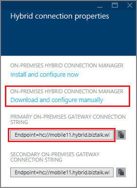
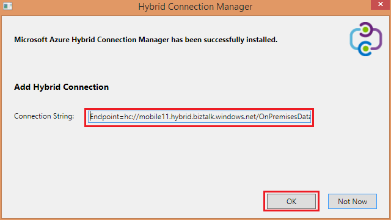

1. 在**混合式連線**刀中，按一下您剛才建立的混合式部署連線，然後按一下 [**接聽程式設定**。
    
    
    
4. **混合式連線內容**刀隨即會開啟。 **內部部署混合式連線管理員**] 底下，選擇 [**下載並手動設定**、 儲存下載的 HybridConnectionManager.msi 套件，並複製閘道器的連線字串。
    
    
    
5. 從管理員命令提示字元中，輸入下列命令以啟動安裝程式︰

        start HybridConnectionManager.msi
 
7. 執行安裝程式之後，按一下 [**不是現在**，然後瀏覽至 %ProgramFiles%\Microsoft\HybridConnectionManager 資料夾執行 HCMConfigWizard.exe 與**使用者帳戶控制**] 對話方塊中，按一下**[是]** 。
        
7. 貼上您先前複製的混合式連接字串，然後按一下**[確定**]。 
    
    
    
8. 安裝完成後，請按一下 [**關閉**]。
    
    ![按一下 [關閉]](./media/app-service-hybrid-connections-manager-install/D09HCMInstallComplete.png)
    
    在**混合式連線**刀中，[**狀態**] 欄現在會顯示**已連線**。 
    
    