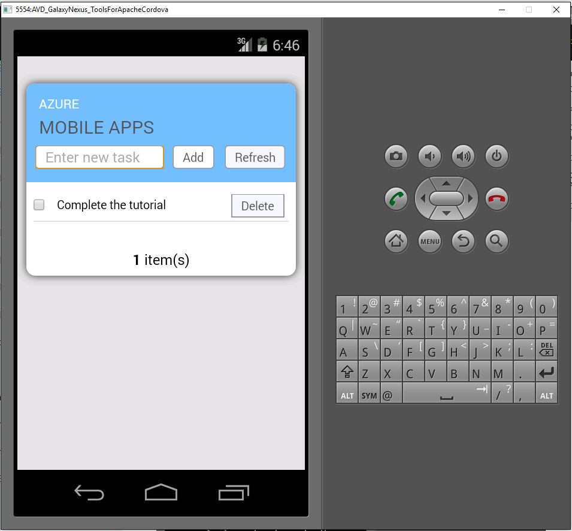

1. 請造訪[Azure 入口網站]。 按一下 [**全部瀏覽** > **Mobile 應用程式**> 剛才建立的後端。 在行動應用程式設定] 中，按一下 [**快速入門** > **Cordova**。 在 [**設定您的用戶端應用程式**] 底下，選取 [**建立新的應用程式**]，然後按一下 [**下載**]。 這會下載預先設定連線到您的後端應用程式的完整的 Cordova 專案。

2. 解壓縮您硬碟上的目錄下載的 ZIP 檔案、 瀏覽至方案檔案 (.sln) 和使用 Visual Studio 將其開啟。

5. 在 Visual Studio 中，選擇解決方案的平台 （Android、 iOS 或 Windows） 從開始箭號] 旁的下拉式，然後按一下下拉式清單上的綠色箭頭以選取特定的部署裝置或模擬器。 請注意，您可以使用的預設 Android 平台和漣漪模擬器。 更多進階的教學課程會要求您選取支援的裝置或模擬器。 

6. 按 F5 或按一下綠色箭頭以建立和執行 Cordova 應用程式。 如果您看到模擬器要求存取網路中的 [安全性] 對話方塊，請接受它。   

7. 後啟動應用程式在裝置或模擬器中，**輸入新的文字**，例如_完成教學課程_中輸入有意義的文字，然後按一下 [**新增**] 按鈕。  
這是您先前部署 Azure 後端傳送文章要求。 要求的後端插入資料至 TodoItem SQL 資料庫資料表，而傳回回到行動應用程式的新儲存的項目的相關資訊。 行動應用程式清單中顯示這項資料。

    
    
8. 針對每個計劃支援的裝置平台重複先前的三個步驟。

[Azure 入口網站]: https://portal.azure.com/
