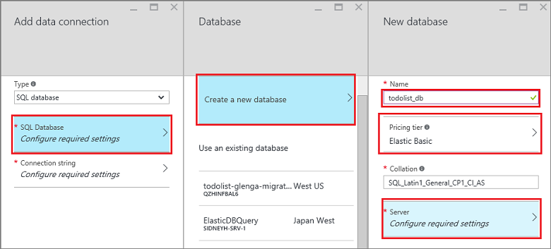

1. 在[Azure 入口網站]登入。

2. 按一下 [ **+ 新增** > **Web + 行動** > **Mobile 應用程式**，然後提供您的行動應用程式後端的名稱。

3. **資源] 群組**中，選取現有的資源群組，或建立新的範本 （使用相同的名稱為您的應用程式）。 
 
    您可以選取另一個應用程式服務方案，或建立新的範本。 如需更多應用程式服務的相關計劃，以及如何建立新的方案在不同的價格層和您想要的位置，請參閱[Azure 應用程式服務方案在您採取進階的概觀](../articles/app-service/azure-web-sites-web-hosting-plans-in-depth-overview.md)。

4. 用於**應用程式服務計劃**中，已選取預設計劃 （在[標準層](https://azure.microsoft.com/pricing/details/app-service/)）。 您也可以選取不同的方案，或[建立新的範本](../app-service/azure-web-sites-web-hosting-plans-in-depth-overview.md#create-an-app-service-plan)。 應用程式服務方案的設定會決定的[成本，並計算資源的位置，功能，](https://azure.microsoft.com/pricing/details/app-service/)與您的應用程式相關聯。 

    決定方案之後，請按一下 [**建立**]。 這樣會建立 Mobile 應用程式後端。 
    
6. 在新的行動應用程式後端的**設定**刀，按一下 [**快速入門**> 用戶端應用程式的平台 >**將資料庫連線**。 

    

7. 在 [**新增資料連線**刀中，按一下 [ **SQL 資料庫** > 的 [**建立新的資料庫**中，輸入資料庫**名稱**、 選擇價格的層]，然後按一下 [**伺服器**。  您可以重複使用此新的資料庫。 如果您已經有資料庫的同一個位置，您可以改為選擇**使用現有的資料庫**。 因為頻寬成本和較高的延遲，不建議使用的資料庫中的其他位置。
 
    

8. 在**新的伺服器**刀中，[**伺服器名稱**] 欄位中輸入唯一的伺服器名稱，提供登入密碼，核取 [**允許 azure 服務存取伺服器**，並按一下**[確定]**。 這樣會建立新的資料庫。

9. 回到**新增資料連線**刀中，按一下 [**連線字串**，輸入您的資料庫，登入名稱和密碼值，按一下**[確定]**。 請稍候幾分鐘，再繼續成功部署資料庫。

<!-- URLs. -->
[Azure 入口網站]: https://portal.azure.com/
