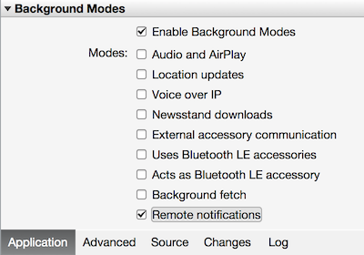

####設定 iOS 專案 Xamarin Studio 中

1. Xamarin.Studio，開啟 [ **Info.plist**，然後更新**套件識別碼**的套件識別碼您先前建立的新的應用程式識別碼。

    

2. 捲動**背景模式**下，核取 [**啟用背景模式**] 方塊和 [**遠端通知**] 方塊。 

    

3. 按兩下以開啟 [**專案選項**的 [方案] 面板中的專案。

4.  選擇 [**套件簽章的 iOS**底下**建立**，並選取對應的**身分識別**和您必須只設定設定為此專案**提供的設定檔**。 

    

    如此一來，可確保專案會使用的程式碼簽署新的設定檔。 佈建文件的正式 Xamarin 裝置，請參閱[Xamarin 裝置提供]。

####在 Visual Studio 中設定 iOS 專案

1. 在 Visual Studio 中，專案中，以滑鼠右鍵按一下，然後按一下**屬性**。

2. 在 [屬性頁**iOS 應用程式**] 索引標籤，並更新**識別碼**您先前建立的識別碼。

    

3. 在**iOS 簽署的套件**] 索引標籤中，選取對應的**身分識別**，您必須只設定設定為此專案**提供的設定檔**。 

    

    如此一來，可確保專案會使用的程式碼簽署新的設定檔。 佈建文件的正式 Xamarin 裝置，請參閱[Xamarin 裝置提供]。

4. 按兩下加以開啟，並啟用背景模式下**RemoteNotifications** Info.plist。 

[佈建 Xamarin 裝置]: http://developer.xamarin.com/guides/ios/getting_started/installation/device_provisioning/