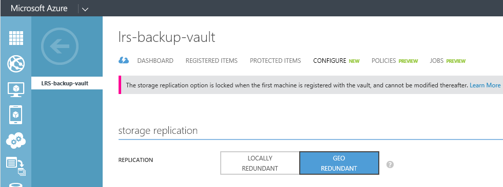

## 建立備份保存庫
若要備份檔案和資料從 Windows Server 或資料保護管理員 (DPM) Azure 或備份 IaaS Vm 至 Azure 時，您必須建立備份保存庫中您想要用來儲存資料的地理區域。

下列步驟會引導您完成建立用來儲存備份保存庫。

1. 登入[管理入口網站](https://manage.windowsazure.com/)
2. 按一下 [**新增** > **資料服務** > **修復服務** > **備份保存庫**，然後選擇 [**快速建立**。

    

3. **名稱**引數，請輸入好記的名稱來識別備份保存庫。 必須是唯一的每個訂閱。

4. **地區**引數，請選取 [備份保存庫的地理區域]。 選擇會決定要傳送您的備份資料的地理區域。 選擇接近您所在位置的地理區域，您可以在時備份到 Azure 減少網路延遲。

5. 按一下 [**建立保存庫**完成工作流程。 需要時建立備份保存庫。 若要查看狀態，您可以監視通知] 底部的入口網站。

    

6. 在建立備份保存庫之後，則會出現訊息，告訴您已成功建立保存庫。 保存庫也會列在資源中復原服務為**使用中**。

    

### Azure 備份-儲存重複性選項

>[AZURE.IMPORTANT] 找出您儲存重複性選項的最佳時機是保存庫建立之後，以及任何電腦註冊為保存庫之前。 若要保存庫登錄項目後, 儲存重複性選項已鎖定，且無法修改。

您的業務需求決定 Azure 備份後端儲存空間的儲存空間重複。 如果您使用的 Azure 為主要備份儲存端點 （例如您要備份到 Azure 從 Windows Server），您應該考慮挑選 （預設） 地理多餘的儲存選項。 這會出現在您的備份保存庫的 [**設定**] 選項。

#### 地理多餘的儲存空間 (GRS)
GRS 維護您的資料的六個複本。 GRS，與您的資料內的主要區域中，複製三次，也會提供最高層級的持續性的主要區域，遠離英哩的次要區域數百中複寫三次。 在主要的區域，先將資料儲存在 GRS，失敗 Azure 備份可確保您的資料長期兩個不同區域中。

#### 在本機上多餘的儲存空間 (LRS)
在本機上多餘的儲存空間 (LRS) 會保留資料的三份數。 LRS 內的一個區域中的單一功能複寫三次。 從標準的硬體失敗，而不是從失敗的整個 Azure 設備 LRS 也會保護您的資料。

如果您使用的 Azure 為第三個備份的儲存空間端點 (例如您使用 SCDPM 本機備份複製內部部署與您長期保留需要使用 Azure)，您應該考慮您備份保存庫的 [**設定**] 選項中選擇本機多餘的儲存空間。 如此會開啟下 Azure 中的資料儲存在可能的第三份可接受的資料提供的持續性較低層級成本。

