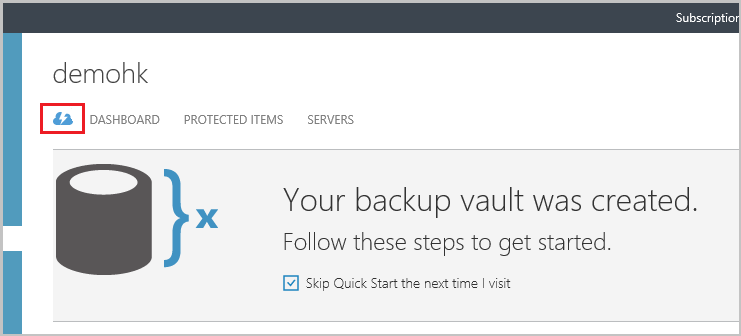
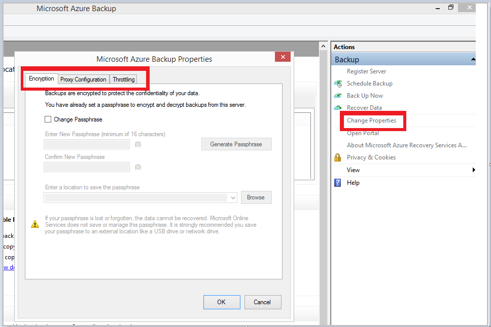

## 下載、 安裝及註冊 Azure 備份代理程式

建立之後 Azure 備份保存庫，在每一個資料和 Azure 應用程式的備份可讓您 Windows 電腦 （Windows Server、 Windows 用戶端、 系統管理中心資料保護管理員伺服器或 Azure 備份伺服器電腦） 上安裝代理程式。

1. 登入[管理入口網站](https://manage.windowsazure.com/)

2. 按一下 [**修復服務**]，然後選取您想要與伺服器註冊備份保存庫]。 該備份保存庫的 [快速入門] 頁面隨即出現。

    

3. 在 [快速入門] 頁面上，按一下**Windows 伺服器的系統管理中心資料保護管理員或 Windows 用戶端**選項底下**下載代理程式**。 按一下 [複製到本機電腦的 [**儲存**]。

    

4. 代理程式安裝後，按兩下 [MARSAgentInstaller.exe 啟動 Azure 備份代理程式的安裝]。 選擇 [安裝資料夾與代理程式所需的草稿資料夾]。 指定的快取位置必須至少 5%的備份資料的可用空間。

5.  如果您使用 proxy 伺服器連線至網際網路，在 [ **Proxy 設定**] 畫面中，輸入 proxy 伺服器的詳細資料。 如果您使用已驗證的 proxy，請在這個畫面輸入使用者名稱和密碼的詳細資料。

6.  Azure 備份代理程式安裝.NET Framework 4.5 與 Windows PowerShell （如果尚未提供） 以完成安裝。

7.  代理程式安裝後，按一下 [繼續進行工作流程**前進到註冊**] 按鈕。

    

8. 在 [保存庫認證] 畫面中，瀏覽並選取先前已經下載保存庫認證檔案。

    

    保存庫認證檔案是僅適用於 48 小時 （之後就會從入口網站下載）。 如果您遇到此畫面 （例如 「 保存庫認證檔案提供已過期 」），登入 Azure 入口網站中的任何錯誤，並再次下載保存庫認證檔案。

    請確定此保存庫認證檔案可在安裝應用程式可存取的位置。 如果您遇到存取相關的錯誤、 複製保存庫認證檔案的暫存的位置，在這台電腦，然後再試。

    如果您遇到無效保存庫認證錯誤 （例如 「 提供無效保存庫認證 」） 可能已損毀檔案，或不會有最新的認證與不相關的復原服務。 從入口網站下載新保存庫認證檔案後再試。 如果使用者在 [快速連續 Azure 入口網站中的 [**下載保存庫認證**] 選項，通常會發生這個錯誤。 在此情況下，只需將第二個保存庫認證檔案是有效的。

9. 在 [**加密設定**] 畫面中，您可以產生複雜密碼，或提供複雜密碼 （16 個字元的最小值）。 請記得在安全的位置儲存複雜密碼。

    

    > [AZURE.WARNING] 如果遺失或忘記密碼; 複雜密碼Microsoft 無法協助您復原備份資料。 使用者擁有加密複雜密碼和 Microsoft 沒有完善複雜使用使用者的密碼。 請將檔案儲存在安全的位置，因為它是修復作業期間必要。

10. 一旦您按一下 [**完成**] 按鈕，電腦登錄成功，可以保存庫，現在可以準備開始備份到 Microsoft Azure。

11. 使用 Microsoft Azure 備份獨立版時，您可以修改 Azure 備份 mmc 嵌入式管理單元中的 [**變更屬性**] 選項，即可在 [工作流程註冊期間所指定的設定。

    

    或者，使用時資料保護管理員，您可以修改登錄工作流程期間所指定選取**Online**在 [**管理**] 索引標籤底下，按一下 [**設定**] 選項的設定。

    
