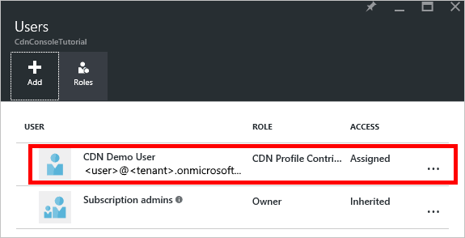

## 必要條件

我們可以撰寫 CDN 管理代碼之前，我們需要執行一些準備，讓我們與 Azure 資源管理員互動的程式碼。  若要這麼做，您必須︰

* 建立包含我們在本教學課程中建立的 CDN 設定檔的資源群組
* 設定以提供驗證應用程式的 Azure Active Directory
* 套用至 [資源] 群組的權限，以便從我們的 Azure AD 租用戶只有授權的使用者可以互動我們 CDN 的設定檔

### 建立資源群組

1. 登入[Azure 入口網站](https://portal.azure.com)。

2. 按一下左上角，然後**管理**並**資源] 群組**中的 [**新增**] 按鈕。
    
    

3. 打電話給您*CdnConsoleTutorial*上的 [資源] 群組。  選取您的訂閱，然後選擇您附近的位置。  如果您想要您可以按一下 [釘選至儀表板的 [資源] 群組，在入口網站中的 [**固定至儀表板**核取方塊。  這會使其更容易找到更新版本。  完成您的選項後，按一下 [**建立**]。

    

4. 建立資源群組時，如果您未將其固定至您的儀表板之後，您可以按一下 [**瀏覽]**，然後**資源群組**找到它。  按一下 [資源] 群組中，將其開啟。  記下您的**訂閱識別碼**。  我們會用得到。

    

### 建立 Azure AD 應用程式，並套用權限

有兩種方法與 Azure Active Directory 的應用程式驗證︰ 個別使用者或服務主要。 主要服務很類似 Windows 中指定帳戶給服務。  而非特定使用者授與權限，以互動的 CDN 設定檔，我們改為授與權限主要的服務。  服務原則通常可用於自動化、 非互動的程序。  雖然在此教學課程為撰寫互動式主控台應用程式，我們將焦點放在服務本金方法。

建立服務主要包含多個步驟，包括建立的 Azure Active Directory 應用程式。  若要這麼做，我們要[遵循此教學課程](../articles/resource-group-create-service-principal-portal.md)。

> [AZURE.IMPORTANT] 請務必遵循[連結的教學課程](../articles/resource-group-create-service-principal-portal.md)中的所有步驟。  是*極為重要*的完成完全所述。  請務必記下您的**租用戶識別碼**，**租用戶的網域名稱**(經常*。 onmicrosoft.com*網域除非您指定的自訂網域)，**用戶端識別碼**和**用戶端驗證金鑰**，我們會需要這些更新版本。  小心非常來保護您的**用戶端識別碼**和**用戶端驗證金鑰**，因為可以由任何使用這些認證，以服務主體執行作業。 
>   
> 當您收到命名[設定多租用戶應用程式](../articles/resource-group-create-service-principal-portal.md#configure-multi-tenant-application)的步驟時，請選取 [**否**]。
> 
> 當您[指派給角色的應用程式](../articles/resource-group-create-service-principal-portal.md#assign-application-to-role)的步驟，使用資源群組之前，建立*CdnConsoleTutorial*，但，而不是 「**讀取**」 角色，將**CDN 的設定檔參與者**角色指派。  您指派的應用程式的**CDN 的設定檔參與者**角色資源群組後，返回本教學課程。 

建立後，您的服務本金和指派**CDN 的設定檔參與者**的角色，資源群組的**使用者**刀看起來應該像這樣。

### 互動式使用者驗證

如果，而不是服務主體，您希望互動式的個別使用者驗證，有非常類似的服務主要的程序。  事實上，您會需要遵循的相同程序，但幾個次要變更。

> [AZURE.IMPORTANT] 如果您選擇使用個別使用者驗證，而不是主要的服務，只要遵循下列步驟。

1. 建立您的應用程式，而不是**Web 應用程式**中，選擇 [**原生應用程式**]。 
    
    
    
2. 在下一個頁面上，系統會提示的**重新導向 URI**。  URI 無法進行驗證，但請記得輸入的內容。  您必須將其更新版本。 

3. 有不需要建立**用戶端驗證金鑰**。

4. 而非**CDN 的設定檔參與者**的角色指派服務主要，我們將個別使用者或群組指派。  在此範例中，您可以看到我已指派， *CDN 示範使用者* **CDN 的設定檔參與者**的角色。  
    
    

