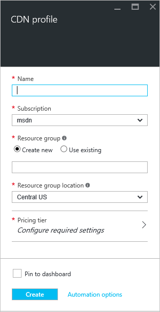

**若要建立新的 CDN 設定檔**

1. 在[Azure 入口網站](https://portal.azure.com)，在左上方，按一下 [**新增**]。  在 [**新增**刀中，選取**媒體 + CDN**，再**cdn 到底**。

    新的 CDN 的設定檔刀隨即出現。

    

2. 輸入您 CDN 的設定檔的名稱。

3. 選取的**位置**。  這是 Azure CDN 的設定檔資訊儲存的位置。  Cdn 到底結束點的位置上有不會影響。

4. 選取或建立**資源群組**]。  如需有關資源群組的詳細資訊，請參閱[Azure 資源管理員的概觀](resource-group-overview.md#resource-groups)。

5. 選取 [**價格層**]。  請參閱[CDN 概觀](cdn-overview.md#azure-cdn-features)定價層的比較。
    
    

6. 選取**訂閱**，此 CDN 設定檔。

7. 按一下 [**建立**] 按鈕，建立新的設定檔]。 