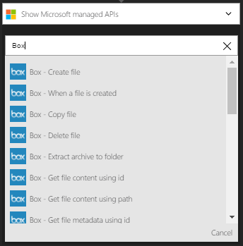
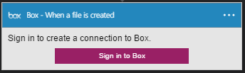
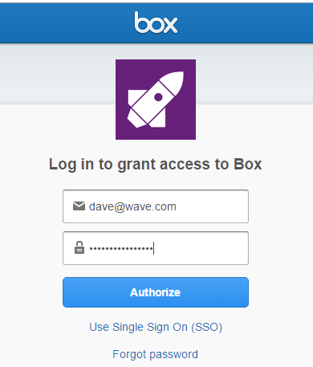

### 必要條件

- [方塊](http://box.com)帳戶  

您可以使用您的帳戶] 方塊中的邏輯應用程式之前，您必須授權邏輯應用程式連線至您的帳戶] 方塊。所幸，您可以輕鬆從 Azure 入口網站上您邏輯的應用程式中。  

以下是授權邏輯應用程式連線至您的帳戶] 方塊中的步驟︰  
1. 邏輯應用程式設計工具中建立連線到] 方塊中，選取下拉式清單中的 [**顯示 Microsoft 受管理的 Api** ，然後在 [搜尋] 方塊中輸入*方塊*。 選取您要使用的巨集指令的觸發程序︰  
  
2. 如果您還沒有建立任何連線到之前] 方塊中，您會提供您] 方塊中的認證提示。 這些認證會用於授權連線，您邏輯的應用程式，並存取方塊帳戶的資料︰  
  
3. 提供] 方塊中的使用者名稱和密碼，即可授權邏輯應用程式︰  
   
4. 讓我們來連線到] 方塊︰  
  
5. 請注意已經建立連線，您現在可以自由邏輯應用程式中的步驟進行︰  
  
