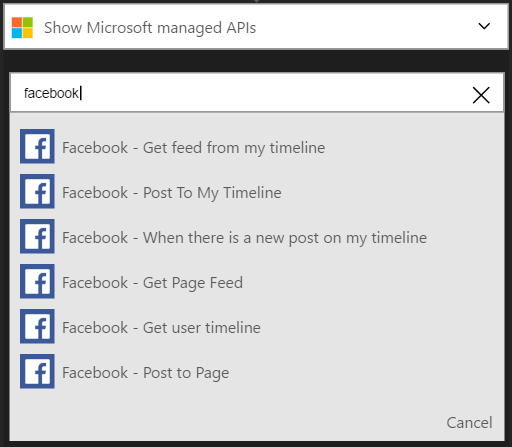
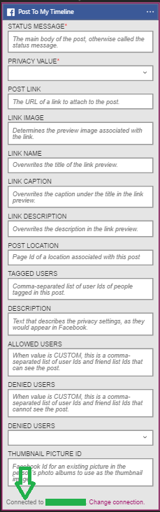

### 必要條件
- [Facebook](https://www.facebook.com/)帳戶 

您可以使用您的 Facebook 帳戶中的邏輯應用程式之前，您必須授權邏輯應用程式連線至 Facebook 帳戶。 所幸，您可以輕鬆從 Azure 入口網站上邏輯應用程式中。 

以下是授權邏輯應用程式連線至您的 Facebook 帳戶的步驟︰

1. 若要在邏輯應用程式設計工具中建立與 Facebook 的連線，下拉式清單中選取 [**顯示 Microsoft 受管理的 Api** ，然後在 [搜尋] 方塊中輸入*Facebook* 。 選取您要使用的巨集指令的觸發程序︰  
  
2. 如果您還沒有建立任何連線至 Facebook 之前，您會提供您的 Facebook 認證提示。 這些認證會用於授權邏輯應用程式連線至，並存取您的 Facebook 帳戶資料︰  
  
3. 提供您的 Facebook 使用者名稱和密碼，即可授權邏輯應用程式︰  
     
4. 請注意已經建立連線，您現在可以自由邏輯應用程式中的步驟進行︰  
     
