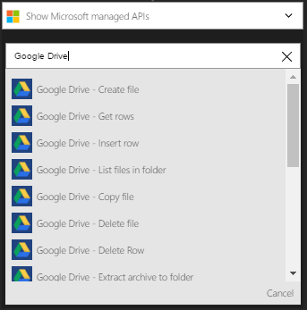
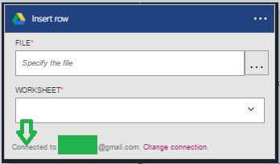

### 必要條件

- [GoogleDrive](https://www.google.com/drive/)帳戶  

您可以使用 GoogleDrive 帳戶中的邏輯應用程式之前，您必須授權邏輯應用程式連線至 GoogleDrive 帳戶。所幸，您可以輕鬆從 Azure 入口網站上您邏輯的應用程式中。  

以下是授權邏輯應用程式連線到您 GoogleDrive 帳戶步驟︰  
1. 若要建立的連線，GoogleDrive，邏輯應用程式設計工具] 中，選取下拉式清單中的 [**顯示 Microsoft 受管理的 Api** ，然後在 [搜尋] 方塊中輸入*GoogleDrive* 。 選取您要使用的巨集指令的觸發程序︰  
  
2. 如果您還沒有建立任何連線到 GoogleDrive 之前，您會提供您 GoogleDrive 認證提示。 這些認證會用於授權邏輯應用程式連線至，並存取 GoogleDrive 帳戶的資料︰  
  
3. 提供 GoogleDrive 電子郵件地址︰  
   
4. 提供 GoogleDrive 密碼，即可授權邏輯應用程式︰  

5. 允許 GoogleDrive 的連線  
  
6. 請注意已經建立連線，您現在可以自由邏輯應用程式中的步驟進行︰  
  

