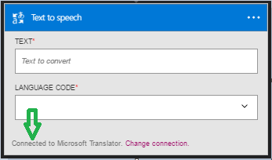

### 必要條件

- [MicrosoftTranslator](https://www.microsoft.com/translator)帳戶  

您可以使用 MicrosoftTranslator 帳戶中的邏輯應用程式之前，您必須授權邏輯應用程式連線至 MicrosoftTranslator 帳戶。所幸，您可以輕鬆從 Azure 入口網站上您邏輯的應用程式中。  

以下是授權您邏輯的應用程式連線至 MicrosoftTranslator 帳戶步驟︰  
1. 若要建立的連線，MicrosoftTranslator，邏輯應用程式設計工具] 中，選取下拉式清單中的 [**顯示 Microsoft 受管理的 Api** ，然後在 [搜尋] 方塊中輸入*MicrosoftTranslator* 。 選取您要使用的巨集指令的觸發程序︰  
  
2. 如果您還沒有建立任何連線到 MicrosoftTranslator 之前，您會提供您 MicrosoftTranslator 認證提示。 這些認證會用於授權連線，您邏輯的應用程式，並存取 MicrosoftTranslator 帳戶的資料︰  
  
3. 請注意已經建立連線，您現在可以自由邏輯應用程式中的步驟進行︰  
   
