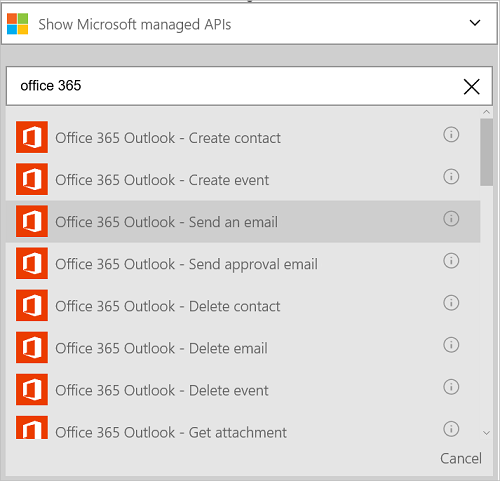

#### 必要條件
- Azure 帳戶。您可以建立的[免費的帳戶](https://azure.microsoft.com/free)
- [Office 365](https://office365.com)帳戶  

邏輯應用程式中使用您的 Office 365 帳戶之前, 授權邏輯應用程式連線至您的 Office 365 帳戶。 您可以輕鬆地在 Azure 入口網站上您邏輯的應用程式中。  

授權邏輯應用程式連線至 Office 365 帳戶使用下列步驟︰

1. 建立邏輯應用程式。 在邏輯應用程式設計工具中，在下拉式清單中，選取 [**顯示 Microsoft 受管理的 Api** ，然後在 [搜尋] 方塊中輸入 「 office 365 」。 選取其中引動程序或動作的詳細資訊︰  
      

2. 如果您還沒有先前建立的任何連線至 Office 365，系統會提示您使用您的 Office 365 認證登入︰  
      

3. 選取 [**登入**，然後輸入您的使用者名稱和密碼。 選取 [**登入**︰  
    

    若要授權邏輯應用程式連線至，並存取您的 Office 365 帳戶會使用這些認證。 

4. 請注意，在建立連線。 現在，繼續邏輯應用程式中的其他步驟︰   
      
  