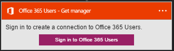
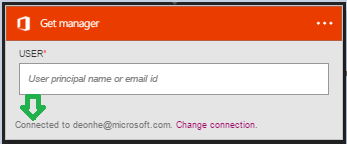

### 必要條件

- [Office 365 的使用者](https://office365.com)帳戶  

您可以使用您的 Office 365 的使用者帳戶中的邏輯應用程式之前，您必須授權邏輯應用程式連線至您的 Office 365 的使用者帳戶。所幸，您可以輕鬆從 Azure 入口網站上邏輯應用程式中。  

以下是授權邏輯應用程式連線至您的 Office 365 的使用者帳戶的步驟︰  
1. 若要建立連線至 Office 365 使用者，請在邏輯應用程式設計工具中，選取下拉式清單中的 [**顯示 Microsoft 受管理的 Api** ，然後在 [搜尋] 方塊中輸入*Office 365 的使用者*]。 選取您要使用的巨集指令的觸發程序︰  
  
2. 如果您還沒有建立任何連線至 Office 365 使用者之前，您會提供您的 Office 365 使用者認證提示。 這些認證會用於授權邏輯應用程式連線至，並存取您的 Office 365 的使用者帳戶的資料︰  
  
3. 提供您的 Office 365 使用者的使用者名稱和密碼，即可授權邏輯應用程式︰  
   
4. 請注意已經建立連線，您現在可以自由邏輯應用程式中的步驟進行︰  
  
  