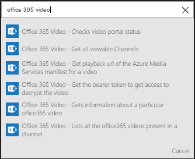

### 必要條件

- [Office 365 影片](https://support.office.com/article/Meet-Office-365-Video-ca1cc1a9-a615-46e1-b6a3-40dbd99939a6)帳戶  

您可以使用您的 Office 365 影片帳戶中的邏輯應用程式之前，您必須授權邏輯應用程式連線至您的 Office 365 影片帳戶。所幸，您可以輕鬆從 Azure 入口網站上您邏輯的應用程式中。  

以下是授權邏輯應用程式連線至您的 Office 365 影片帳戶步驟︰  
1. 若要建立連線至 Office 365 影片，邏輯應用程式設計工具] 中，選取下拉式清單中的 [**顯示 Microsoft 受管理的 Api** ，然後在 [搜尋] 方塊中輸入*Office 365 影片*]。 選取您要使用的巨集指令的觸發程序︰  
  
2. 如果您還沒有建立任何連線至 Office 365 影片之前，您會提供您的 Office 365 影片認證提示。 這些認證會用於授權邏輯應用程式連線至，並存取您的 Office 365 影片帳戶資料︰  
  
3. 提供您的認證以連線至 Office 365 影片︰  
   
4. 請注意已經建立連線，您現在可以自由邏輯應用程式中的步驟進行︰  
  
