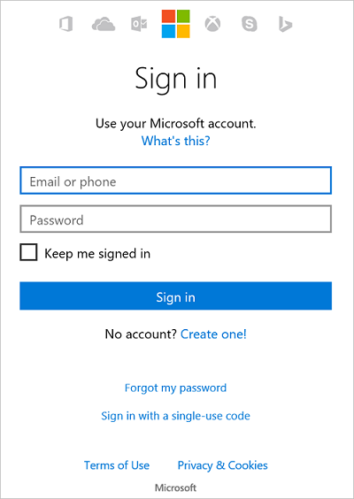
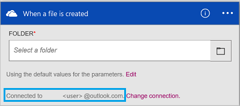

#### 必要條件
- Azure 帳戶。您可以建立的[免費的帳戶](https://azure.microsoft.com/free)
- [OneDrive](https://www.microsoft.com/store/apps/onedrive/9wzdncrfj1p3)帳戶 

您可以使用 OneDrive 帳戶中的邏輯應用程式之前，授權邏輯應用程式連線至您的 OneDrive 帳戶。  您可以輕鬆地在 Azure 入口網站上邏輯應用程式中。 

授權邏輯應用程式連線至您的 OneDrive 帳戶使用下列步驟︰

1. 建立邏輯應用程式。 在邏輯應用程式設計工具中，在下拉式清單中，選取 [**顯示 Microsoft 受管理的 Api** ，然後在 [搜尋] 方塊中輸入 「 onedrive 」。 選取其中引動程序或動作的詳細資訊︰  
  
2. 如果您還沒有先前建立的任何連線到 OneDrive，系統會提示您使用您的 OneDrive 認證登入︰  
  
3. 選取 [**登入**，然後輸入您的使用者名稱和密碼。 選取 [**登入**︰  
     

    若要授權邏輯應用程式連線至，並存取您的 OneDrive 帳戶中的資料會使用這些認證。 
4. 選取**[是]**以授權邏輯應用程式，使用您的 OneDrive 帳戶︰  
     
5. 請注意，在建立連線。 現在，繼續邏輯應用程式中的其他步驟︰  
  
