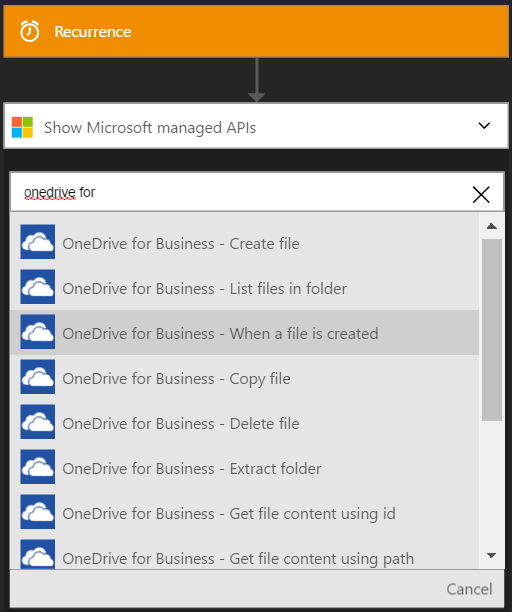
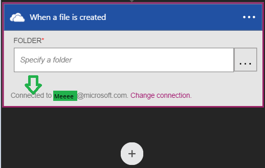

### 必要條件
- [OneDrive](http://OneDrive.com)帳戶 

您可以使用您的 OneDrive 企業版帳戶中的邏輯應用程式之前，您必須授權邏輯應用程式連線至您的商務用 OneDrive。 所幸，您可以輕鬆從 Azure 入口網站上您邏輯的應用程式中。 

以下是授權邏輯應用程式連線至商務用 OneDrive 的步驟︰

1. 若要建立連線到商務用 OneDrive，邏輯應用程式設計工具] 中，選取下拉式清單中的 [**顯示 Microsoft 受管理的 Api** ，然後在 [搜尋] 方塊中輸入*商務用 OneDrive* ]。 選取您要使用的巨集指令的觸發程序︰  
  
2. 如果您還沒有建立任何連線到之前的商務用 OneDrive，您會取得系統提示您提供您的 OneDrive 商務認證。 這些認證會用於授權邏輯應用程式連線至，並存取您的 OneDrive for Business 帳戶的資料︰  
  
3. 提供您的商務使用者名稱和密碼，即可授權邏輯應用程式的 OneDrive:  
     
4. 請注意已經建立連線，您現在可以自由邏輯應用程式中的步驟進行︰  
     
