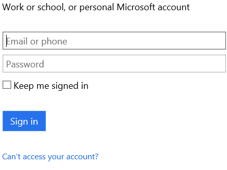

## 連線至 Outlook.com

### 必要條件
- Outlook.com 帳戶

您可以使用您的 Outlook.com 帳戶中的邏輯應用程式之前，您必須授權邏輯應用程式連線至您的 Outlook.com 帳戶。 所幸，您可以輕鬆從 Azure 入口網站上您邏輯的應用程式中。 

以下是授權邏輯應用程式連線至您的 Outlook.com 帳戶的步驟︰

1. 所有邏輯應用程式都需要啟動觸發程序，讓您建立邏輯應用程式，設計工具開啟並顯示清單的觸發程序的之後您可以使用開始邏輯應用程式︰

  
2. 在 [搜尋] 方塊中輸入 「 outlook 」。 注意若要在名稱] 清單中的 「 Outlook 」 的所有觸發程序會篩選的清單︰
3. 選取 [ **Office 365 Outlook-在新的電子郵件**]。   
  如果您還沒有建立任何連線至 Outlook 之前，會收到提示您輸入您的 Outlook.com 認證。 這些認證會用於授權邏輯應用程式連線至，並存取您的 Outlook.com 帳戶資料︰
4. Outlook 提供您的認證，登入︰  
  就是它。 您現在已建立的連線至 Outlook。 此連線將可供您建立的任何其他邏輯應用程式中使用。

