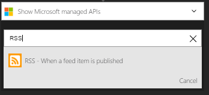
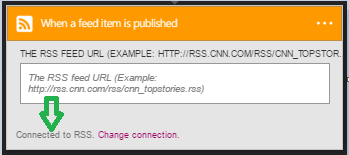

### 必要條件

- [RSS](https://wikipedia.org/wiki/RSS)帳戶  

您可以使用您的 RSS 帳戶中的邏輯應用程式之前，您必須授權邏輯應用程式連線至您的 RSS 帳戶。所幸，您可以輕鬆從 Azure 入口網站上邏輯應用程式中。  

以下是授權邏輯應用程式連線至您的 RSS 帳戶的步驟︰  
1. 若要建立邏輯應用程式設計工具中的 RSS 的連線，在下拉式清單中選取 [**顯示 Microsoft 受管理的 Api** ，然後在 [搜尋] 方塊中輸入*RSS* 。 選取您要使用的巨集指令的觸發程序︰  
  
2. 選取**建立連線**︰  
  
3. 請注意已經建立連線，您現在可以自由邏輯應用程式中的步驟進行︰  
   
