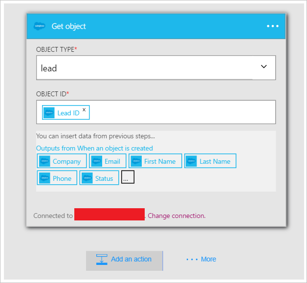

既然您已新增條件，其時間進行操作有趣的資料所產生的觸發程序。 請遵循這些步驟來新增**Salesforce-取得物件**動作。 每次建立新的潛在客戶時，這個動作會取得資料。 您也會加入會使用 Salesforce-取得物件動作來傳送電子郵件使用 Office 365 連接器之資料的第二個動作。  

若要設定此動作，您需要提供下列資訊。 您會注意到會觸發程序所產生的做為輸入某些新檔案的摘要資訊的使用簡單資料︰

|建立檔案屬性|描述|
|---|---|
|物件類型|這是您感興趣的 Salesforce 物件的類型。 範例包括潛在客戶、 帳戶等。|
|物件識別碼|這表示識別項的物件。|

1. 選取 [**新增動作**] 連結。 [搜尋] 方塊，您可以搜尋的任何動作您想要採取此隨即會開啟。 此範例中，Salesforce 動作會感興趣。      
  
- 輸入*salesforce*搜尋 salesforce 與相關的動作。
- 您可以選取 [ **Salesforce-取得物件**為要採取的動作。   **注意**︰ 您會提示您授權邏輯應用程式來存取您的 Salesforce 帳戶，如果您還不這麼做之前。    
    
- **取得物件**控制項隨即會開啟。  
- 選取物件類型的 [*潛在客戶*]。
- 選取的**物件識別碼**控制項。
- 若要展開可以做為動作輸入的權杖清單中選取**...** 。       
    
- 選取 [**潛在客戶編號**] 控制項隨即會開啟。   
     
- 請注意的潛在客戶識別碼 token 現在位於物件識別碼控制項，指出取得物件動作會搜尋的潛在客戶識別碼，等於觸發此邏輯應用程式的潛在客戶的潛在客戶識別碼。  
  
- 儲存您的工作。 您已加入邏輯應用程式中的取得物件動作]，就是。 將物件控制看起來應該像這樣︰    
  

既然您已新增的動作，以取得潛在客戶，您可能會想要建立新的潛在客戶與感興趣的項目。 在企業中，您可能會想要傳送電子郵件通知已建立新的潛在客戶的通訊群組清單。 現在就讓我們從新的潛在客戶物件中 Salesforce 傳送內含部分的相關資訊的電子郵件中使用 Office 365 連接器。  

1. 選取 [**新增動作**]，然後在搜尋控制項中輸入*電子郵件*]。 這樣會篩選所傳送及接收電子郵件與相關的動作。  
- 選取 [ **Office 365 Outlook-傳送電子郵件**清單項目]。 如果您還沒有建立*連線*到您的 Office 365 帳戶，系統會提示您輸入您的 Office 365 認證，現在建立。 完成之後，隨即會開啟 [**傳送電子郵件**] 控制項。        
  
- 輸入您想要傳送電子郵件**至**控制項中的電子郵件地址。
-  在**主旨**控制項中，輸入*新的潛在客戶所建立*的然後選取 [*公司*權杖。 這會顯示 [*公司*] 欄位從 [Salesforce 中建立新的潛在客戶。  
-  在**本文**控制項中，您可以選取任何權杖新的潛在客戶物件，然後您也可以輸入您想要顯示的電子郵件本文中的任何文字。 以下是範例︰  
   
- 儲存您的工作流程。  

就是它。 邏輯應用程式現已完成。  

現在，您可以測試您的邏輯應用程式︰ 在 Salesforce，建立新的潛在客戶符合您所建立的條件。  如果您完全按照逐步解說，只要建立電子郵件地址內含*amazon.com*的潛在客戶。 邏輯應用程式應該會觸發幾秒鐘後，結果可能看起來像這樣︰  
  

