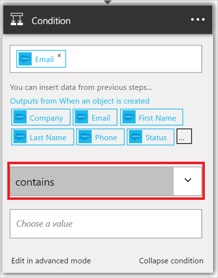

此條件會評估每個新的 Salesforce 潛在客戶的電子郵件地址] 的欄位。 如果電子郵件地址包含*amazon.com*，條件則結果為*True*。

1. 選取 [ **+ 新的步驟**。  
   
- 選取 [**新增條件**。    
  
- 選取 [**選擇一個值**。    
  
- 從潛在客戶的觸發程序中選取的*電子郵件*的 token。    
  
- 選取 [*包含*]。      
  
- 選取 [**選擇一個值**，底部的控制項。     
  
- 輸入*amazon.com*做為您想要評估的新的潛在客戶的電子郵件地址的值。 如果電子郵件地址包含*amazon.com*，則條件會評估為*True* ，邏輯應用程式中的其他步驟進行。    
  
- 儲存您的邏輯應用程式。  

