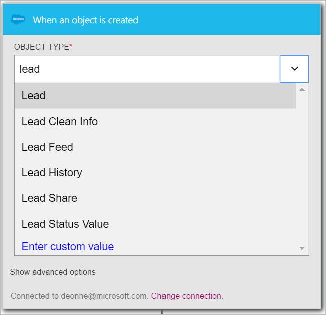

在此逐步解說，您將學習如何使用**Salesforce-建立物件時**觸發程序進行邏輯應用程式工作流程，當您 Salesforce 中建立新的潛在客戶。

>[AZURE.NOTE]收到提示您登入 Salesforce 帳戶，如果您還沒有建立*連線*到 Salesforce。  

1. 在 [搜尋] 方塊中輸入*salesforce*邏輯應用程式設計工具，然後選取 [ **Salesforce-建立物件時**觸發程序。  
   
- 會顯示**在建立物件時**控制項。  
   
- 選取的**物件類型**，然後選取 [從清單中的物件的 [*潛在客戶]* 。 您要在此步驟中，表示您正在建立 Salesforce 中建立新的潛在客戶時，會通知您邏輯應用程式的觸發程序。   
   
- 就是它。 您已建立觸發程序。 不過，您需要建立至少有一個動作，才能將此設為有效邏輯應用程式。    
   

此時，邏輯應用程式已使用會開始執行的其他引動程序和工作流程中的動作，在您 Salesforce 中建立新的項目時的觸發程序。  