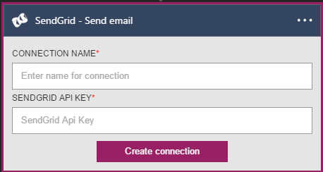
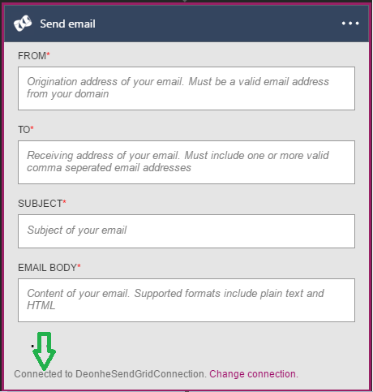

### 必要條件
- [SendGrid](https://www.SendGrid.com/)帳戶 

您可以使用 SendGrid 帳戶中的邏輯應用程式之前，您必須授權邏輯應用程式連線至 SendGrid 帳戶。 所幸，您可以輕鬆從 Azure 入口網站上邏輯應用程式中。 

以下是授權邏輯應用程式連線到您 SendGrid 帳戶步驟︰

1. 若要建立的連線，SendGrid，邏輯應用程式設計工具] 中，選取下拉式清單中的 [**顯示 Microsoft 受管理的 Api** ，然後在 [搜尋] 方塊中輸入*SendGrid* 。 選取您要使用的巨集指令的觸發程序︰  
  
2. 如果您還沒有建立任何連線到 SendGrid 之前，您會提供您 SendGrid 認證提示。 這些認證會用於授權邏輯應用程式連線至，並存取 SendGrid 帳戶的資料︰  
  
3. 請注意已經建立連線，您現在可以自由邏輯應用程式中的步驟進行︰  
     
