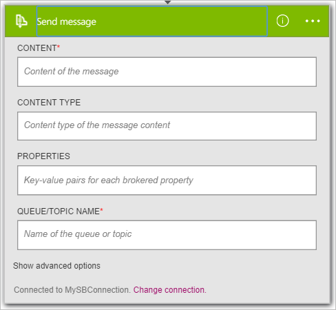

現在您已新增觸發程序，就進行感興趣的資料所產生的觸發程序的時間。 請遵循這些步驟來新增 [**服務匯流排-傳送訊息**] 動作。 這個動作會將郵件傳送到服務匯流排。  

請遵循這些步驟來建立傳送郵件的動作︰  

1. 選取 [ **+ 新步驟**以新增動作]。  
- 選取 [**新增動作**。 [搜尋] 方塊中，讓您可以搜尋的任何動作您想要採取此隨即會開啟。 此範例中，服務匯流排動作會感興趣。    
   
- 輸入*服務匯流排*。  
- 選取要採取的動作**服務匯流排-傳送訊息**。  
    
- 輸入訊息的內容。 這是必要。  
- 輸入將會傳送郵件的佇列或主題名稱。 這也是必要。   
- 提供有關郵件的其他詳細資料。 此為選用步驟。     
    
- 儲存您的工作流程的變更。   
     
