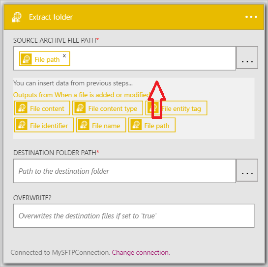
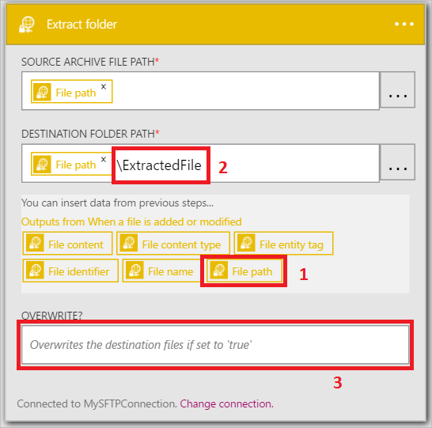
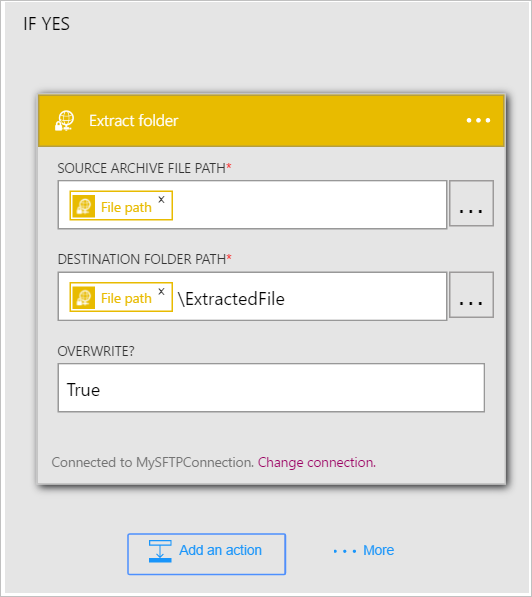

既然您已新增觸發程序，其時間進行操作 interesting 所產生的觸發程序的資料。 請遵循下列步驟以新增**SFTP-解壓縮資料夾**動作。 定義的條件符合時，此動作會擷取檔案的內容。 

若要設定此動作，您需要提供下列資訊。 您會發現很容易使用做為新檔案的摘要資訊的部分輸入產生觸發程序的資料︰

|SFTP-解壓縮資料夾屬性|描述|
|---|---|
|來源封存檔案路徑|這是解壓縮檔案的路徑。 您可以從舊版動作選取其中一個權杖，或瀏覽以尋找檔案路徑 SFTP 伺服器。|
|目的地資料夾路徑|這是解壓縮的檔案所在的路徑。 您可以從舊的動作，作為目的地路徑選取其中一個權杖或瀏覽 SFTP 伺服器，然後選取的路徑。|
|覆寫嗎？|指出使用相同的解壓縮的檔案名稱的檔案是否要或不應該覆寫現有檔案的目的地資料夾路徑中找到。|

現在就讓我們開始新增巨集指令解壓縮先前定義的條件結果為*True*的檔案。 

1. 選取 [**新增動作**。        
   
- 選取 [ **SFTP-解壓縮的資料夾**] 動作      
   
- 選取**來源封存檔案路徑**              
   
- 選取的**檔案路徑**token。 這表示您將使用之檔案的觸發程序找到檔案路徑作為來源封存檔案路徑。           
   
- 選取**目的地資料夾的路徑**           
   
- 選取的**檔案路徑**token。 這表示您將使用之檔案的觸發程序找到檔案路徑作為目的地路徑解壓縮的檔案。   
- *\ExtractedFile*控制項中輸入**目的地資料夾路徑**。 執行此動作後目的地資料夾路徑控制項中的檔案路徑 token。         
   
- 輸入 [ *True* **覆寫？*控制項來指出是否其為解壓縮的檔案中有相同的名稱，應該覆寫現有的檔案。      
   
- 將所做的變更儲存到您的工作流程  
