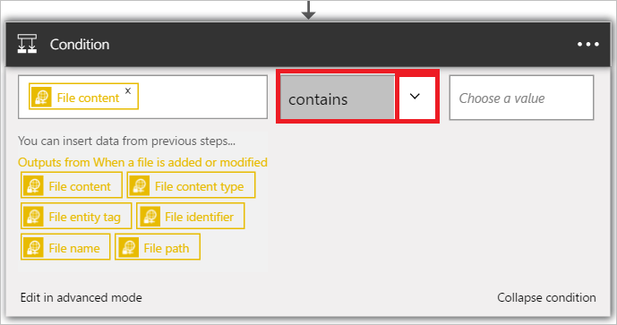
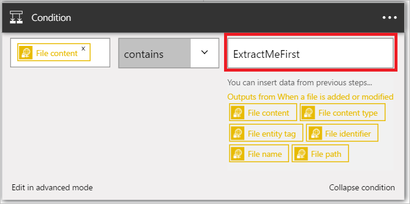

1. 選取 [ **+ 新步驟**以新增動作]。  
- 選取 [**新增動作**] 連結。 [搜尋] 方塊，您可以搜尋的任何動作您想要採取此隨即會開啟。 此範例中，SharePoint 動作會感興趣。    
    
- 選取 [**選擇一個值**的左側。 
    
- 選取**檔案內容**，表示您想要評估的條件中檔案內容。      
   
- 從運算子的清單中選取 [*包含*]。       
   
- 選取 [右側的 [**選擇一個值**，然後輸入*ExtractMeFirst*。 在此範例中，ExtractMeFirst 是 SFTP 資料夾，以表示它是要展開的封存檔案中有權存取的人員所預期，檔案中的值。  
   