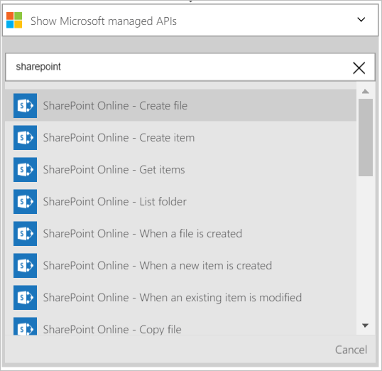

既然您已新增觸發程序，其時間進行操作有趣的資料所產生的觸發程序。 請遵循這些步驟來新增的**SharePoint Online-建立檔案**的動作。 這個動作會檔案在 SharePoint Online 中每次建立新的項目觸發程序，則會啟動。 

若要設定此動作，您需要提供下列資訊。 為您提供這項資訊，您會注意到會觸發程序所產生的輸入某些新檔案的摘要資訊的使用簡單資料︰

|建立檔案屬性|描述|
|---|---|
|網站 URL|這是您要建立新檔案的 SharePoint Online 網站的 URL。 從清單中選取的網站。|
|資料夾的路徑|這是資料夾 （在上一個步驟中選取 [網站 URL) 所在的新檔案。 瀏覽並選取的資料夾。|
|檔案名稱|這是建立檔案的名稱。|
|檔案內容|檔案會寫入的內容。|

1. 選取 [ **+ 新步驟**以新增動作]。  
  
- 選取 [**新增動作**] 連結。 [搜尋] 方塊，您可以搜尋的任何動作您想要採取此隨即會開啟。 此範例中，SharePoint 動作會感興趣。    
    
- 輸入*sharepoint*搜尋 SharePoint 與相關的動作。
- 選取 [ **SharePoint Online-建立檔案**以採取的動作。   **附註**︰ 系統會提示授權邏輯應用程式來存取您的 SharePoint 帳戶，如果您還沒有先前建立的 SharePoint online 的連線。    
    
- **建立檔案**控制項隨即會開啟。   
     
- 選取**網站的 URL** ，然後瀏覽以尋找您想要建立檔案的網站。     
  
- 選取**資料夾路徑**，然後瀏覽以尋找新的檔案所在的資料夾。  
  
- 選取 [**檔案名稱**] 控制項，然後輸入您想要建立檔案的名稱。 在這裡，您可以直接輸入檔案名稱，或您可以使用從您先前建立的觸發程序的屬性。 從**輸出中建立新的項目時，從**清單中選取屬性來執行此動作。 這是清單僅顯示後選取 [**檔案名稱**] 控制項。 在此 walkthough，我可以選取 [識別碼 （新的清單項目的識別碼） 和**SharePoint Online-建立檔案**的動作所建立的檔案的名稱。    
  
- 選取**檔案內容**控制項，然後輸入會建立的檔案會寫入的內容。 對於檔案的內容，請注意，您可以使用的任何內容，從您先前建立的觸發程序。 只從所呈現的清單中選取的內容。 或者，您也可以直接將控制項輸入**檔案內容**的文字。 在此範例中，我可以選取某些屬性，並新增空格及連字號之間的每個屬性。        
  
- 將所做的變更儲存到您的工作流程  
- 恭喜您，現在您有新的項目新增至 SharePoint Online 清單時觸發的完整功能的邏輯應用程式。 應用程式，則會建立檔案]，使用部分屬性，從新的清單項目。  您現在可以測試 SharePoint 清單中建立新的項目。 
