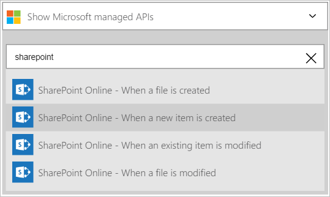
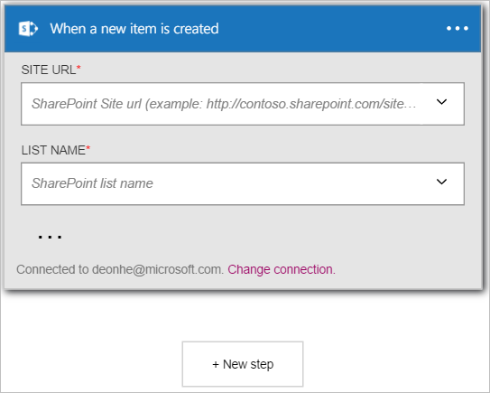

在此範例中，我會顯示您如何使用**SharePoint Online-當您建立新的項目時**的觸發程序中的 SharePoint Online 清單建立新的項目時，啟動邏輯應用程式工作流程。

>[AZURE.NOTE]收到提示您登入 SharePoint 帳戶，如果您還沒有建立 SharePoint online 的*連線*。  

1. 在 [搜尋] 方塊中輸入*sharepoint*邏輯應用程式設計工具，然後選取 [ **SharePoint Online-當您建立新的項目時**的觸發程序。  
  
- 會顯示**建立新的項目時**的控制項。  
   
- 選取**網站的 URL**。 這是您想要的新項目觸發工作流程監視 SharePoint online 網站。  
   
- 選取的**清單名稱**。 這是您想要監視的新項目會觸發工作流程的 SharePoint Online 網站上的清單。  
   

此時，邏輯應用程式已設定就會開始執行的其他引動程序和工作流程中的動作觸發程序。 這將會執行每次您選取的 SharePoint Online 清單中建立新的項目。  