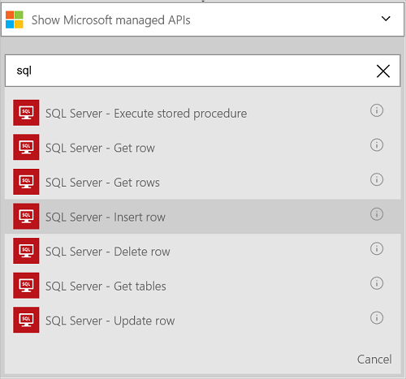

### 必要條件
- Azure 帳戶。您可以建立的[免費的帳戶](https://azure.microsoft.com/free)
- [Azure SQL 資料庫](../articles/sql-database/sql-database-get-started.md)的連線資訊，包括伺服器名稱、 資料庫名稱，以及使用者名稱與密碼。 這項資訊包含在 SQL 資料庫連線字串︰
  
    伺服器 = tcp:*yoursqlservername*。 database.windows.net,1433;Initial 目錄 =*yourqldbname*;保存安全性資訊 = False。使用者識別碼 = {your_username};密碼 = {your_password};MultipleActiveResultSets = False。加密 = True;TrustServerCertificate = False。連線逾時 = 30。

    進一步瞭解[Azure SQL 資料庫](https://azure.microsoft.com/services/sql-database)。

> [AZURE.NOTE] 當您建立 Azure SQL 資料庫時，您也可以建立包括的 SQL 範例資料庫。 

使用之前 Azure SQL 資料庫中的邏輯應用程式，連線至 SQL 資料庫。 您可以輕鬆地在 Azure 入口網站上邏輯應用程式中。  

連線至 Azure SQL 資料庫使用下列步驟︰  

1. 建立邏輯應用程式。 在邏輯應用程式設計工具中，將觸發程序，然後再新增動作。 在下拉式清單中，選取 [**顯示 Microsoft 受管理的 Api** ，然後在 [搜尋] 方塊中輸入 「 sql 」。 選取其中一個動作︰  

    

2. 如果您還沒有先前建立的任何 SQL 資料庫連線，您會出現提示連線詳細資料︰  

     

3. 輸入 SQL 資料庫的詳細資訊。 星號屬性所需。

    | 屬性 | 詳細資料 |
|---|---|
| 透過 [閘道器 | 請將此核取。 連線到內部部署的 SQL Server 時，會使用這項目。 |
| 連線名稱 * | 輸入您的連線任何名稱。 | 
| SQL Server 名稱 * | 輸入伺服器名稱。這是*servername.database.windows.net*類似。 伺服器名稱是顯示在 [SQL 資料庫中的屬性 Azure 入口網站中，，而且也會顯示在 [連接字串。 | 
| SQL 資料庫名稱 * | 輸入 SQL 資料庫的名稱。 這會列在 [連線字串中的 SQL 資料庫屬性︰ 初始目錄 =*yoursqldbname*。 | 
| 使用者名稱 * | 輸入時所建立的 SQL 資料庫所建立的使用者名稱。 這會列在 Azure 入口網站中的 [SQL 資料庫] 屬性。 | 
| 密碼 * | 輸入時所建立的 SQL 資料庫所建立的密碼。 | 

    授權連線，並存取 SQL 資料邏輯應用程式會使用這些認證。 完成之後，您連線的詳細資料看起來類似下列動作︰  

     

4. 選取 [**建立**]。 

5. 請注意，在建立連線。 現在，繼續邏輯應用程式中的其他步驟︰ 

    