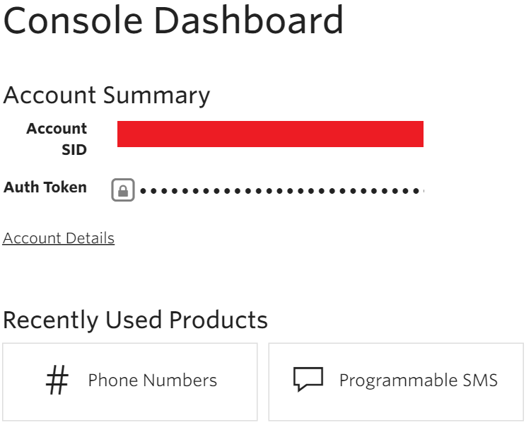

### 必要條件
- Twilio 帳戶
- 可接收簡訊驗證的 Twilio 電話號碼
- 可以傳送簡訊驗證的 Twilio 電話號碼

>[AZURE.NOTE] 如果您使用的 Twilio 試用帳戶，您只能傳送簡訊**驗證**電話號碼。  

您可以使用 Twilio 帳戶中的邏輯應用程式之前，您必須授權邏輯應用程式連線至 Twilio 帳戶。 所幸，您可以輕鬆從 Azure 入口網站上邏輯應用程式中。 

以下是授權邏輯應用程式連線到您 Twilio 帳戶步驟︰

1. 若要建立的連線，Twilio，邏輯應用程式設計工具] 中，選取下拉式清單中的 [**顯示 Microsoft 受管理的 Api** ，然後在 [搜尋] 方塊中輸入*Twilio* 。 選取您要使用的巨集指令的觸發程序︰  
  
2. 如果您還沒有建立任何連線到 Twilio 之前，會收到提示您輸入 Twilio 認證。 這些認證會用於授權邏輯應用程式連線至，並存取 Twilio 帳戶的資料︰  
    
3. 您需要**Twilio 帳戶 id**和**Twilio 存取權杖**從儀表板中 Twilio，因此登入您 Twilio 帳戶現在擷取資訊這兩項︰  
    
4. Twilio 和邏輯應用程式會使用不同的名稱來識別下列兩項資訊。 以下是如何您對應必須將其邏輯應用程式] 對話方塊︰  
5. 選取 [**建立連線**] 按鈕︰  
  
6. 請注意已經建立連線，您現在可以自由邏輯應用程式中的步驟進行︰  
  