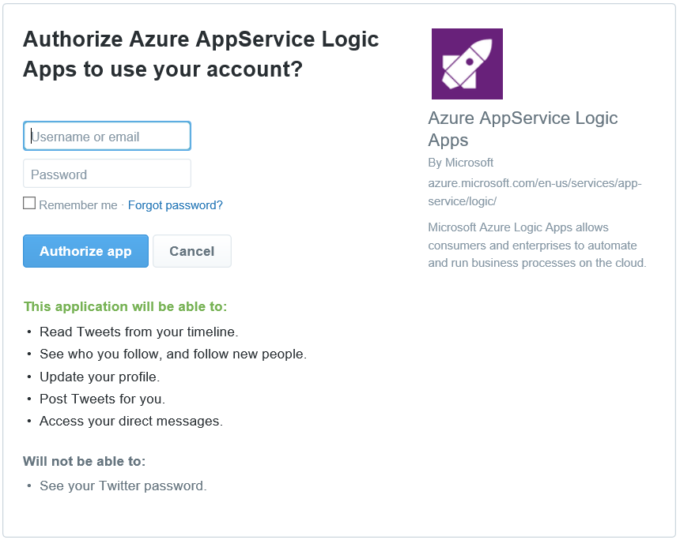

### 必要條件
- Twitter 帳戶 

您可以使用 Twitter 帳戶中的邏輯應用程式之前，您必須授權邏輯應用程式連線至您 Twitter 的帳戶。 所幸，您可以輕鬆從 Azure 入口網站上邏輯應用程式中。 

以下是授權邏輯應用程式連線到您 Twitter 帳戶步驟︰

1. 若要建立的連線，Twitter 邏輯應用程式設計工具中，選取下拉式清單中的 [**顯示 Microsoft 受管理的 Api** ，然後在 [搜尋] 方塊中輸入 [ *Twitter* 。 選取您要使用的巨集指令的觸發程序︰  
  
2. 如果您還沒有建立任何連線到 Twitter 之前，會提示提供您 Twitter 的認證。 這些認證會用於授權邏輯應用程式連線至，並存取 Twitter 帳戶的資料︰  
    
3. 提供您 Twitter 使用者名稱和密碼，即可授權邏輯應用程式︰  
    
4. 確認您的授權︰  
    
6. 請注意已經建立連線，您現在可以自由邏輯應用程式中的步驟進行︰  
  